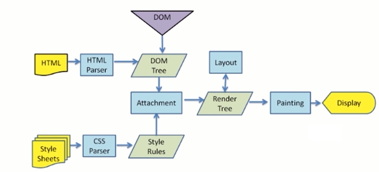
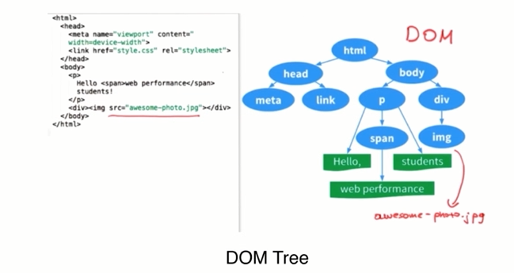
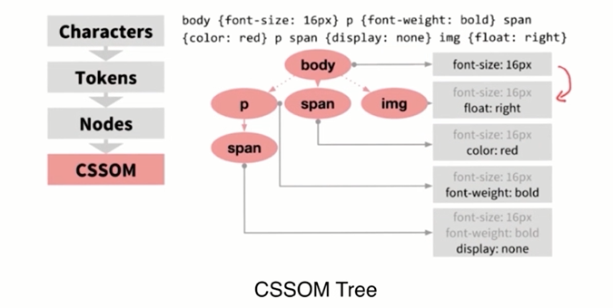
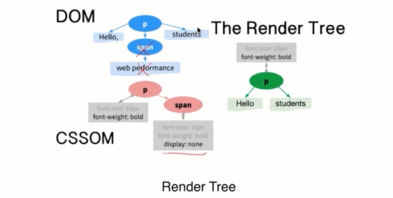
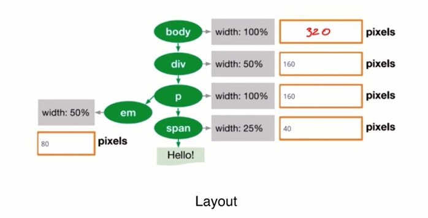

# 浏览器页面相关

- 渲染机制
- JS 运行机制
- 页面性能
- 错误监控

## 渲染机制

目标:
- 什么是 DOCTYPE 及作用
- 浏览器渲染机制
- 重排 Reflow
- 重绘 Repaint
- 布局 Layout


### 什么是 DOCTYPE 及作用

DTD(Document Type Definition):文档类型定义,是一系列的语法规则，用来定义 XML 或者 XHTML 的文件类型，浏览器会使用它来判断文档的类型，觉得使用何种协议来解析以及切换浏览器模式。

DOCTYPE 是用来声明文档和 DTD 规范的，一个主要的用途使文件的合法性验证。如果文件代码不合法，那么浏览器解析时便会出一些差错。

HTML5: `<!DOCTYPE html>`

HTML 4.01 Strict: 该 DTD 包含所有 HTML 元素和属性，但不包括展示性的和弃用的元素（比如 font）。不允许框架集（Framesets）。
`<!DOCTYPE HTML PUBLIC "-//W3C//DTD HTML 4.01//EN" "http://www.w3.org/TR/html4/strict.dtd">`


HTML 4.01 Transitional: 该 DTD 包含所有 HTML 元素和属性，包括展示性的和弃用的元素（比如 font）。不允许框架集（Framesets）。

`<!DOCTYPE HTML PUBLIC "-//W3C//DTD HTML 4.01 Transitional//EN"
"http://www.w3.org/TR/html4/loose.dtd">`

HTML 4.01 Frameset:该 DTD 等同于 HTML 4.01 Transitional，但允许框架集内容。

`<!DOCTYPE HTML PUBLIC "-//W3C//DTD HTML 4.01 Frameset//EN"
"http://www.w3.org/TR/html4/frameset.dtd">`


### 浏览器的渲染机制












### 重排（reflow）

DOM 结构中的各个元素都有自己的盒子（模型），这些都需要浏览器根据各种样式来计算结果将元素放到它该出现的位置，这个过程称之为 reflow

- DOM 节点的增删改，会导致 reflow 或者 repaint
- 当 DOM 的位置移动，或者搞个动画
- 修改 CSS 样式
- resize 窗口的时候（移动端没有这个问题），或是滚动的时候
- 当修改网页的默认字体时

触发 reflow：
- 1、页面渲染初始化；(无法避免)
- 2、添加或删除可见的 DOM 元素；
- 3、元素位置的改变，或者使用动画；
- 4、修改 CSS 样式：元素尺寸的改变——大小，外边距，边框；
- 5、浏览器窗口尺寸的变化（resize 事件发生时），或者滚动的时候；
- 6、填充内容的改变，比如文本的改变或图片大小改变而引起的计算值宽度和高度的改变；
- 7、读取某些元素属性：（offsetLeft/Top/Height/Width,　clientTop/Left/Width/Height,　scrollTop/Left/Width/Height,　width/height,　getComputedStyle(),　currentStyle(IE)　)
- 8.修改网页默认字体


### 重绘（redraw 或 repaint）

定义：当盒子的位置、大小以及其他属性，例如颜色、字体大小等都确定下来之后，浏览器便把这些元素都按照各自的特性绘制一遍，将内容呈现在页面上。

触发条件：
- DOM 改变
- CSS 改变


`重排必定会引发重绘，但重绘不一定会引发重排`

重绘重排的代价：耗时，导致浏览器卡慢。

优化：　　

1、浏览器自己的优化：浏览器会维护1个队列，把所有会引起回流、重绘的操作放入这个队列，等队列中的操作到了一定的数量或者到了一定的时间间隔，浏览器就会 flush 队列，进行一个批处理。这样就会让多次的回流、重绘变成一次回流重绘。

2、我们要注意的优化：我们要减少重绘和重排就是要减少对渲染树的操作，则我们可以合并多次的 DOM 和样式的修改。并减少对 style 样式的请求。

（1）直接改变元素的 className

（2）display：none；先设置元素为 display：none；然后进行页面布局等操作；设置完成后将元素设置为display：block；这样的话就只引发两次重绘和重排；

（3）不要经常访问浏览器的 flush 队列属性；如果一定要访问，可以利用缓存。将访问的值存储起来，接下来使用就不会再引发回流；

（4）使用cloneNode(true or false) 和 replaceChild 技术，引发一次回流和重绘；

（5）将需要多次重排的元素，position 属性设为 absolute 或 fixed，元素脱离了文档流，它的变化不会影响到其他元素；

（6）如果需要创建多个 DOM 节点，可以使用 DocumentFragment 创建完后一次性的加入 document；

```js
var fragment = document.createDocumentFragment();

var li = document.createElement('li');
li.innerHTML = 'apple';
fragment.appendChild(li);

var li = document.createElement('li');
li.innerHTML = 'watermelon';
fragment.appendChild(li);

document.getElementById('fruit').appendChild(fragment);
```

（7）尽量不要使用 table 布局。
