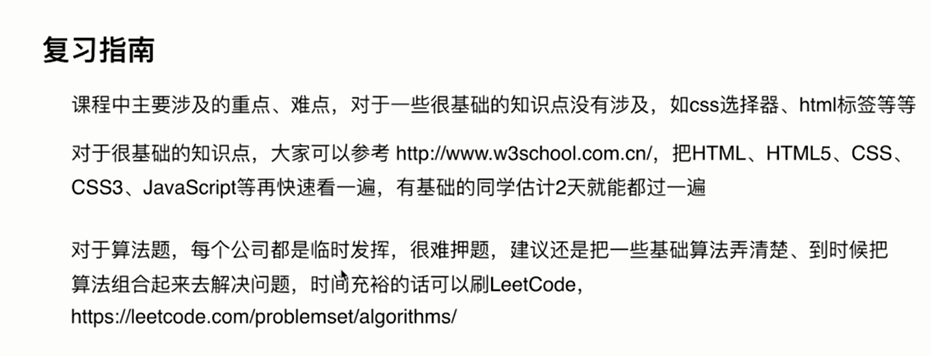

# 职业竞争力

- 积极乐观
- 主动沟通
- 逻辑顺畅
- 上进有责任心
- 有主张，做事果断

职业竞争力

- 业务能力
- 思考能力：对同一件事情可以从不同角度去思考，找到最优解
- 学习能力：不断学习新的业务和技术、沉淀、总结
- 无上限的付出：对于无法理解的问题可以熬夜加班解决问题

职业规划

1. 目标： 在业务上称为专家，在技术上称为大牛
2. 近期目标：不断学习积累各方面的经验，以学习为主
3. 长期目标：做很有价值的事情，如开源作品、技术框架等
4. 方式方法：先完成业务上的问题，做到极致，然后逐步向目标靠拢
5. 多赞美公司、赞美HR，说好话，夸在点上，不要说空话

## 总结

JD 描述一定要看

对照 JD 吻合简历，快速对未掌握技术栈快速复习、理解

自我简介：一定要打草稿，展示优势，描述项目，忌讳临时发挥

1. 重基础、懂原理、要思考、知进退、势不可挡
2. 横向扩展、项目结合、做到有的放矢
3. 有经验、懂合作、有担当、懂规矩、察言观色

会沟通、要上进、好性格、有主见、强逻辑、无可挑剔

胜不骄、败不馁、总结经验

<!--  -->
