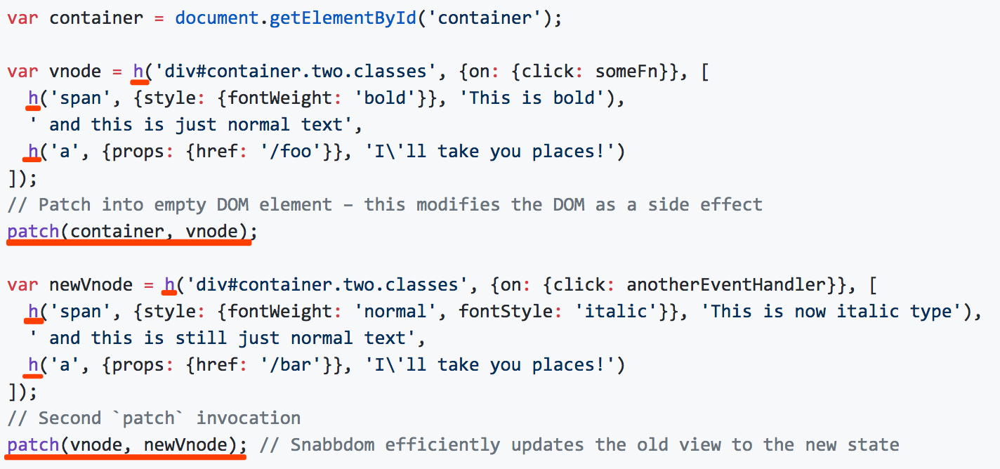
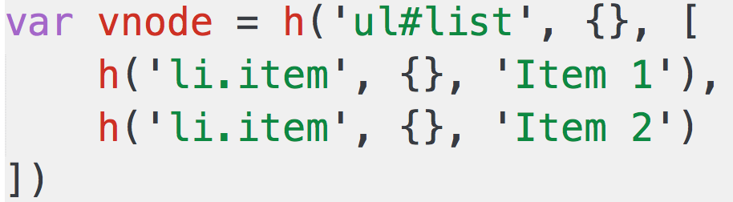
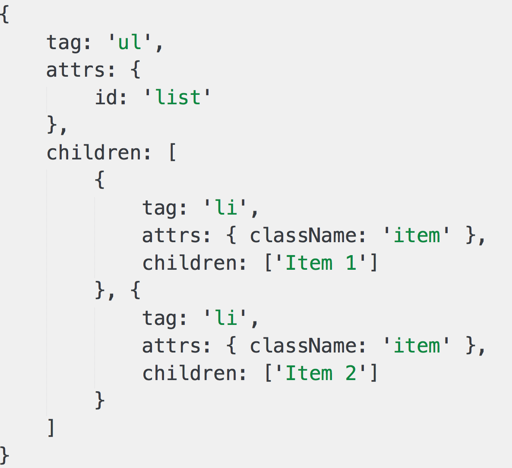
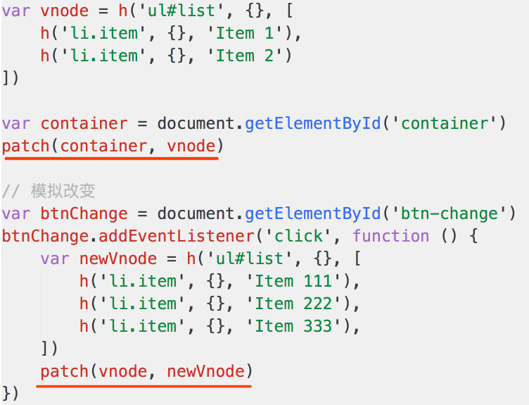

# 虚拟DOM


## virtual dom

- vdom 是 vue 和 React 的核心
- vdom 比较独立，使用也比较简单
- vue 和 React 的实现，免不了vdom


问题
- vdom 是什么？为何会存在 vdom？
- vdom 的如何应用，核心 API 是什么
- 介绍一下 diff 算法


什么是 vdom，为何使用 vdom
- 什么是 vdom
- 设计一个需求场景
- 用 jQuery 实现
- 遇到的问题


什么是 vdom
- 用 JS 模拟 DOM 结构
- DOM 变化的对比，放在 JS 层来做（图灵完备语言）
- 提高重绘性能


用jQ实现
```html
<div id="container"></div>
<button id="btn-change">change</button>

<script type="text/javascript" src="https://cdn.bootcss.com/jquery/3.2.0/jquery.js"></script>
<script type="text/javascript">
    var data = [
        {
            name: '张三',
            age: '20',
            address: '北京'
        },
        {
            name: '李四',
            age: '21',
            address: '上海'
        },
        {
            name: '王五',
            age: '22',
            address: '广州'
        }
    ]

    // 渲染函数
    function render(data) {
        var $container = $('#container')

        // 清空容器，重要！！！
        $container.html('')

        // 拼接 table
        var $table = $('<table>')

        $table.append($('<tr><td>name</td><td>age</td><td>address</td>/tr>'))
        data.forEach(function (item) {
            $table.append($('<tr><td>' + item.name + '</td><td>' + item.age + '</td><td>' + item.address + '</td>/tr>'))
        })

        // 渲染到页面
        $container.append($table)
    }

    $('#btn-change').click(function () {
        data[1].age = 30
        data[2].address = '深圳'
        // re-render  再次渲染
        render(data)
    })

    // 页面加载完立刻执行（初次渲染）
    render(data)

</script>
```


遇到的问题
- DOM 操作是“昂贵”的，js 运行效率高
- 尽量减少 DOM 操作，而不是“推倒重来”
- 项目越复杂，影响就越严重
- vdom 即可解决这个问题

总结
-  virtual dom ， 虚拟 DOM
- 用 JS 模拟 DOM 结构
- DOM 操作非常“昂贵”
- 将 DOM 对比操作放在 JS 层，提高效率


## vdom-snabbdom

vdom 的如何应用，核心 API 是什么
- 介绍 snabbdom
- 核心 API

介绍 snabbdom



介绍 snabbdom - h 函数





介绍 snabbdom - patch 函数



```html
<div id="container"></div>
<button id="btn-change">change</button>

<script src="https://cdn.bootcss.com/snabbdom/0.7.1/snabbdom.js"></script>
<script src="https://cdn.bootcss.com/snabbdom/0.7.1/snabbdom-class.js"></script>
<script src="https://cdn.bootcss.com/snabbdom/0.7.1/snabbdom-props.js"></script>
<script src="https://cdn.bootcss.com/snabbdom/0.7.1/snabbdom-style.js"></script>
<script src="https://cdn.bootcss.com/snabbdom/0.7.1/snabbdom-eventlisteners.js"></script>
<script src="https://cdn.bootcss.com/snabbdom/0.7.1/h.js"></script>
<script type="text/javascript">
    var snabbdom = window.snabbdom

    // 定义 patch
    var patch = snabbdom.init([
        snabbdom_class,
        snabbdom_props,
        snabbdom_style,
        snabbdom_eventlisteners
    ])

    // 定义 h
    var h = snabbdom.h

    var container = document.getElementById('container')

    // 生成 vnode
    var vnode = h('ul#list', {}, [
        h('li.item', {}, 'Item 1'),
        h('li.item', {}, 'Item 2')
    ])
    patch(container, vnode)

    document.getElementById('btn-change').addEventListener('click', function () {
        // 生成 newVnode
        var newVnode = h('ul#list', {}, [
            h('li.item', {}, 'Item 1'),
            h('li.item', {}, 'Item B'),
            h('li.item', {}, 'Item 3')
        ])
        patch(vnode, newVnode)
    })

</script>
```

渲染表格的实例

- 使用 data 生成 vnode
- 第一次渲染，将 vnode 渲染到 #container 中
- 并将 vnode 缓存下来
- 修改 data 之后，用新 data 生成 newVnode
- 将 vnode 和 newVnode 对比

```html
<div id="container"></div>
<button id="btn-change">change</button>

<script src="https://cdn.bootcss.com/snabbdom/0.7.0/snabbdom.js"></script>
<script src="https://cdn.bootcss.com/snabbdom/0.7.0/snabbdom-class.js"></script>
<script src="https://cdn.bootcss.com/snabbdom/0.7.0/snabbdom-props.js"></script>
<script src="https://cdn.bootcss.com/snabbdom/0.7.0/snabbdom-style.js"></script>
<script src="https://cdn.bootcss.com/snabbdom/0.7.0/snabbdom-eventlisteners.js"></script>
<script src="https://cdn.bootcss.com/snabbdom/0.7.0/h.js"></script>
<script type="text/javascript">
    var snabbdom = window.snabbdom
    // 定义关键函数 patch
    var patch = snabbdom.init([
        snabbdom_class,
        snabbdom_props,
        snabbdom_style,
        snabbdom_eventlisteners
    ])

    // 定义关键函数 h
    var h = snabbdom.h

    // 原始数据
    var data = [
        {
            name: '张三',
            age: '20',
            address: '北京'
        },
        {
            name: '李四',
            age: '21',
            address: '上海'
        },
        {
            name: '王五',
            age: '22',
            address: '广州'
        }
    ]
    // 把表头也放在 data 中
    data.unshift({
        name: '姓名',
        age: '年龄',
        address: '地址'
    })

    var container = document.getElementById('container')

    // 渲染函数
    var vnode
    function render(data) {
        var newVnode = h('table', {}, data.map(function (item) {
            var tds = []
            var i
            for (i in item) {
                if (item.hasOwnProperty(i)) {
                    tds.push(h('td', {}, item[i] + ''))
                }
            }
            return h('tr', {}, tds)
        }))

        if (vnode) {
            // re-render
            patch(vnode, newVnode)
        } else {
            // 初次渲染
            patch(container, newVnode)
        }

        // 存储当前的 vnode 结果
        vnode = newVnode
    }

    // 初次渲染
    render(data)


    var btnChange = document.getElementById('btn-change')
    btnChange.addEventListener('click', function () {
        data[1].age = 30
        data[2].address = '深圳'
        // re-render
        render(data)
    })

</script>
```

核心 API
- `h(‘<标签名>’, {…属性…}, […子元素…])`
- `h(‘<标签名>’, {…属性…}, ‘….’)`
- `patch(container, vnode) `
- `patch(vnode, newVnode) `


总结
- 如何使用？可用 snabbdom 的用法来举例
- 核心 API：h 函数、patch 函数


## diff 算法

- 介绍一下 diff 算法
- 去繁就简
- vdom 为何用 diff 算法
- diff 算法的实现流程

去繁就简
- diff 算法非常复杂，实现难度很大，源码量很大
- 去繁就简，讲明白核心流程，不关心细节
- 大部分都不清楚细节，但是很关心核心流程
- 去繁就简之后，依然具有很大挑战性，并不简单

vdom 为何使用 diff 算法
- DOM 操作是“昂贵”的，因此尽量减少 DOM 操作
- 找出本次 DOM 必须更新的节点来更新，其他的不更新
- 这个“找出”的过程，就需要 diff 算法


diff 实现过程
- patch(container, vnode)
- patch(vnode, newVnode)

```js
// 代码不可运行
// patch(container, vnode)

function createElement(vnode) {
    var tag = vnode.tag  // 'ul'
    var attrs = vnode.attrs || {}
    var children = vnode.children || []
    if (!tag) {
        return null
    }

    // 创建真实的 DOM 元素
    var elem = document.createElement(tag)
    // 属性
    var attrName
    for (attrName in attrs) {
        if (attrs.hasOwnProperty(attrName)) {
            // 给 elem 添加属性
            elem.setAttribute(attrName, attrs[attrName])
        }
    }
    // 子元素
    children.forEach(function (childVnode) {
        // 给 elem 添加子元素
        elem.appendChild(createElement(childVnode))  // 递归
    })

    // 返回真实的 DOM 元素
    return elem
}
```
```js
// 代码不可运行
// patch(vnode, newVnode)

function updateChildren(vnode, newVnode) {
    var children = vnode.children || []
    var newChildren = newVnode.children || []

    children.forEach(function (childVnode, index) {
        var newChildVnode = newChildren[index]
        if (childVnode.tag === newChildVnode.tag) {
            // 深层次对比，递归
            updateChildren(childVnode, newChildVnode)
        } else {
            // 替换
            replaceNode(childVnode, newChildVnode)
        }
    })
}

function replaceNode(vnode, newVnode) {
    var elem = vnode.elem  // 真实的 DOM 节点
    var newElem = createElement(newVnode)

    // 替换
}
```

不仅仅是以上内容
- 节点新增和删除
- 节点重新排序
- 节点属性、样式、事件变化
- 如何极致压榨性能
- ...


diff 实现过程
- patch(container, vnode) 和 patch(vnode, newVnode)
- createElment
- updateChildren


总结
- 知道什么是 diff 算法，是 linux 的基础命令
- vdom 中应用 diff 算法是为了找出需要更新的节点
- vdom 实现过程，createElement 和 updateChildren
- 与核心函数 patch 的关系


## 总结

- vdom 是什么？为何会存在 vdom？
- vdom 如何应用，核心 API 是什么
- 介绍一下 diff 算法


vdom 是什么，为何使用 vdom
- virtual dom ， 虚拟 DOM
- 用 JS 模拟 DOM 结构
- DOM 操作非常“昂贵”
- 将 DOM 对比操作放在 JS 层，提高效率

vdom 如何使用，核心函数是什么
- 如何使用？可用 snabbdom 的用法来举例
- 核心 API：h 函数、patch 函数


介绍一下 diff 算法
- 知道什么是 diff 算法，是 linux 的基础命令
- vdom 中应用 diff 算法是为了找出需要更新的节点
- 实现，patch(container, vnode) 和 patch(vnode, newVnode)
- 核心逻辑，createElement 和 updateChildren

