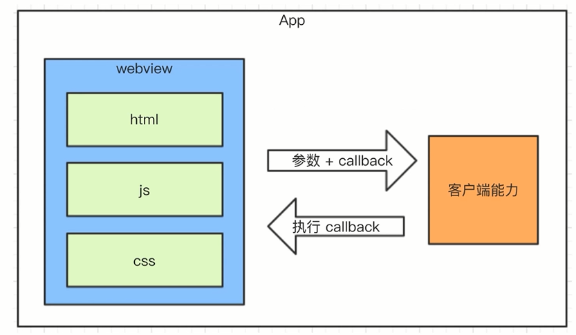
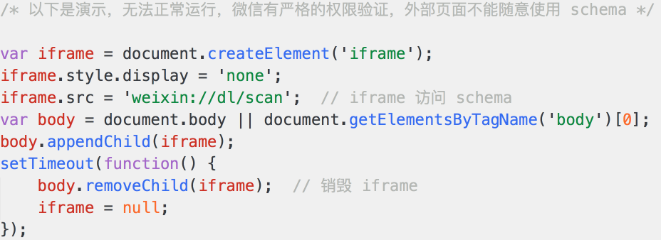
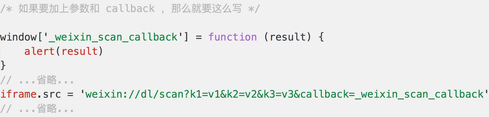
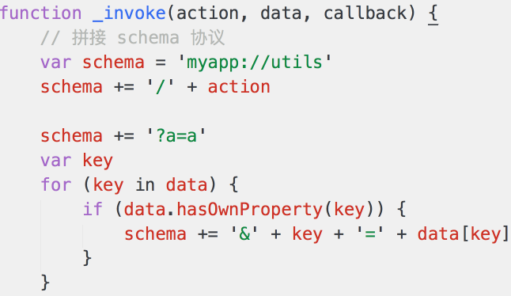
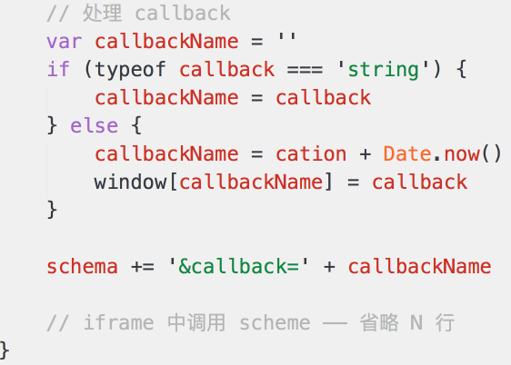
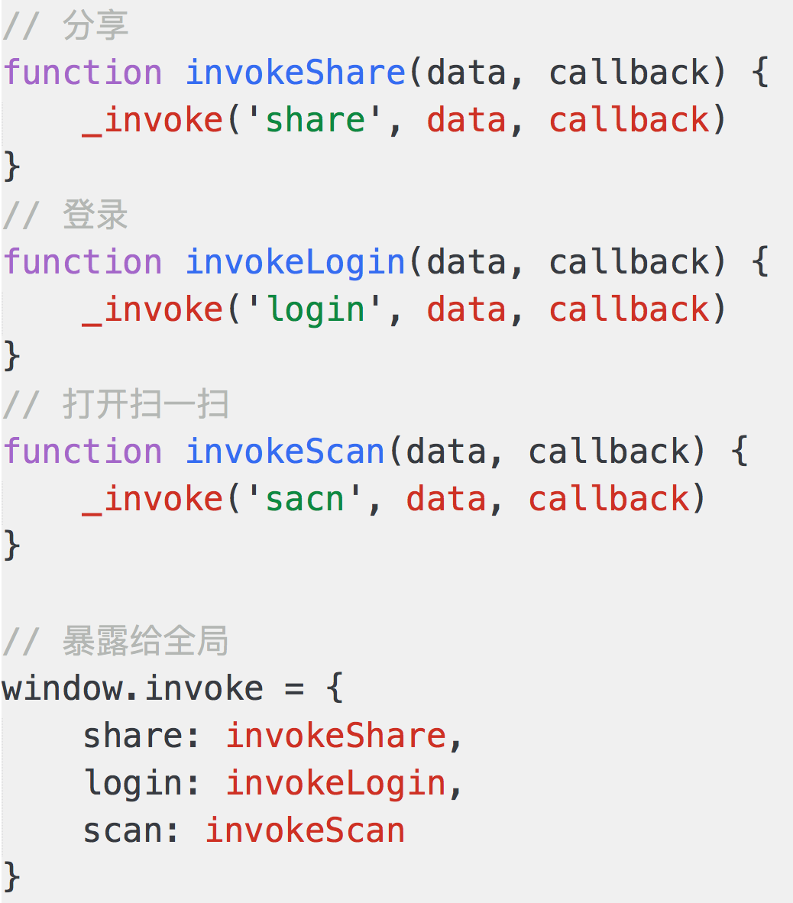
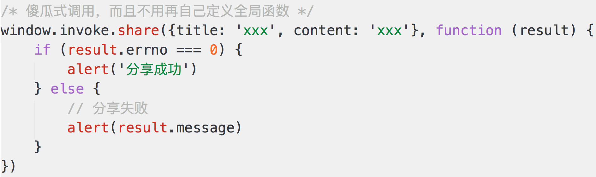

# Hybrid

```
移动端占大部分流量，已经远超PC
大多数公司都有自己的App
App中有大量前端代码
微信中有多少页面是前端的开发
```

目标
- Hybrid 是什么，为何要用
- Hybrid 如何更新上线
- Hybrid 和H5有何区别
- JS和Native相互通信


## Hybrid 是什么，为何要用

- Hybrid文字解释
- 存在价值，为何用
- webview
- file：//协议
- Hybrid实现流程


Hybrid文字解释
- Hybrid即为“混合”，即前端和客户端的混合开发
- 需前端开发和客户端配合完成
- noU型环节也涉及server端
- PS：不要以为自己是前端就不理会客户端和服务端的知识


Hybrid存在的价值
- 可以快速迭代更新【关键】(无需app审核)
- 体验流程(和NA体验基本一致)
- 减少开发和沟通成本，多端公用一套代码


webview
- 是app中的一个组件(app可以有webview，也可以没有)
- 用于加载h5页面，即一个小型的浏览器内核


file协议
- 双击html打开时，即使用了file协议
- 协议、标准的重要性

```
file:///ds/html/test.html
```

区别
- file协议：本地文件，快
- http(s):网络加载，慢


具体实现：
- 前端做好静态页面(html,js,css),将文件交给客户端
- 客户端拿到前端的静态页面，以文件形式存储于app中
- 客户端在一个webview中
- 使用file协议加载静态页面


注意：
- 不是所有的场景都适合用Hybrid
- 使用NA：体验要求极致，变化不频繁
- 使用hybrid：体验要求高，变化频繁
- 使用h5：体验无要求，不常用


## 更新上线

问题：
- app发布之后，静态文件如何实时更新
- 静态页面如何获取内容


更新流程：

- 要替换每个客户端的静态文件
- 只能客户端来做
- 客户端去server下载最新的静态文件
- 我们维护server的静态文件

```
server  <-  app
zip包(注意版本管理)       
```

完整流程：
- 分版本，有版本号
- 将静态文件压缩成zip包，上传到服务器端
- 客户端每次启动，都去服务器检查版本号
- 如果服务器版本号大于客户端版本号，就去下载最新的zip包
- 下载完成之后解压包，然后将现有文件覆盖


要点：
- 服务端的版本和zip维护
- 更新zip之前，先对比版本号
- zip下载解压和覆盖


## Hybrid和H5有何区别

优点：
- 体验更好，跟NA体验基本一致
- 可快速迭代，无需app审核

缺点：
- 开发成本高。联调、测试、查bug都比较麻烦
- 运维成本高（即上线更新）

使用场景
hybrid:产品的稳定功能，体验要求高，迭代频繁（适合产品型）
h5:单次的运营活动，不常用的功能（适合运营型）


## JS和Native通信

参考微信js-sdk


前端和客户端通信
- js和客户端通信的基本形式
- schema协议简介和使用
- schema使用的封装

注意：
- 不用ajax，第一跨域，第二慢
- 客户端获取，然后js通讯拿到内容，再渲染




schema协议简介和使用
- schema协议---前端客户端通信的约定

```
weixin://dl/general
weixin://dl/favorites 收藏
weixin://dl/scan 扫一扫
weixin://dl/feedback 反馈
weixin://dl/moments 朋友圈
weixin://dl/settings 设置
weixin://dl/notifications 消息通知设置
weixin://dl/chat 聊天设置
weixin://dl/general 通用设置
weixin://dl/officialaccounts 公众号
weixin://dl/games 游戏
weixin://dl/help 帮助
weixin://dl/feedback 反馈
weixin://dl/profile 个人信息
weixin://dl/features 功能插件
```

```
微信url schema清单
*官方未公开的参数，不建议使用在生产环境，仅作学习参考。

weixin://dl/scan 扫一扫
weixin://dl/feedback 反馈
weixin://dl/moments 朋友圈
weixin://dl/settings 设置
weixin://dl/notifications 消息通知设置
weixin://dl/chat 聊天设置
weixin://dl/general 通用设置
weixin://dl/officialaccounts 公众号
weixin://dl/games 游戏
weixin://dl/help 帮助
weixin://dl/profile 个人信息
weixin://dl/features 功能插件
weixin://dl/businessWebview/link/ 貌似可以跳某个url，没试出参数如何设置
weixin://dl/stickers
weixin://dl/games
weixin://dl/moments
weixin://dl/add
weixin://dl/shopping
weixin://dl/groupchat
weixin://dl/scan
weixin://dl/profile
weixin://dl/settings
weixin://dl/general
weixin://dl/help
weixin://dl/notifications
weixin://dl/terms
weixin://dl/chat
weixin://dl/features
weixin://dl/clear
weixin://dl/feedback
weixin://dl/faq
weixin://dl/recommendation
weixin://dl/groups
weixin://dl/tags
weixin://dl/officialaccounts
weixin://dl/posts
weixin://dl/favorites
weixin://dl/privacy
weixin://dl/security
weixin://dl/wallet
weixin://dl/businessPay
weixin://dl/businessPay/
weixin://dl/wechatout
weixin://dl/protection
weixin://dl/card
weixin://dl/about
weixin://dl/blacklist
weixin://dl/textsize
weixin://dl/sight
weixin://dl/languages
weixin://dl/chathistory
weixin://dl/bindqq
weixin://dl/bindmobile
weixin://dl/bindemail
weixin://dl/securityassistant
weixin://dl/broadcastmessage
weixin://dl/setname
weixin://dl/myQRcode
weixin://dl/myaddress
weixin://dl/hidemoments
weixin://dl/blockmoments
weixin://dl/stickersetting
weixin://dl/log
weixin://dl/wechatoutcoupon
weixin://dl/login/phone_view
weixin://dl/login/common_view
weixin://dl/businessPay
weixin://dl/businessTempSession/
weixin://dl/businessGame/detail/
weixin://dl/businessGame/library/
weixin://dl/businessWebview/link/
weixin://dl/business/tempsession/
weixin://dl/businessTempSession/
weixin://dl/business
weixin://dl/wechatout
weixin://dl/update_newest_version
weixin://dl/moments
weixin://dl/recommendation
```















```js
invoke.js

(function (window, undefined) {

    // 调用 schema 的封装
    function _invoke(action, data, callback) {
        // 拼装 schema 协议
        var schema = 'myapp://utils/' + action

        // 拼接参数
        schema += '?a=a'
        var key
        for (key in data) {
            if (data.hasOwnProperty(key)) {
                schema += '&' + key + data[key]
            }
        }

        // 处理 callback
        var callbackName = ''
        if (typeof callback === 'string') {
            callbackName = callback
        } else {
            callbackName = action + Date.now()
            window[callbackName] = callback
        }
        schema += 'callback=callbackName'

        // 触发
        var iframe = document.createElement('iframe')
        iframe.style.display = 'none'
        iframe.src = schema  // 重要！
        var body = document.body
        body.appendChild(iframe)
        setTimeout(function () {
            body.removeChild(iframe)
            iframe = null
        })
    }

    // 暴露到全局变量
    window.invoke = {
        share: function (data, callback) {
            _invoke('share', data, callback)
        },
        scan: function (data, callback) {
            _invoke('scan', data, callback)
        },
        login: function (data, callback) {
            _invoke('login', data, callback)
        }
    }

})(window);
```

```html
<button id="btn1">扫一扫</button>
<button id="btn2">分享</button>

<script type="text/javascript" src="./invoke.js"></script>
<script type="text/javascript">
    document.getElementById('btn1').addEventListener('click', function () {
        window.invoke.scan({}, function () {})
    })
    document.getElementById('btn2').addEventListener('click', function () {
        window.invoke.share({
            title: 'xxx',
            content: 'yyy'
        }, function (result) {
            if (result.errno === 0) {
                alert('分享成功')
            } else {
                alert(result.message)
            }
        })
    })
</script>
```


内置上线
- 将以上封装的代码打包，叫做 invoke.js，内置到客户端
- 客户端每次启动 webview ，都默认执行 invoke.js
- 本地加载，免去网络加载的时间，更快。
- 本地加载，没有网络请求，黑客看不到 schema 协议，更安全


要点：
- 通讯的基本形式：调用能力，传递参数，监听回调
- 对 schema 协议的理解和使用
- 调用 schema 代码的封装
- 内置上线的好处：更快、更安全


## 

hybrid 是什么，为何用 hybrid？
- hybrid 是客户端和前端的混合开发
- hybrid 存在的核心意义在于快速迭代，无需审核
- hybrid 实现流程（图），以及 webview 和 file 协议


hybrid 更新上线的流程
- 要点1：服务端的版本和 zip 包维护
- 要点2：更新 zip 包之前，先对比版本号
- 要点3：zip 下载解压和覆盖


hybrid 和 h5 的区别
- 优点：体验好，可快速迭代
- 缺点：开发成本高，运维成本高
- 适用的场景：hybrid 适合产品型，h5 使用运营型


前端和客户端通讯
- 通讯的基本形式：调用能力，传递参数，监听回调
- 对 schema 协议的理解和使用
- 调用 schema 代码的封装
- 内置上线的好处：更快、更安全
