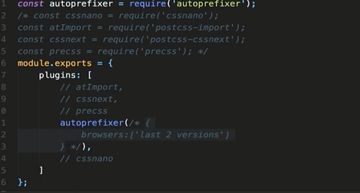
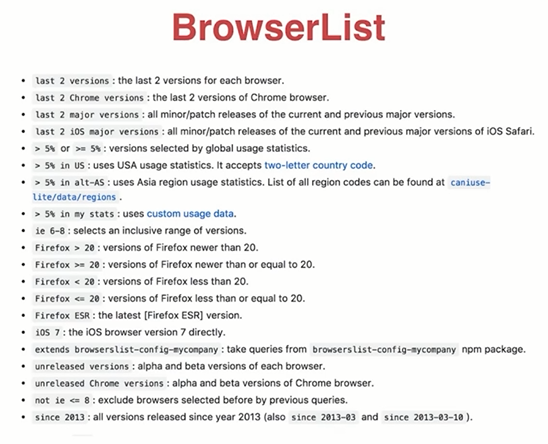
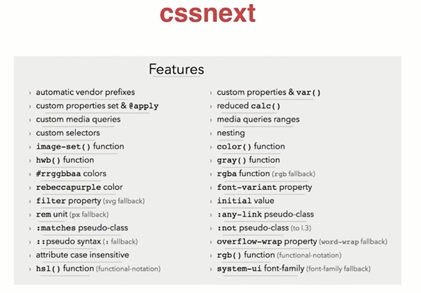
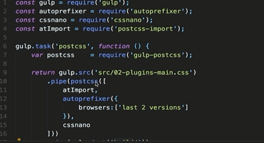

# CSS工程化


- 组织
- 优化
- 构建
- 维护

## PostCSS

CSS -> PostCSS解析转换 -> CSS

PostCSS解析转换：模块化、加前缀、兼容性、...

- PostCss本身只有解析能力
- 各种神奇的特性全靠插件
- 目前至少200多个插件


常用
- import 模块合并
- autoprefixier 自动加前缀
- cssnano 压缩代码
- cssnext 使用最新CSS特性
- precss 变量、mixin、循环

```
npm install postcss-cli

./node_modules/.bin/postcss


./node_modules/.bin/postcss  源文件 -o 目标文件
```

### postcss.config.js



### blist



### cssnext




```css
:root {
  --heading-color: #ff0000;
}

/* custom selectors */
@custom-selector :--headings h1, h2, h3, h4, h5, h6;

/* usage */
:--headings { 
  color: var(--heading-color);
}
```


### precss

- 变量
- 条件（if）
- 循环
- Mixin Extend
- import
- 属性值引用

```css
$line-height: 32px;

/* vertical rhythm function */
@function vr($amount) {
  @return $line-height * $amount;
}

/* input */
.selector { margin-bottom: vr(2) }

/* output */
.selector { margin-bottom: 64px; }
```

## PostCss支持的构建工具

- Cli命令行工具
- webpack postcss-loader
- Gulp gulp-postcss
- Grunt grunt-postcss
- Rollup rollup-postcss
- ...

### gulp-postcss




### webpack

- JS是整个应用的核心入口
- 一切资源均由JS管理依赖
- 一切资源由webpack打包


npm install css-loader style-loader 


css-modules 
```js
{
    loader: 'css-loader', 
    options: {
        modules: true
    }
}
```

extract-text-plugin
```js
use: ExtractTextPlugin.extract({
    fallback: 'style-loader',
    use: {
        loader: 'css-loader', 
        options: {
            modules: true
        }
    }
})


new ExtractTextPlugin('build-css.css');
```

- css-loader 将css编程js
- style-loader 将js样式插入head
- ExtractTextPlugin 将css从js中提取出来
- css modules 解决css命名冲突的问题
- less-loader sass-loader 各种预处理器
- postcss-loader 处理PostCSS处理


## 总结

如何解决CSS模块化问题
- Less Sass等预处理器
- PostCSS插件(postcss-import/precss等)
- webpack处理css(css-loader/style-loader)

PostCSS可以做什么
- 取决于插件可以做什么
- autoprefixer cssnext precss等 兼容性处理
- import模块合并
- css语法检查  兼容想检查
- 压缩文件

css modules是做什么的，如何使用
- 解决类名冲突的问题
- 使用postcss或者webpack构建工具进行编译
- 在HTML模板中使用编译过程产生的类名


为什么要js来引用、加载css
- JS作为入口，管理资源有天然优势
- 将组建的结构、样式、行为封装到一起，增强内聚
- 可以做更多处理(webpack)
