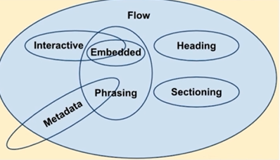

# HTML 基础

前端三大件：

- HTML 结构
- CSS 样式
- JS  行为

目标

- HTML 常见元素和理解
- HTML 版本
- HTML 分类
- HTML 元素的嵌套关系
- HTML 元素默认样式和定制化

常见元素：

```txt
meta
title
style
link
script
base
```

```txt
div / section /article / aside / header /footer
p
span / em / strong
table / thead / tbody / tr / td / th
ul / ol / li / dl / dt / dd
a
from / input / select / textarea / button
```

```html
<meta charset="utf-8">
<meta name="viewport" content="width=device-width, initial-scale=1.0,maximum-scale=1.0,user-scalable=no">
<base href="">
```

HTML 重要属性：

```txt
a [href,target]
img [src, alt]
table td [colspan, rowspan]
form [target, method, enctype]
input [type, value]
button [type]
select > option [value]
label [for]
```

如何理解 HTML？

- HTML "文档"
- 描述文档的 “结构”
- 有区块和大纲

工具：[https://h5o.github.io/](https://h5o.github.io/)

## HTML 版本

- HTML4 / 4.01 （SGML）
- XHTML（XML）
- HTML5

|   HTML4 |   XHTML |   HTML5   |
|   ---     |   --- |   ---     |
| 标签允许不结束    |   标签必须结束    |   标签允许不结束  |
| 属性不用带引号    |   属性必须带引号    |   不用带引号  |
| 标签属性可大写    |   标签属性必须小写    |   标签属性可大写  |
| Boolean 属性可省略值    |   Boolean属性必须写值    |   Boolean 属性可省略值  |

[http://validator.w3.org/](http://validator.w3.org/)

HTML5 新增内容：

1. 新区块标签：

    - section
    - article
    - nav
    - aside

2. 表单增强：

    - 日期、时间、搜索
    - 表单验证
    - PLaceholder、自动聚焦

新增语义标签：

- header \ footer 头尾
- section \ article 区域
- nav 导航
- aside 不重要内容
- em \ strong 强调
- i \ icon

## 元素分类

按默认样式分：

- 块级 block
- 行内 inline
- inline-block

按内容分：



参考：https://www.w3.org/TR/html5/dom.html

## HTML嵌套关系

- 块级元素可以包含行内元素
- 块级元素不一定能包含块级元素
- 行内元素一般不能包含块级元素
- 但。。。注意：一般

为什么 a 可以包含 div？

```html
<a ...>
    <div>
    </div>
</a>
```

## 默认样式和 reset

- 默认样式的意义
- 默认样式带来的问题
- CSS Reset

1. reset.css
2. normalize.css
3. `*{}`

## 问题

doctype 的意义是什么

- 让浏览器以标准模式渲染
- 让浏览器知道元素的合法性

HTML、XHTML、HTML5 的关系

- HTML 属于 SGML
- XHTML 属于 XML，是 HTML 进行 XML 严格化的结果
- HTML5 不属于 SGML 或 XML，比 XHTML 宽松

HTML5 有什么变化

- 新的语义化元素
- 表单增强
- 新的 API（离线、音视频、图形、实时通信、本地存储、设备能力）
- 分类和嵌套变更

em 和 i 有什么区别

- em 是语义化的标签，表示强调
- i 是纯样式的标签、标斜体
- HTML5 中i 不推荐使用，一般用作图标

语义化的意义是什么

- 开发中容易理解
- 机器容易理解结构（搜索、读屏软件）
- SEO
- Semantic Microdata

哪些元素可以自闭合？

```txt
input
img
br hr
meta link
```

HTML 和 DOM 的关系

- HTML 是'死'的
- DOM 由 HTML 解析而来，是活的
- JS 可以维护 DOM

property 和 attribute 的区别

- attribute 是死的
- property 是活的

form 的作用有哪些

- 直接提交表单
- 使用 submit、reset 按钮
- 便于浏览器保存表单
- 第三方库可以直接提取值
- 第三方库可以进行表单验证
