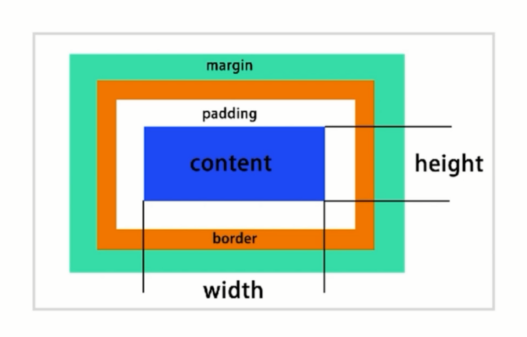

# CSS 布局

- CSS 知识体系的重中之重
- 早期以 table 为主（简单）
- 后来以技巧布局为主（难）
- flexbox/grid
- 响应式布局是必备

常用布局：

- table 表格布局
- float 浮动 + margin
- inline-block 布局
- floxbox 布局

## 表格布局

```css
.table{
    margin-top:20px;
    display: table;
    width:800px;
    height:200px;
}
.table-row{
    display: table-row;
}
.table-cell{
    vertical-align: center;
    display: table-cell;
}
```

```html
<div class="table">
    <div class="table-row">
        <div class="left table-cell">
            左
        </div>
        <div class="right table-cell">
            右
        </div>
    </div>
</div>
```

## 盒模型



```css
margin
border
padding
content(height\width)
```

确定元素的显示类型：

```css
display: block / inline / inline-block;
```

确定元素的位置：

```css
position: static / relative / absolute / fixed
z-index
```

absolute 是相对于 最近的 relative / absolute 来定位的

## flexbox

- 弹性盒子
- 盒子本来就是并列的
- 指定宽度即可

```css
display: flex;

flex: 1;
flex: 2;

width: 50px;
flex: none;
```

`注意版本兼容`

## float 布局

- 元素"浮动"
- 脱离文档流
- 但不脱离文本流

对自身的影响：

- 形成"块" (BFC)
- 位置尽量考上
- 位置尽量靠左(右)

对兄弟元素的影响：

- 上面贴非 float 元素
- 旁边贴 float 元素
- 不影响其他块级元素的位置
- 影响其他块级元素内部文本

对父级元素的影响：

- 从布局上"消失"
- 高度塌陷

清除浮动：

```css
.container::after{
    content: '';
    clear: both;
    display: block;
    visibility: hidden;
    height: 0;
}
```

**`思考`**：实现两栏、三栏布局

## inline-block布局

- 像文本一样排 block 元素
- 没有清除浮动元素
- 需要处理间隙

清除间隙：
- 方式一：父元素 font-size:0;
- 方式二：相邻子元素不换行显示
- 方式三：注释掉换行的内容

```html
<div class="container">
    <div class="left">
        左
        <!-- 重要，下面不能换行 -->
    </div><div class="right">
        右
    </div>
</div>
```

```html
<div class="container">
    <div class="left">
        左
    </div>
    <div class="right">
        右
    </div>
</div>
```

```html
<div class="container">
    <div class="left">
        左
    </div><!--
    --><div class="right">
        右
    </div>
</div>
```

## 响应式布局

- 在不同设备上正常使用
- 一般主要处理屏幕大小问题
- 主要方法：
    - 隐藏 + 折行 + 自适应空间
    - rem / viewport / media query

```css
html {
    font-size: 100px;
}

.text {
    font-size: .24rem;
}
```

```css
@media (max-width: 640px){
    .left{
        display: none;
    }
}
```

```css
@media (max-width: 640px){
    .intro{
        margin:.3rem auto;
        display: block;
    }
}
@media (max-width: 320px){
    .intro{
        margin:.2rem auto;
        display: block;
    }
}

/* 注意范围大的写在上面 小的写在下面 */
/* rem 使用到小数  精准布局不适用 */
```

## 主流网站布局方式

- float
- display
- 清除浮动
- flexbox

## 总结

实现两栏、三栏布局的方式：

- 表格布局
- float + margin 布局
- inline-block 布局
- flexbox 布局

position: absolute/fixed 有什么区别：

- 前者相对于最近的 absolute/relative
- 后者相对于屏幕(viewport)

display: inline-block 的间隙：

- 原因：字符间隙
- 解决：消灭字符 或者 消灭间距

如何清除浮动，为什么要清除浮动？

答：让盒子负责自己的布局；

- overflow: hidden(auto);
- ::after{clear: both}
- 使用单独元素

如何适配移动端页面？

- viewport
- rem / viewport / media query
- 设计上：隐藏 + 折行 + 自适应空间
