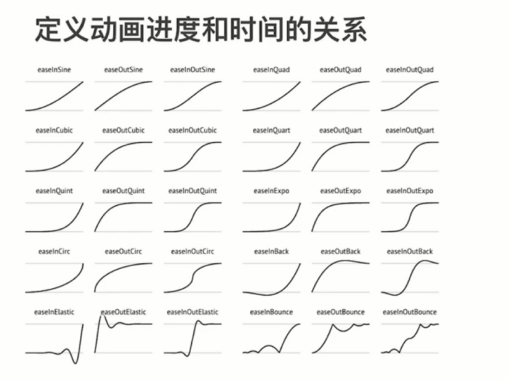

# CSS 动画

动画原理：

- 视觉暂留的作用
- 画面逐渐变化

动画的作用：

- 愉悦感
- 引起注意
- 反馈
- 掩饰

动画类型：

- transition 补间动画
- keyframes 关键帧动画
- 逐帧动画

## transition 补间动画

- 位置-平移： left、right、margin、transform
- 方位-旋转：transform
- 大小-缩放：transform
- 透明度：opacity
- 其他-线型变换：transform

`transition-timing-function: ease-in-out/linear/;`



```css
transition: all 1s;
transition-timing-function: ease-in-out;
transition-timing-function: cubic-bezier(0.465, -0.460, 0.525, 1.435);
transition-delay: 1s;
```

https://www.matthewlein.com

## keyframes 关键帧动画

关键帧动画：

- 相当于多个补间动画
- 与元素状态的变化无关
- 定义更加灵活

```css
{
    width: 100px;
    height: 100px;
    background: red;
    animation: run 1s linear;
    /* animation-direction: reverse; */
    /* animation-fill-mode: forwards; */
    animation-iteration-count: infinite;
    /* animation-play-state: paused; */
}
@keyframes run{
    0%{
        width: 100px;
    }
    50%{
        width: 800px;
    }
    100%{
        width: 100px;
    }
}


@keyframes aa{
    from{
        width: 100px;
    }
    to{
        width: 800px;
    }
}
```

## 逐帧动画

- 适用于无法补间计算的动画
- 资源较大
- 使用 steps()

```css
animation-timing-function: steps(1);
```

## 总结

css 动画的实现方式有几种：

- transition
- keyframes(animation)

过渡动画和关键帧动画的区别：

- 过渡动画需要有状态变化
- 关键帧动画不需要状态变化
- 关键帧动画能控制更精细

如何实现逐帧动画：

- 使用关键帧动画
- 去掉补间（steps）

CSS 动画的性能：

- 性能不坏
- 部分情况下优于 JS
- 但 JS 可以做到更好
- 部分高危属性：box-shadow 等
