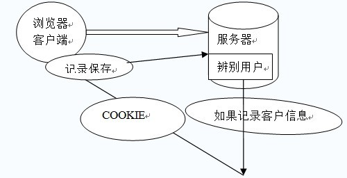
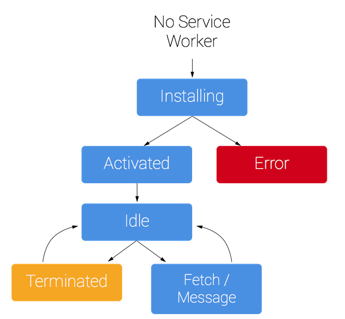

# 浏览器存储

- localstorage、cookie、sessionstorage、indexdb
- 理解pwa和service worker的应用

## Cookie



HTTP请求无状态，http response header 中的set-cookie

- 因为HTTP请求无状态，所以需要cookie去维持客户端状态
- 过期时间 expire
- cookie的生成方式
     1. http response header中的set-cookie
     2. js中可以通过document.cookie可以读写cookie
- 仅仅作为浏览器存储（大小4KB左右，能力被localstorage替代）
- cookie中在相关域名下面 —— cdn的流量损耗
- httponly

```js
var Cookie = {
    // 读取
    get: function (name) {
        var cookieStr = "; " + document.cookie + "; ";
        var index = cookieStr.indexOf("; " + name + "=");
        if (index != -1) {
            var s = cookieStr.substring(index + name.length + 3, cookieStr.length);
            return unescape(s.substring(0, s.indexOf("; ")));
        } else {
            return null;
        }
    },
    // 设置
    set: function (name, value, expires) {
        var expDays = expires * 24 * 60 * 60 * 1000;
        var expDate = new Date();
        expDate.setTime(expDate.getTime() + expDays);
        var expString = expires ? "expires=" + expDate.toGMTString() : "";
        var pathString = ";path=/";
        document.cookie = name + "=" + escape(value) + expString + pathString;
    },
    // 删除
    del: function (name) {
        var exp = new Date(new Date().getTime() - 1);
        var s = this.read(name);
        if (s != null) {
            document.cookie = name + "=" + s + "expires=" + exp.toGMTString() + ";path=/"
        }
    }
};
```

## LocalStorage

- HTML5设计出来专门用于浏览器存储的
- 大小为5M左右
- 仅在客户端使用，不和服务端进行通信
- 接口封装较好
- 浏览器本地缓存方案

api
- 保存数据：localStorage.setItem(key,value);
- 读取数据：localStorage.getItem(key); 
- 删除单个数据：localStorage.removeItem(key); 
- 删除所有数据：localStorage.clear(); 
- 得到某个索引的key：localStorage.key(index); 

[store.js](https://github.com/marcuswestin/store.js)

## SessionStorage

- 会话级别的浏览器存储
- 大小为5M左右
- 仅在客户端使用，不和服务端进行通信
- 接口封装较好
- 对于表单信息的维护

## IndexedDB

- IndexedDB 是一种低级API，用于客户端存储大量结构化数据。该API使用索引来实现对该数据的高性能搜索。虽然 Web Storage 对于存储较少量的数据很有用，但对于存储更大量的结构化数据来说，这种方法不太有用。IndexedDB提供了一个解决方案。
- 为应用创建离线版本


## PWA

PWA (Progressive Web Apps) 是一种 Web App 新模型，并不是具体指某一种前沿的技术或者某一个单一的知识点，我们从英文缩写来看就能看出来，这是一个渐进式的 Web App，是通过一系列新的 Web 特性，配合优秀的 UI 交互设计，逐步的增强 Web App 的用户体验。


- 可靠：在没有网络的环境中也能提供基本的页面访问，而不会出现“未连接到互联网”的页面。
- 快速：针对网页渲染及网络数据访问有较好优化。
- 融入（Engaging）：应用可以被增加到手机桌面，并且和普通应用一样有全屏、推送等特性。

chrome扩展工具 lighthouse （下载地址：https://lavas.baidu.com/doc-assets/lavas/vue/more/downloads/lighthouse_2.1.0_0.zip）


## Service Worker

Service Worker 是一个脚本，浏览器独立于当前网页，将其在后台运行,为实现一些不依赖页面或者用户交互的特性打开了一扇大门。在未来这些特性将包括推送消息,背景后台同步， geofencing（地理围栏定位），但它将推出的第一个首要特性，就是拦截和处理网络请求的能力，包括以编程方式来管理被缓存的响应。

- chrome://serviceworker-internals/
- chrome://inspect/#service-workers




- Service Worker离线应用
- Service Worker的主页面之间的通信
