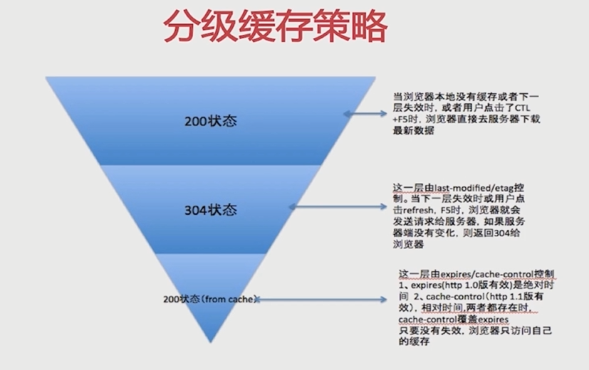
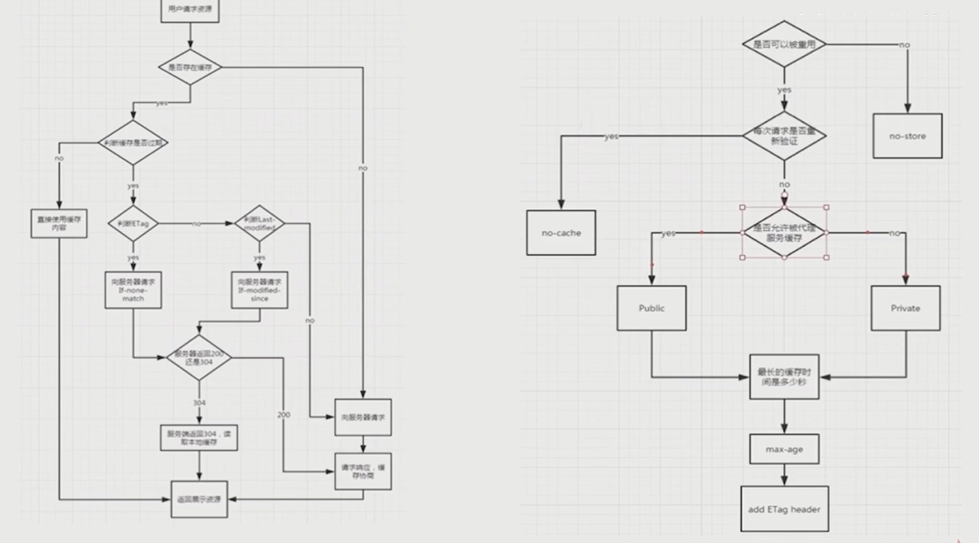

# 缓存

目标
- 理解cache-control所控制的缓存策略
- 理解last-modified和etag以及整个服务端浏览器端的缓存流程
- 基于nodejs实践缓存方式

## httpheader

### cache-control

- max-age：最大有效时间
- s-maxage
- private
- public
- no-cache
- no-store

** 
- Response
- Request

### Expires

缓存过期时间，用来指定资源的到期时间，是服务器端的具体的时间点

告诉浏览器在过期时间之前，浏览器可以直接从浏览器缓存中读取数据，而无需再次请求

### Last-Modified、If-Modified-Since

- 基于客户端和服务端协商的缓存机制
- last-modified --- response header
- if-modified-since --- request header
- 需要与cache-control共同使用

缺点：
1. 某些服务器不能获取精确的修改时间
2. 文件修改时间改了，文件内容没变

## Etag、If-None-Match

- 文件内容的hash值
- etag --- response header
- if-none-match --- request header
- 需要与cache-control共同使用

## 流程图

## nodejs下的缓存
