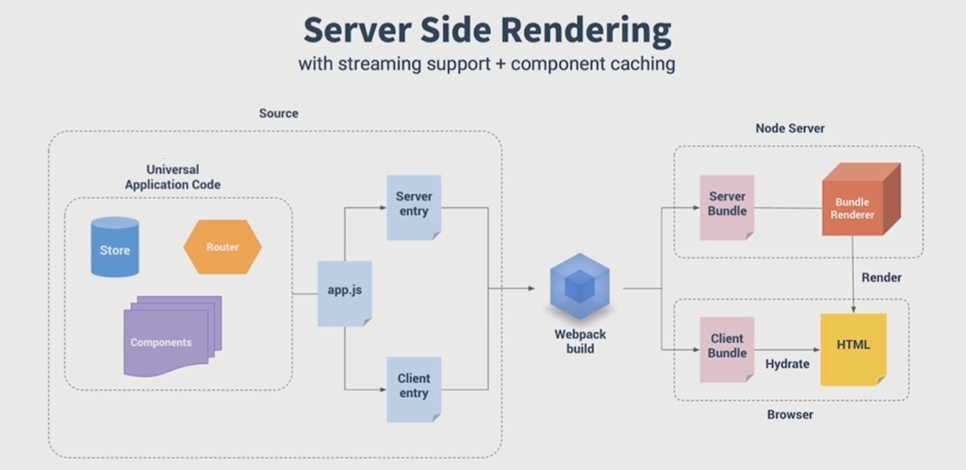

# 服务端性能优化

- CSR渲染的问题
- SSR的原理和应用

vue渲染面临的问题是什么？

- 下载vuejs
- 执行vuejs
- 生成html页面
- 白屏时间过长

**
- jsp、Php服务器端直出html
- 使用jq异步加载数据
- 使用React和vue前端框架

怎么在vue这个层面对性能进行提升？
- 构建层面模板编译
- 数据无关的prerender的方式
- 服务端渲染

