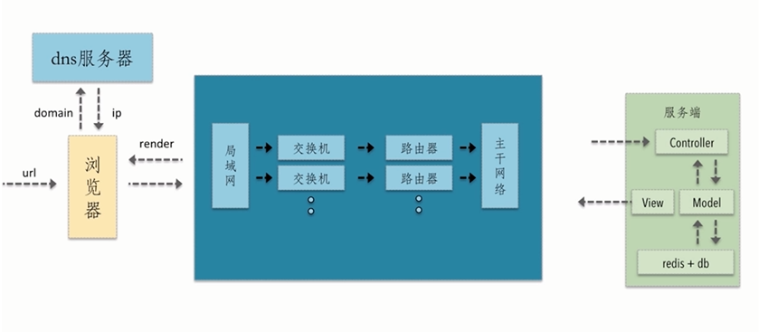

# 资源的合并与压缩

目标

- 理解减少 http 请求、减少请求资源大小两个优化要点
- 合并压缩的原理
- 通过在线网站和自动化工具实现压缩合并的方式

## http 清求的过程及潜在的性能优化点

web 前端本质上是一种 GUI 软件，本可以直接借鉴其他 GUI 系统架构设计方式，但 web 前端有点特别。

- CS 架构 GUI 软件的开发与部署：如安卓 app
- web 前端的开发与部署过程：webServer/cdn

1. `CS架构`的 GUI 软件的开发与部署过程：

   开发代码 -----> 打包 -----> 运行

   以 android 为例：开发代码后，打包一个 apk 包，放置到应用平台，用户从应该商店下载该 apk 包，实际上进行解压，在用户的手机本地是有一份本地的代码的，用户访问的实际上都是本地资源。

2. `web前端（BS架构）`的开发与部署过程：

   开发代码 -----> 将代码发布到 webServer 以及 CDN -------> 运行

   其中，运行的过程是：用户打开浏览器，输入网址，浏览器向 webServer 发出请求，**动态的、增量式**的加载静态资源。

   因此 web 前端加载静态资源是（通过 http 请求）动态地、增量式的一个过程。

浏览器的一个请求从发送到返回都经历了什么

url ---> 浏览器 ---> dns 服务器 ---> ip ---> 局域网/交换机/路由器/主干网络 -----> Controller/Model/redis+db/View ---> 返回

优化点：

1. dns 是否可以通过缓存减少查询时间
2. 网络请求的路径走最近的网络环境
   - CDN 是请求动态资源用的，在请求静态资源时，http 请求中携带的 cookie 信息是不需要的，所以通常我们此时会将请求中的 cookie 去掉。
   - 如果我们主站的域名与 CDN 的域名相同的话，在访问 CDN 的时候，这些 cookie 信息默认是会被携带的。这通常是对网络无谓的损耗，所以**通常 CDN 的域名要与主站的域名保持不一样**，防止访问 CDN 的同时携带主站 cookie。
3. 相同的静态资源缓存
   - 相同的静态资源可以缓存
4. 减少 http 请求大小
5. 减少 http 请求
6. 服务端渲染
   - 当前主流框架，它们的模板都是在浏览器端进行渲染的，不是直出的 html，而是需要走框架中相关的框架代码才能渲染出页面，那么这个渲染过程对于首屏就有很大的损耗。这点其实是不利于前端的性能的。
   - 业界的解决方案是--服务端渲染--将整个 html 直出到浏览器端，而不是在浏览器端进行渲染。

其他优化点：

- html 压缩
- css 压缩
- js 的压缩与混淆
- 文件合并
- 开启 gzip

## html 压缩

html 压缩就是压缩这些在文本文件中有意义，但在 HTML 中不显示的字符，包括空格、制表符、换行符等，还有部分有意义的，如 HTML 注释等

- html 本身就是一种超文本标记语言，html 文档中的空格、回车等字符在我们写代码时，可以帮助我们更清晰的看清代码结构。
- 但是浏览器在解析 html 文档时，这些空格、回车、注释等字符是没有意义的，浏览器不需要良好的代码风格。
- 因此，html 压缩其实上就是去掉这些在文本文件中有意义，但在 html 中没有意义的字符。

html 压缩：

1. 使用在线网站进行压缩
2. nodejs 提供了 html-minifier 工具
3. 后端模板引擎渲染压缩

## css 压缩

- 无效代码的删除
- css 语义合并

css 压缩：

1. 使用在线网站进行压缩
2. nodejs 提供了 html-minifier 工具，对 html 中的 css 进行压缩
3. 使用 clean-css 之类的工具进行压缩

## js 压缩与混乱

1. 无效代码的删除
2. 剔除注释
3. 代码语义的缩减和优化
4. 代码保护
   - 对于前端来说，代码是透明的，客户端的代码用户是可以看到的，如果客户端的代码的语义非常明显，没有进行过压缩与混乱，代码格式还是完整保留的话，对于任何一个用户来说，它都可以窥探到网站的漏洞
   - 所以 js 压缩与混乱，降低代码的可读性实际上是对代码的一种保护。

压缩：

1. 使用在线网站进行压缩
2. nodejs 提供了 html-minifier 工具，对 html 中的 js 进行压缩
3. uglifyjs2 对 js 进行压缩

最好是使用构建工具结合上面的来进行 js 压缩。

## 文件合并

合并文件存在的问题:

1. 首屏渲染的问题
   - 当我们在进行文件合并的时候，合并之后的资源显示会比合并之前的大，那么在渲染的时候，则整个页面的渲染就要等到整个资源被请求回来之后才能渲染，如果这个资源过大，请求过慢，则会影响整个首屏的渲染的效率。
   - vue、react 等框架，如果在没有使用服务端渲染的情况下，它的渲染过程通常是由框架来接管的。那么它的渲染过程必须要等到框架代码执行完之后才能进行渲染，如果这个框架代码被一个非常大的 js 合并在一起了，这样的话，就会有首屏渲染的问题。
2. 缓存失效的问题
   - 使用 md5 戳来唯一标识 资源是否发生变化
   - 如果不合并，改动其中一个资源，并不会影响其他资源的变化，从而更不会引起缓存大面积的失效。只会引起当前改动的资源的缓存失效。
   - 如果合并之后，改动任何一个，都会引起其他一起合并的资源的缓存也失效。也就引起了缓存大面积失效的问题。

以上这两点是在进行文件合并的时候，重点要考量的点。

所以，对于文件合并，有以下三个建议。

文件合并建议：

1. 公共库的合并
   - 公共资源库单独打包
2. 不同页面的合并
   - SPA，不能将所有的页面合并成一个进行打包
   - 应该是将不同页面的 js 单独打包，
   - （当路由到某个页面的时候，才去加载那个组件，以及页面对应的 js 文件）
3. 见机行事，随机应变

方案：

1. 在线网站
2. nodejs 实现文件合并：gulp、fis3、webpack 等

现在的构建工具基本都能够很好的完成文件合并的工作，如 grunt、gulp、webpack、fis3 等。

了解这些构建工具的原理或者至少知道它们之间的区别。
