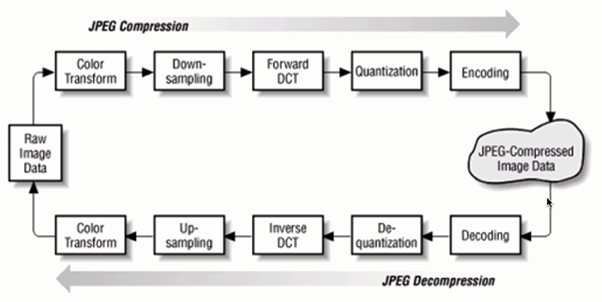

# 图片相关的优化

- 图片相关优化的核心
- 优化方式

## 有损压缩 - 一张 jpg 图片的解析过程

## png8、png24、png32之间的区别

1. PNG8：256 色 PNG 的别名，只有 256 种颜色，和 GIF 比较类似，支持索引色透明和 Alpha 透明。

2. PNG24：全色PNG的别名，不支持透明，但是颜色数变多了。每一张"png24"图像，可展示的颜色就远远多于"png8"了，最多可展示的颜色数量多大1600万；所以"png24"所展示的图片颜色会更丰富，图片的清晰度也会更好，图片质量更高，当然图片的大小也会相应增加，所以"png24"的图片比较适合像摄影作品之类颜色比较丰富的图片；

3. PNG32：全色PNG的别名，在 PNG24 的基础上增加了Alpha通道。

Alpha：一个图像的每个像素都有 RGB 三个通道，后来 Alvy Ray Smith 提出每个像素再增加一个 Alpha 通道，取值为0到1，用来储存这个像素是否对图片有「贡献」，0代表透明、1代表不透明。也就是说，「Alpha 通道」储存一个值，其外在表现是「透明度」，Alpha 和透明度没啥关系。

`真正让图片变透明的不是Alpha 实际是Alpha所代表的数值和其他数值做了一次运算 比如你有一张图片你想抠出图片中间的一部分 在PS里你会建立一个蒙板 然后在蒙板里把不需要的地方填充成黑色 需要的留成白色 这个时候实际上是是做了一次乘法 用黑色所代表的数值0去乘以你所填充的地方 那么这个地方就变透明了 反之白色所代表的数值1乘以你需要保留的地方 1乘以任何数都还是那个数本身 而0乘以任何数都是0  如果需要半透明的效果就用灰色去填充`

## 不同格式图片常用的业务场景

- jpg 有损压缩，压缩率高，不支持透明
- png 支持透明，浏览器兼容好
- webp 压缩程度更好，在 ios webview 有兼容性问题
- svg 矢量图，代码内嵌、相对较小，图片样式相对简单的场景

**

- jpg：大部分不需要透明图片的业务
- png：大部分需要透明图片的业务
- webp：安卓全部
- svg：图片样式相对简单的业务

## 图片压缩的方式

- css 雪碧图
- Image inline
- base64

在安卓下使用webp：WebP 格式，谷歌（google）开发的一种旨在加快图片加载速度的图片格式。图片压缩体积大约只有JPEG的2/3，并能节省大量的服务器宽带资源和数据空间。Facebook Ebay 等知名网站已经开始测试并使用WebP格式。
