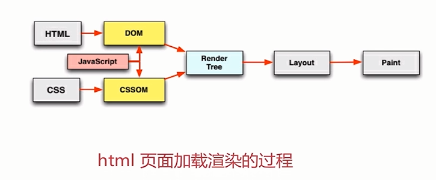

# css 和 js 的装载与执行

HTML渲染过程的一些特点

- 顺序执行、并发加载
    - 词法分析
    - 并发加载
    - 并发上限
- 是否阻塞
    - css 阻塞
        - css head 中阻塞页面的渲染
        - css 阻塞 js 的执行
        - css 不阻塞外部脚本的加载
    - js 阻塞
        - 直接引入的 js 阻塞页面的渲染
        - js 不阻塞资源的加载
        - js 顺序执行，阻塞后续 js 逻辑的执行
- 依赖关系
    - 页面渲染依赖于 css 的加载
    - js 的执行顺序的依赖关系
    - js 逻辑对于 dom 节点的依赖关系
- 引入方式
    - 直接引入
    - defer
    - async
    - 异步动态引入 js

## 加载和执行的一些优化点

- css 样式表置顶
- 用 link 代替 import
- js 脚本置底
- 合理使用 js 的异步加载能力
