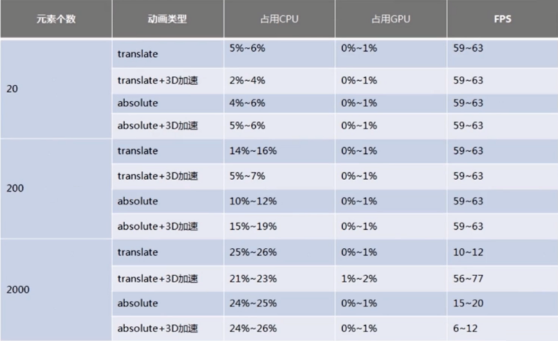

# 重绘与回流

目标：

1. 理解浏览器重绘与回流的机制
2. 如何通过代码层面的优化，减少重绘与回流，从而减小浏览器渲染上的负担？
3. 浏览器的layout 和 paiting 是如何进行的？深入了解浏览器绘制的整个过程。
4. 哪些机制会触发重绘与回流？哪些机制不会？这些机制下，浏览器的表现是怎么样的？如何css代码创建一个新的图层，从而减少绘制的区域？

## CSS 性能让 JavaScript 变慢？

1. css 放在 head 中，页面的渲染会被阻塞的。
2. 同样，js代码执行时，页面的渲染也是会被阻塞的。
    * 在js中写一个死循环，会导致页面完全卡死，整个界面没有办法操作，浏览器没有响应。
    * 原因就在于 js 导致整个渲染没有办法进行。

3. 实质上，js 引擎与 UI引擎是在两个单独的线程中工作的。
    * 在浏览器中，有一个线程是专门进行 js 解析的。
    * 另一个线程是专门进行 UI 渲染的。

4. 既然是在不同的线程内，为什么会相互阻塞呢？
    * 原因在于，js可能会需要获取到UI 线程中渲染之后的结果。
    * 在这种场景下，渲染前与渲染后的结果可能会不一样，如果 UI 线程与 js线程并行执行的话，有可能就获取不到我们希望的结果。
    * 所以在浏览器中，**UI线程与js线程是互斥的**。
5. UI线程与js线程是互斥
    * 换句话说，当UI线程在渲染的时候，js线程是被中止，没有被执行，是处于被**冻结**的。
    * 当 js 线程在执行的时候，UI线程也是被冻结的。

6. 所以，css的性能会让 javascript变慢是正确的。
    * css 核心会影响页面的展示，渲染的流程（重绘与回流）如果频繁的触发的话，会导致UI频繁渲染，最终导致js变慢。

这个问题引出一点：**css 的性能是非常重要**的，**css 不仅影响渲染，还影响 js 代码执行**。

所以我们需要尝试去优化 css 写法和性能，从而让 UI 线程的渲染次数和渲染难度降低，从而加快渲染的速度。

## 回流

1. 当 render tree 中的一部分（或全部）因为元素的**规模尺寸**、**布局**、**隐藏**等改变而需要重新**构建**。这就称为回流（reflow）。
    * 像手淘，商品列表是分页的，往下滑动，会有新的商品图片不断的增加到DOM 树上。
    * 这种就是典型的，动态修改render tree的布局变化。
    * 这种情况下肯定会触发回流。
2. 当页面的**布局**和**几何属性**发生改变的时候会触发回流。
    * 鼠标移过，图片尺寸变大，也会触发回流

减少使用 css 属性触发回流，可以在回流上做一些优化。

## 重绘

1. 当 render tree 中的一些元素需要重新更新属性，而这些属性只是影响元素的**外观、风格，而不影响布局**的，比如 background-color。则就叫做重绘。

2. **`回流必将引起重绘，而重绘不一定会引起回流`**。

综上：实际中，回流与重绘都对应着一些相应的 css 属性。通过避免 cs s触发回流与重绘的属性，从而可以做出在浏览器渲染层面的优化。

## 触发页面重布局的属性

1. 盒子模型相关属性，会触发重布局
2. 定位属性及浮动属性，会触发重布局
3. 改变节点内部文字结构，也会触发重布局

当这些属性触发时页面会重新布局，从而会触发回流。

- 盒子模型相关属性会触发重布局
    - width
    - height
    - padding
    - margin
    - display
    - border-width
    - border
    - min-height
- 定位属性及浮动也会触发重布局
    - top
    - bottom
    - left
    - right
    - position
    - float
    - clear
- 改变节点内部文字结构也会触发重布局
    - text-align
    - overflow-y
    - font-weight
    - overflow
    - font-family
    - line-height
    - vertival-align
    - white-space
    - font-size

## 只触发重绘的属性

- color
- border-style
- border-radius
- visibility
- text-decoration
- background
- background-image
- background-position
- background-repeat
- background-size
- outline-color
- outline
- outline-style
- outline-width
- box-shadow

## 新建 DOM 的过程

1. 获取 DOM 后分割为多个图层
2. 对每个图层的节点计算样式结果（Recalculate style--样式重计算）
3. 为每个节点生成图形和位置（Layout--回流和重布局）
4. 将每个节点绘制填充到图层位图中（Paint Setup 和 Paint--重绘）
5. 图层作为纹理上传至 GPU
6. 符合多个图层到页面上生成最终屏幕图像（Composite Layers--图层重组）

## 性能优化出发点

1. 能否避免使用上面这些触发重绘与回流的属性，减少页面重布局，减少回流次数，达到同样的效果，从而使得前端页面展示的性能提升？
    * 尤其在移动端，cpu计算能力不是特别强的情况下，使用这些css属性触发重绘与回流，它的代价是非常大的。
    * 页面展示会有非常卡顿的现象。

2. 缩小重绘与回流的范围
    * 重绘与回流的核心概念是“图层”
    * 将频繁重绘回流的DOM元素单独作为一个独立图层，那么这个DOM元素的重绘与回流的影响只会有这个图层。
    * 图层的缺点：
        * 图层的合并过程是非常消耗运算量的。
        * 所以要极力避免使用图层。
3. 如何将DOM元素变成独立的新图层？
    * `chrome 创建图层的条件`：
        - 3D 或透视变换（perspective transform）CSS属性
        - 使用加速视频解码的 `<video>` 节点
        - 拥有 3D（WebGL）上下文或加速的 2D上下文的 `<canvas>` 节点
        - 混合插件（如 Flash）
        - 对自己的 opacity 做 CSS 动画或使用一个动画 webkit 变换的元素
        - 拥有加速 CSS 过滤器的元素
        - 元素有一个包含复合层的后代节点（一个元素拥有一个子元素，该子元素在自己的层里）
        - 元素有一个 z-index 较低且包含一个复合层的兄弟元素（换句话说就是该元素在复合层上面渲染）
    * gif 图

## 小总结：

- 避免使用触发重绘、回流的css属性
- 将重绘、回流的影响范围限制在单独的图层之内

## 优化点

1. 用 translate 替代 top 改变 (top 会触发回流，translate 则不会)
2. 用 opacity 替代 visibility
3. 不要一条一条地修改 DOM 的样式，预先定义好 class，然后修改 DOM 的 className
4. **把DOM离线后修改**，比如：先把 DOM 给 display:none (有一次 Reflow)，然后你修改100次，然后再把它显示出来
5. 不要把 DOM 结点的属性值放在一个循环里当成循环里的变量
    * DOM 节点的属性值，比如 offsetHeight 或者 offsetWidth。
    * 浏览器**在获取这些属性值时会触发回流区flash**，以防有缓存，会flash(刷新)掉回流缓冲区以保证能获取最新的值。
    * 最好的做法是：**获取到这些属性，赋值到某个变量中**。在js代码中保存，而不是每次都去获取。
6. 不要使用 table 布局，可能很小的一个小改动会造成整个 table 的重新布局
    * table 非常大的时候，一次小改动，会增加layout的时间。
    * 推荐使用 div 布局
7. 动画实现的速度的选择
    * 由于UI线程与js线程互斥，所以css性能会使得javascript变慢，它们之间相互阻塞。
    * 动画会触发回流，如果动画的频率过高，出现多次重复渲染，那么js代码会受到UI线程的阻塞，导致页面非常卡顿。
    * 而且回流与重绘非常消耗CPU资源，所以要选择合适的动画速度。
8. 对于动画新建图层
    * video/ canvas/ transform 等DOM元素，浏览器会把这些DOM节点创建新的图层
    * 因为这些DOM元素一定会频繁地进行回流与重绘。
    * 浏览器是自动为这些DOM元素创建新图层的
9. 启用 GPU 硬件加速
    * GPU是一个并行运算的运算单元
    * webGL 有渲染器，有能力进行并行运算，选择GPU加速
    * 启用GPU加速也是有代价的：因为原来的数据都是在CPU上的，如果要使用GPU加速，意味着数据要从总线传到GPU上，那么GPU才可以对数据进行运算。
    * 如果数据过多，那么数据从CPU传输到GPU过程，也会存在传输损耗。
    * 所以到底什么情况下适合使用GPU加速，也是需要balance的一个点。

bad case:
```js
var doms = []; // 通过选择器选择出了一个dom元素的数组
var domsTop = [];
// 去根据当前页面的可视区域的高度，计算这个dom元素的位置
for(var i=0; i<doms.length; i++) {
    domsTop.push(document.body.clientHeight + i*100) // 在循环中直接获取元素属性，会导致回流缓冲区的flash。从而导致性能下降。
}
```

good case:
```js
var doms = [];
var domsTop = [];
var clientHeight = document.body.clientHeight; // 在循环外面对获取到的属性，保存到一个变量中。
for(var i=0; i<doms.length; i++) {
    // 然后在循环中使用变量即可
    domsTop.push(clientHeight + i*100)
}
```


