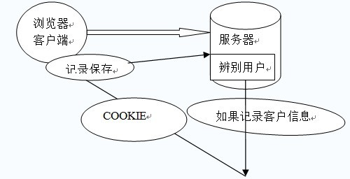
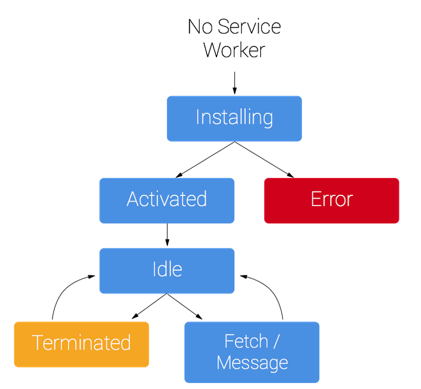

# 浏览器存储

- localstorage、cookie、sessionstorage、indexdb
- 理解 pwa 和 service worker 的应用

目标：

* 理解 localStorage、cookie、sessionStorage、indexDB的概念和使用
* 学习理解 pwa 和  service worker 的应用
    * pwa 非常火，到底它在性能优化上能起到什么样的作用
    * service worker 在手淘上是如何运作的？以及如何通过service worker做一些不阻塞浏览器渲染的大数据的处理？

## Cookie

- cookie 最常见的业务场景就是：用 cookie 给服务端传递相关信息，让服务端来辨别用户。

- 为什么要使用 cookie 来做这件事呢？
  - 实际上 cookie 是 1993 年诞生的，它诞生的目的就是用来区分一个 http 请求的客户端情况。
  - 因为**http 请求本身是无状态的**，http 协议是一种无状态协议。
  - 当 http 请求结束之后，这个连接就关闭了，那么下一次再发送请求到服务端，它**不能跟踪 http 请求的会话发生情况**，
  - 在这种场景下，我们很难解决一个问题就是：如何保存用户信息、登录信息？
  - 在 cookie 诞生之前是没有特别好的方案的，
  - 所以 93 年的时候，网景公司设计出了 cookie，**用来维护客户端状态**。通过 cookie 可以知道 http 请求来自于哪个客户端。因为用户的登录信息都存储在 cookie 中。这个客户端在浏览器中做了什么事情，这个其实服务端也是知道的。

- cookie 的生成方式：
  - （1）http response header 中的 set-cookie
    - 当浏览器客户端检测到 http response header 中有 set-cookie 时，就会把 set-cookie 中的值种植到浏览器的 cookie 这个区域里。
    - 所以，**cookie 是由服务端来生成，由客户端来存储和维护的。**
    - 所以，cookie 中的用户信息，服务端是知道的，并且通知客户端需要存下来。
    - 在之后该客户端所有的 http 请求中，都会携带此 cookie。那么服务端也由此就知道当前 http 请求来自于哪个客户端。
    - 这个逻辑生活中也很常见：比如去健身房，每次去都不携带任何状态，但是发给你一张卡，记录状态，就会知道你每次的信息和当前用户信息。
  - （2）js 中可以通过 document.cookie 可以读写 cookie

- cookie 的作用：
  - 用于浏览器端和服务端的交互(cookie 设计的初衷)
  - 客户端自身数据的存储

- cookie 存储的限制
  - 作为浏览器存储，大小 4KB 左右
  - 需要设置过期时间 expire
  - 若设置 httponly 属性时，则 js 无法读写 cookie
    - 因为如果 cookie 可以通过 js 来读写，就有可能被黑客攻击（比如模拟用户信息发送请求），因为 cookie 里维护了非常重要的客户端信息。

- cookie 存储数据能力被 localStorage 替代
- **cookie 是一个域名维度下的概念**：
  - 同一个域名下的所有请求，都会携带上 cookie（并不是所有的请求都需要用到 cookie，如静态资源的请求）
  - 所以**cookie 在相关域名下面---存在：cdn 的流量损耗**
  - 当我们只请求 js、css、图片等静态资源时，应该从 http 请求中去掉 cookie 信息
  - 正确做法就是： **cdn 的域名和主站的域名要分开**。
  - 这样在请求 cdn 静态资源的时候，就不会携带 cookie 信息了。节省无谓的网络开销。

cookie 实际上经历了一个既当爹又当妈的状态，不仅可以维护客户端状态，还可以作为浏览器端存储。



HTTP 请求无状态，http response header 中的 set-cookie

- 因为 HTTP 请求无状态，所以需要 cookie 去维持客户端状态
- 过期时间 expire
- cookie 的生成方式
     1. http response header 中的 set-cookie
     2. js 中可以通过 document.cookie 可以读写 cookie
- 仅仅作为浏览器存储（大小 4KB 左右，能力被 localstorage 替代）
- cookie 中在相关域名下面 —— cdn 的流量损耗
- httponly 属性的 cookie —— js 无法读写

```js
var Cookie = {
    // 读取
    get: function (name) {
        var cookieStr = "; " + document.cookie + "; ";
        var index = cookieStr.indexOf("; " + name + "=");
        if (index != -1) {
            var s = cookieStr.substring(index + name.length + 3, cookieStr.length);
            return unescape(s.substring(0, s.indexOf("; ")));
        } else {
            return null;
        }
    },
    // 设置
    set: function (name, value, expires) {
        var expDays = expires * 24 * 60 * 60 * 1000;
        var expDate = new Date();
        expDate.setTime(expDate.getTime() + expDays);
        var expString = expires ? "expires=" + expDate.toGMTString() : "";
        var pathString = ";path=/";
        document.cookie = name + "=" + escape(value) + expString + pathString;
    },
    // 删除
    del: function (name) {
        var exp = new Date(new Date().getTime() - 1);
        var s = this.read(name);
        if (s != null) {
            document.cookie = name + "=" + s + "expires=" + exp.toGMTString() + ";path=/"
        }
    }
};
```

## LocalStorage

- HTML5 设计出来专门用于浏览器存储的
- 大小为 5M 左右
- 仅在客户端使用，不和服务端进行通信
- 接口封装较好
    * 在js层面有比较好的API封装
    * 对于cookie来说，并没有过多js操作的接口
- 浏览器本地缓存方案

API：

- 保存数据：localStorage.setItem(key,value);
- 读取数据：localStorage.getItem(key);
- 删除单个数据：localStorage.removeItem(key);
- 删除所有数据：localStorage.clear();
- 得到某个索引的 key：localStorage.key(index);

[store.js](https://github.com/marcuswestin/store.js)

## SessionStorage

- 会话级别的浏览器存储
- 大小为 5M 左右
- 仅在客户端使用，不和服务端进行通信
- 接口封装较好
- 对于表单信息的维护
    * 可以时时地将表单信息存储在 sessionStorage中，即使用户刷新页面，信息依然还在。
    * 当tab关闭时，表单信息就会被清空。

## IndexedDB

- IndexedDB 是一种低级 API，用于客户端存储大量结构化数据。该 API 使用索引来实现对该数据的高性能搜索。虽然 Web Storage 对于存储较少量的数据很有用，但对于存储更大量的结构化数据来说，这种方法不太有用。IndexedDB 提供了一个解决方案。
- 为应用创建离线版本

## PWA

PWA (Progressive Web Apps) 是一种 Web App 新模型，并不是具体指某一种前沿的技术或者某一个单一的知识点，我们从英文缩写来看就能看出来，这是一个渐进式的 Web App，是通过一系列新的 Web 特性，配合优秀的 UI 交互设计，逐步的增强 Web App 的用户体验。

- 可靠：在没有网络的环境中也能提供基本的页面访问，而不会出现"未连接到互联网"的页面。
    * 这是web app 相较于原生的app的一个比较大的劣势。
    * 因为 web app 是一个**动态地、增量式**加载资源的过程。
- 快速：针对网页渲染及网络数据访问有较好优化。
    * 原生 app 在页面切换时非常流畅
    * 而 web app 在页面切换时，很可能因为需要加载网络资源，页面的渲染速度有所影响。
- 融入（Engaging）：应用可以被增加到手机桌面，并且和普通应用一样有全屏、推送等特性。
    * 应用可以被增加到手机桌面，并且和普通应用一样有全屏、推送等新特性。

chrome 扩展工具 lighthouse： 用来检测一个 web app 是否是 pwa。
（下载地址：https://lavas.baidu.com/doc-assets/lavas/vue/more/downloads/lighthouse_2.1.0_0.zip）

## Service Worker

 service worker 产生的意义：
1. javascript是单线程的
    * 也就是说，js在用户层面是没有办法创建多个线程的。
    * 所有的js代码都在js的主线程上进行的。
    * 如果要进行大量运算的话，就会严重阻塞相关页面的渲染。因为 js线程与UI线程是互斥的。
2. 涉及到前端大量数量运算的场景，可以使用 service worker来单独开辟线程进行数据的获取与运算，然后把结果直接返回
    * 避免了页面渲染的阻塞。

Service Worker

1. service worker 是一个脚本，浏览器独立于当前网页，将其在后台运行。
    * **可以做一些大规模的数据运算，而不阻塞js主线程的执行**。
2. 为实现一些不依赖页面或者用户交互的特性打开了一扇大门。
3. 在未来这些特性将包括特推送消息、背景后台同步、geofencing（地理围栏定位），但它退出的一个首要特性，就是**拦截和处理网络请求的能力**，包括以编程方式来管理被缓存的响应。
    * 当请求发出的时候，会被service worker拦截，那么就可以直接用service worker的缓存来渲染页面，
    * 而不用去webserver，通过网络环境加载数据，减少了延迟和网络开销。
4. 用拦截网络请求的能力，**就可以实现做出一个离线应用**。

chrome提供了两个工具来进行 service workers 的检测与调试：

1. chrome://inspect/#service-workers
    * 可以检测出当前浏览器中正在启用 service workers 的网站有哪些。
2. chrome://serviceworker-internals
    * 可以检测出哪些网站已经在chrome中注册了 service workers

service worker 可以实现页面之间的通信：

* service worker 在接收到其他页面发送来的消息之后，会把该消息广播给除了信息来源页面之外的据页面。
* 这种场景就可以应用到大数据的处理，处理完成之后，再将消息传递给页面。



- Service Worker 离线应用
- Service Worker 的主页面之间的通信
