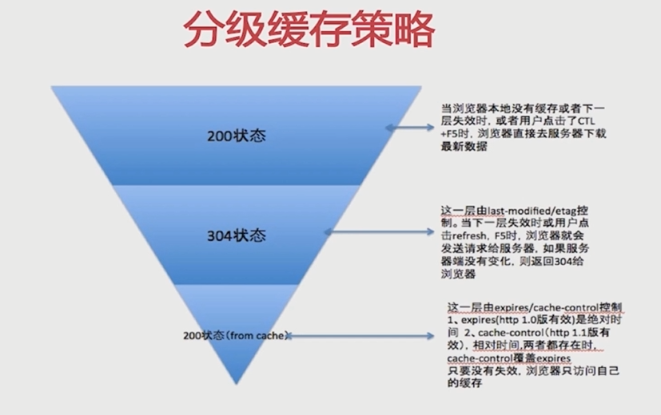
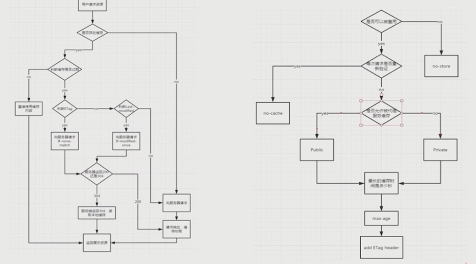

# 缓存

目标：

- 理解 cache-control 所控制的缓存策略
- 理解 last-modified 和 etag 以及整个服务端浏览器端的缓存流程
- 基于 nodejs 实践缓存方式

## httpHeader

### cache-control --- response / request

- max-age：最大有效时间
    * 在max-age 时间内，浏览器是不会向服务端发起请求的，
    * **max-age 会让浏览器在请求资源的时候，不去向服务端发起请求**。
    * 因为它知道在 max-age 时间内，这个请求对应的资源都是有效的，不会过期的。
    * 所以它会从 Status Code: 200 (from memory cache) 缓存中读取资源。
    * expires 是 http 1.0 里的配置
    * cache-control 是 http 1.1中新增的。
    * 所以 max-age 的优先级比 expires 高。
- s-maxage
    * Status Code: 304
    * **去 public 的缓存区去获取，比如 cdn**
    * s-maxage 设置的就是 public 缓存区的过期时间
- private
- public
    * cdn 就是 public的缓存
- no-cache
    * 不会像 max-age 那样，直接从缓存中拿数据，而不去服务端发请求
    * no-cache 的作用就是：不会直接从缓存中获取数据，而是要先发请求到服务端，确认下自己缓存中的数据有没有过期。
    * 服务端根据  last-modified 等来告知客户端中的缓存是否过期
- no-store
    * 使用了 no-store之后，就不会使用任何缓存策略。

```txt
    // response headers
    cache-control: max-age=315263058   // max-age的优先级比expires高
    expires: Sun, 15 Aug 2017 01:09:24 GMT
```

```txt
    cache-control: max-age=3600, s-maxage=31464679000
```

### Expires

- 缓存过期时间，用来指定资源的到期时间，是服务器端的具体的时间点
- 告诉浏览器在过期时间之前，浏览器可以直接从浏览器缓存中读取数据，而无需再次请求
- 与 max-age 原理一样。
- 都不会向服务器发起请求
- 问题：由于 max-age 与 expires 不再向服务器发起请求，而直接从浏览器缓存中取数据，就会导致无法感知到缓存的更新。

### Last-Modified、If-Modified-Since

- 服务端与客户端对于缓存资源是否修改进行的协商方案
- 客户端发起请求的时候，服务端在返回响应时，会把当前资源的修改时间加到 response header 的 last-modified 头中。
- 客户端拿到 response 时，会与 if-modified-since 的时间比较。
- 如果两者一致，表示服务端没有对请求的资源进行修改，返回304（Not Modified），客户端就可以直接去浏览器缓存中读取
- 如果不一致，表示缓存资源发生了变化，需要再次发送请求到服务端，获取最新的资源。
- 但是 last-modified 只有在 max-age或者expires 过期之后，才会跟服务端进行协商。
- 在 max-age 没有过期时，仍然是只从浏览器缓存中去获取。
- 需要与 cache-control 共同使用

缺点：

1. 某些服务器不能获取精确的修改时间
2. 文件修改时间改了，文件内容没变

## ETag、If-None-Match

- 针对 last-modified / if-modified-since 这种协商方案有缺陷，提出了 etag 协商方案。

- 文件内容的 hash 值
- response header 返回 etag
- request header 使用 if-none-match
- 比 last-modified / if-modified-since 这种协商方案更加精确，因为它是对文件内容匹配。
- 文件内容的修改，会直接反映在 etag 标签中存储的哈希值上。
- 需要与 cache-control 共同使用

## 分级缓存策略

1. 200状态（from cache）：这一层由 expires/cache-control: max-age控制
    * expires（http1.0版本有效）是绝对时间
    * cache-control（http1.1版本有效）是相对时间
    * 两者都存在时， cache-control 覆盖 expires
    * 只要没有失效，浏览器只访问自己的缓存

2. 304状态：这一层由 last-modified/etag 控制。
    * 当1层失效时或者用户点击refresh，F5时，浏览器就会发送请求给服务器，如果服务端没有变化，则返回304 给浏览器

3. 200状态：当浏览器本地没有缓存或者2层失效时，或者用户点击了 ctrl+f5时，浏览器直接去服务器下载最新数据。



## 流程图


