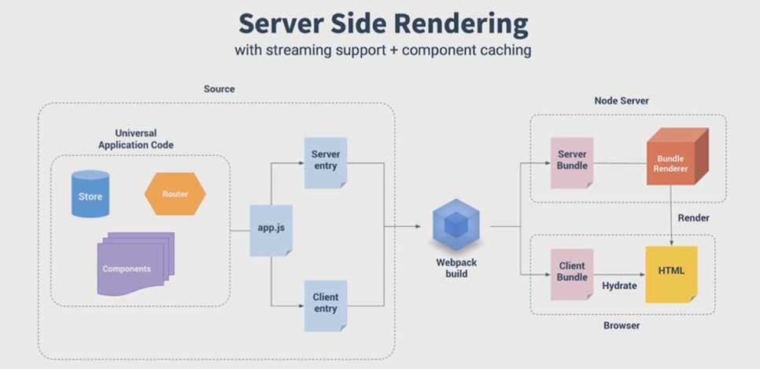

# 服务端性能优化

- CSR 渲染的问题
- SSR 的原理和应用

vue 渲染面临的问题是什么？

- 下载 vuejs
- 执行 vuejs
- 生成 html 页面
- 白屏时间过长

**
- jsp、Php 服务器端直出 html
- 使用 jq 异步加载数据
- 使用 React 和 vue 前端框架

怎么在 vue 这个层面对性能进行提升？
- 构建层面模板编译
- 数据无关的 prerender 的方式
- 服务端渲染

