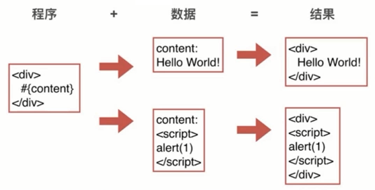

# XSS

Cross Site Scriping

跨站脚本攻击


## XSS 攻击原理




## XSS 攻击能干啥

- 获取页面数据
- 获取Cookies
- 劫持前端逻辑
- 发送请求
- 偷取网站任意资料
- 偷取用户资料
- 偷取用户密码和登录态
- 欺骗用户
- ......


## XSS 分类

- 反射型： url参数直接注入
- 存储型： 存储到DB后读取时注入


## XSS 攻击注入点

- HTML节点内容
- HTML属性
- JS代码
- 富文本


富文本
- 富文本的保留HTML
- HTML有XSS攻击风险

```js
ctx.set('X-XSS-Protection', 1);
```


## 防御

### HTML 节点内容


```html
<div>
    #{content}
</div>
```


转义 < `&lt;` 和 > `&gt;`

```js
var escapeHtml = function(str) {
    if(!str) return '';
    str = str.replace(/&/g, '&amp;');

    // 转换 < > 
    str = str.replace(/</g, '&lt;');
    str = str.replace(/>/g, '&get;');

    // 转义" ' 空格
    str = str.replace(/"/g, '&quto;');
    str = str.replace(/'/g, '&#39;');
    // str = str.replace(/ /g, '&#32;');
    return str;
}
```


