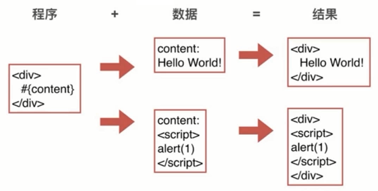
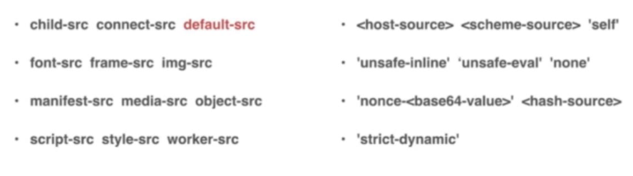

# XSS

Cross Site Scriping

跨站脚本攻击

## XSS 攻击原理

url 参数中携带 'script', 比如：https://www.host.com/?q=https://www.baidu.com/test.js



## XSS 攻击能干啥

- 获取页面数据
- 获取 Cookies
- 劫持前端逻辑
- 发送请求
- 偷取网站任意资料
- 偷取用户资料
- 偷取用户密码和登录态
- 欺骗用户
- ......

## XSS 分类

- 反射型： url 参数直接注入
- 存储型： 存储到 DB 后读取时注入

## XSS 攻击注入点

- HTML 节点内容
- HTML 属性
- JS 代码
- 富文本

富文本：

- 富文本的保留 HTML
- HTML 有 XSS 攻击风险

```js
ctx.set('X-XSS-Protection', 1);
```

## 防御

### HTML 节点内容

```html
<div>
    #{content}
</div>
```

转义 < `&lt;` 和 > `&gt;`

```js
var escapeHtml = function(str) {
    if(!str) return '';
    str = str.replace(/&/g, '&amp;');

    // 转换 < >
    str = str.replace(/</g, '&lt;');
    str = str.replace(/>/g, '&get;');

    return str;
}
```

转义引号为 `&quto;`

```js
var str = '';
str = str.replace(/"/g, '&quto;');
str = str.replace(/'/g, '&#39;');
str = str.replace(/ /g, '&#32;');
```

### HTML 属性

```html


```

### JS 代码

```js
var data = "#{data}";
var data = "hello";alert(123);"";
```

解决： 转义"\", 或者转换成 json

注意： 输入时是带有斜杠

### 富文本

- 黑名单： onerror 这种去掉
- 白名单：保留部分标签和属性

黑名单：

```js
var str = '';
str = str.replace(/<\s*\/?script\s*/g, '');
str = str.replace(/javascript:[^'"]*/g, '');
str = str.replace(/onerror\s*=\s[^'"]?[^'"]*/g, '');
```

```bash
npm i cheerio
npm i xss
```

## CSP

Content Security Policy

内容安全策略

用于指定哪些内容可执行



```js
ctx.set('Content-Security-Policy', 'default-src');
```

## PHP 中防御 XSS

- 内置函数转义
- DOM 解析白名单
- 第三方库
- CSP
