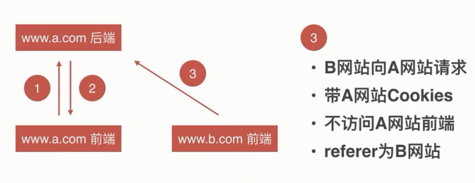

# CSRF

CSRF 全名是 Cross-site request forgery , 跨站请求伪造

CSRF 攻击危害
- 利用用户登录态
- 用户不知情
- 完成业务请求
- 盗取用户资金
- 冒充用户发帖
- 损坏网站名誉

## SCRF 防御



### SameSite
在 SameSite=Strict 的情况下，浏览器一般不会添加 cookie。如果 SameSite=Lax，则如果用户单击顶级网址，浏览器将发送 cookie

- 在前端加入验证
- 图形验证码
- Token

图形验证码
```bash
npm i ccap  // 图形验证码
```

Token: 在页面存入 Token，提交时携带校验

### Referer 头信息

Referer 校验： 来判断是否是自己的网站，在 http.header 中存在
