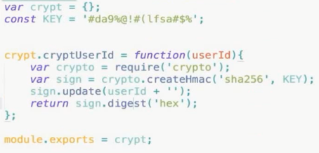

# Cookies 问题

- 前端数据存储
- 后端通过 http 头设置
- 请求时通过 http 头传给后端
- 前端可读写
- 遵守同源策略

## Cookies 特征

- 域名
- 有效期
- 路径
- http-only
- secure
- same-site

## Cookies 作用

- 存储个性化设置
- 存储未登录时用户唯一标识
- 存储用户登录凭证
- 其他作用

Cookies 登录用户凭证：

- 前端提交用户名和密码
- 后端验证用户名和密码
- 后端通过 http 头设置用户凭证

### 生成凭证

- 用户ID
- 用户ID + 签名

- SessionId：生成随机字符串和用户ID关联，业务处理式去校验

## Cookies 和 XSS 的关系

- XSS 可能偷走 Cookies
- http-only 的 Cookie 不会被偷

## Cookies 和 CSRF 的关系

- CSRF 利用了用户的 Cookies
- 攻击站点无法读写 Cookies
- 最好阻止第三方网站使用 Cookies

## Cookies 前端策略

- 签名防篡改
- 数据加密
- http-only(防止 XSS)
- secure
- same-site
