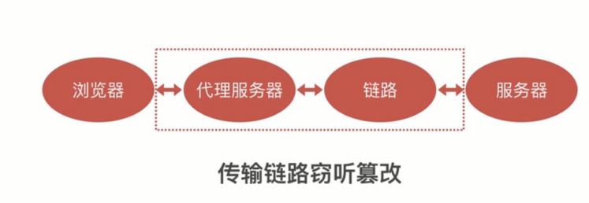
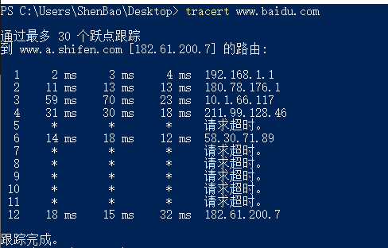
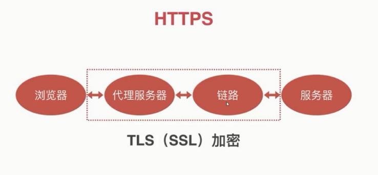
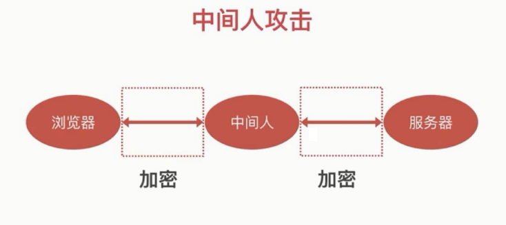
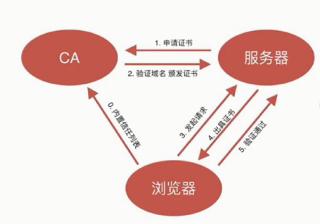

# 传输安全

## HTTP 传输窃听



traceroute 命令(unix) / tracert 命令(windows)
```bash
traceroute www.baidu.com

tracert www.baidu.com
```



代理软件： anyproxy

危害：

- 窃取用户名密码
- 铭感信息
- 个人信息

HTTP 篡改：

- 插入广告
- 重定向网站
- 无法防御的 XSS 和 CSRF 攻击

场景：

- 运营商劫持
- 局域网劫持
- 公共wifi获取密码

## HTTPS





如何确定服务器身份



- 证书无法伪造
- 证书私钥不被泄露
- 域名管理权不泄露
- CA 坚守原则

SSL for Free

nginx 下配置 https
