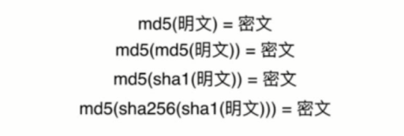
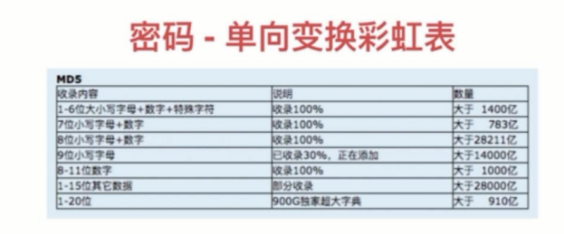
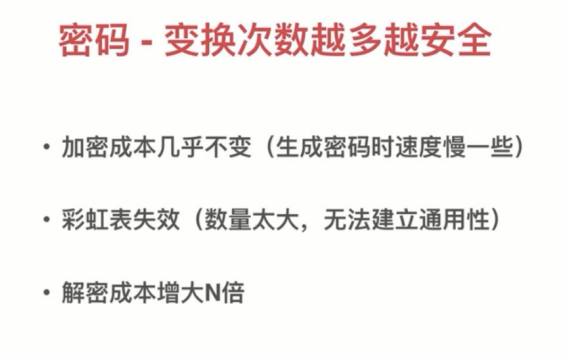

# 密码安全

- 密码的作用 - 证明你是你
- 密码的存储
- 密码的传输
- 密码的替代方案
- 生物特征密码的问题(指纹解锁)

## 密码 - 泄露渠道

- 数据库被盗
- 服务器入侵
- 通讯被窃听
- 内部人员泄露数据
- 其他网站(撞库)

## 密码 - 存储

- 禁止明文存储(防泄露)
- 单向变换(防泄露)
- 变换负责度要求(防猜解)
- 密码复杂度要求(防猜解)
- 加盐(防猜解)

## 密码 - 哈希算法

- 明文 - 密文 一一对应
- 雪崩效应
- 密文 - 明文 无法反推
- 密文固定长度
- 常见哈希算法：md5、sha1、sha256

单向变换彩虹表

## 密码传输安全性

- https 传输
- 频率限制
- 前端加密

## 密码 - 生物特征密码

- 指纹
- 声纹
- 虹膜
- 人脸

问题：
- 私密性 - 容易泄露
- 安全性 - 碰撞
- 唯一性 - 终身唯一，无法修改
