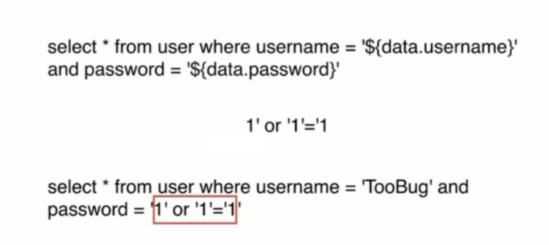

# 接入层注入问题

- 存放结构化数据
- 可高效操作大量数据
- 方便处理数据之间的关联关系
- 常见： access/sqlite/mysql/mssql server

## SQL 语言

- `select * from table where id = 1`
- 标准化
- 类似于自然语言的描述性语言
- 用于关系型数据库
- 可完成增删改查的操作

## SQL 注入

`select * from table where id = ${id}`

若 id 为 `1 or 1 = 1`

`select * from table where id = 1 or 1 = 1`




## SQl 注入危害

- 猜解密码
- 获取数据
- 删库删表
- 拖库

## SQL 注入防御

- 关闭错误输出
- 检查参数类型
- 对数据进行转义
- 使用参数化查询
- 使用 ORM (对象关系映射)

```js
mysql.escape(id)
```

使用参数化查询: 使用 mysql2 模块
```bash
npm i mysql2
```

## NoSQL 注入和防御

- 检查数据类型
- 类型转换
- 写完整条件
