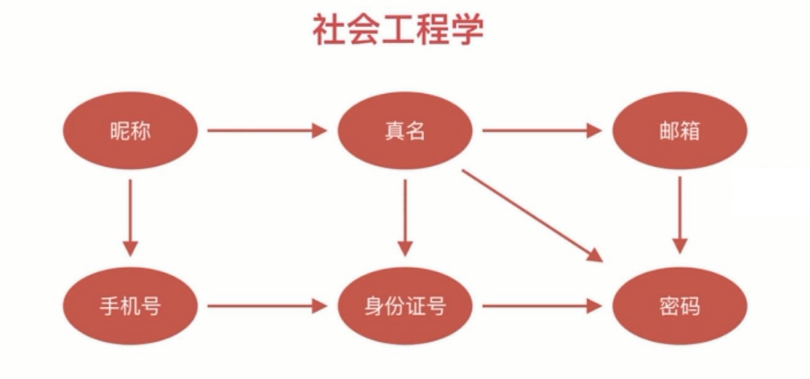

# 社会工程学和信息泄露

- 泄露系统敏感信息
- 泄露用户敏感信息
- 泄露用户密码

## 信息泄露的途径

- 错误信息失控
- SQL 注入
- 水平权限控制不当
- XSS  CSRF

## 社会工程学

案例：
- 电信诈骗(徐玉玉案)
- 伪装公检法
- QQ视频借钱
- 微信伪装好友

## Oauth 思想

- 一切行为由用户授权
- 授权行为不泄露敏感信息
- 授权会过期

## 利用 Oauth 思想防止资料泄露

- 用户授权读取资料
- 无授权的资料不可读取
- 不允许批量读取数据
- 数据接口可风控审计
