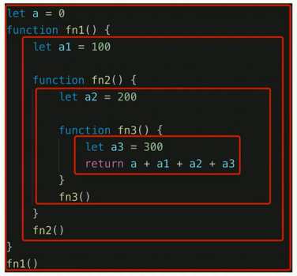

# JS 基础 - 作用域和闭包

问题
- this 的不同应用场景,如何取值
- 手写 bind 函数
- 实际开发中闭包的应用场景
- 创建 10 个 a 标签，点击时弹出对应序号

知识点
- 作用域和自由变量
- 闭包
- this

## 作用域



- 全局作用域
- 函数作用域
- 块级作用域(ES6 新增)

## 自由变量

- 一个变量在当前作用域没有定义，但是被使用了
- 向上级作用域，一层一层依次寻找，直至找到为止
- 如果到全局作用域都没有找到，则报错 xxx s not defined

## 闭包

作用域应用的特殊场景，有两种表现：
- 函数作为返回值
- 函数作为参数传递

闭包的作用：封装变量，收敛权限

函数作为返回值
```js
function create() {
    const a = 100;
    return function () {
        console.log(a);
    };
}

const fn = create();
const a = 200;
fn(); // 100
```

函数作为参数被传递
```js
function print(fn) {
    const a = 200;
    fn();
}
const a = 100;
function fn() {
    console.log(a);
}
print(fn); // 100
```

`所有的自由变量的查找，是在函数定义的地方，向上级作用域查找; 不是在执行的地方!!!`

## this

- 作为普通函数
- 使用 call apply bind
- 作为对象方法被调用
- 在 class 方法中调用
- 箭头函数

```js
function fn1() {
    console.log(this);
}
fn1()   // window

fn1.call({ x: 100 })    // { x: 100 }

const fn2 = fn1.bind({ x: 200 });
fn2();          // { x: 200 }
```

```js
const zhangsan = {
    name: '张三',
    sayHi() {
        // this 即当前对象
        console.log(this);
    }
    wait() {
        setTimeout(function() {
            // this === window
            console.log(this);
        })
    }
}

const zhangsan = {
    name: '张三',
    sayHi() {
        // this 即当前对象
        console.log(this);
    }
    wait() {
        setTimeout(() => {
            // this 即当前对象
            console.log(this);
        })
    }
}
```

```js
class People {
    constructor (name) {
        this.name = name;
        this.age = 20;
    }
    sayHi() {
        console.log(this);
    }
}
const zhangsan = new People('张三');
zhangsan.sayHi(); // People 张三 对象
```

```js
xialuo.__proto__.sayHi();
// 姓名 undefined 学号 undefined
xialuo.sayHi();

xialuo.__proto__.sayHi.call(xialuo);
// 姓名 夏洛 学号 100
```

## 题解

this 的不同应用场景
- 作为普通函数
- 使用 call apply bind
- 作为对象方法被调用
- 在 class 方法中调用
- 箭头函数

手写 bind 函数
```js
// 模拟 bind
Function.prototype.bind1 = function () {
    // 将参数拆解为数组
    const args = Array.prototype.slice.call(arguments);

    // 获取 this（数组第一项）
    const t = args.shift();

    // fn1.bind(...) 中的 fn1
    const self = this;

    // 返回一个函数
    return function () {
        return self.apply(t, args);
    };
};

function fn1(a, b, c) {
    console.log('this', this);
    console.log(a, b, c);
    return 'this is fn1';
}

const fn2 = fn1.bind1({ x: 100 }, 10, 20, 30);
const res = fn2();
console.log(res);
```

闭包的实际应用
```js
// 闭包隐藏数据，只提供 API
function createCache() {
    const data = {}; // 闭包中的数据，被隐藏，不被外界访问
    return {
        set: function (key, val) {
            data[key] = val;
        },
        get: function (key) {
            return data[key];
        },
    };
}

const c = createCache();
c.set('a', 100);
console.log(c.get('a'));
```

创建 10 个 a 标签，点击时弹出对应序号
```js
let a
for (let i = 0; i < 10; i++) {
    a = document.createElement('a')
    a.innerHTML = i + '<br>'
    a.addEventListener('click', function (e) {
        e.preventDefault()
        alert(i)
    })
    document.body.appendChild(a)
}
```
