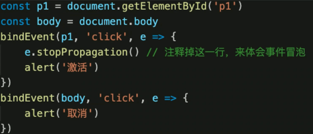
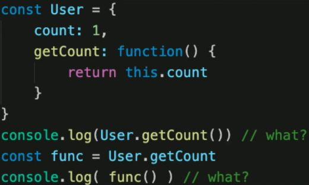
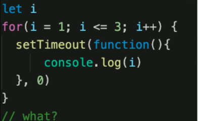
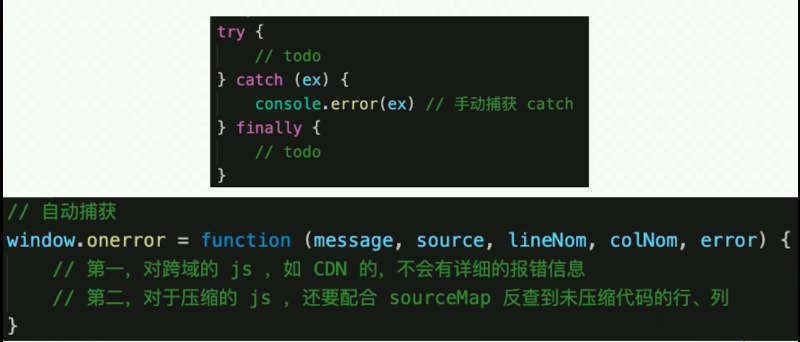

# 题

## var 和 let const 的区别
- var 是 ES5 语法，let const 是 ES6 语法；var 有变量提升
- var 和 let 是变量，可以修改；const 是常量，不可修改；
- let const 有块级作用域，var 没有

## typeof 返回哪些类型

- undefined string number boolean symbol
- object (typeof null === 'object')
- function

## 列举强制类型转换和隐式类型转换

- 强制：parseInt、 parseFloat、 toString 等
- 隐式：if、逻辑运算、== 、+ 拼接字符串

## 手写深度比较 isEqual

```js
// 判断是否是对象或数组
function isObject(obj) {
    return typeof obj === 'object' && obj !== null;
}
// 全相等（深度）
function isEqual(obj1, obj2) {
    if (!isObject(obj1) || !isObject(obj2)) {
        // 值类型（注意，参与 equal 的一般不会是函数）
        return obj1 === obj2;
    }
    if (obj1 === obj2) {
        return true;
    }
    // 两个都是对象或数组，而且不相等
    // 1. 先取出 obj1 和 obj2 的 keys ，比较个数
    const obj1Keys = Object.keys(obj1);
    const obj2Keys = Object.keys(obj2);
    if (obj1Keys.length !== obj2Keys.length) {
        return false;
    }
    // 2. 以 obj1 为基准，和 obj2 一次递归比较
    for (let key in obj1) {
        // 比较当前 key 的 val —— 递归！！！
        const res = isEqual(obj1[key], obj2[key]);
        if (!res) {
            return false;
        }
    }
    // 3. 全相等
    return true;
}

// 测试
const obj1 = {
    a: 100,
    b: {
        x: 100,
        y: 200,
    },
};
const obj2 = {
    a: 100,
    b: {
        x: 100,
        y: 200,
    },
};
// console.log( obj1 === obj2 )
console.log(isEqual(obj1, obj2));

const arr1 = [1, 2, 3];
const arr2 = [1, 2, 3, 4];
```

## split 和 join 的区别

```js
'1-2-3'.split('-')  // [1, 2, 3]
[1, 2, 3].join('-') // '1-2-3'
```

## 数组的 pop push unshift shift 分别做什么

- 功能使什么？
- 返回值是什么？
- 是否会对原数组造成影响?

```js
const arr = [10, 20, 30, 40];

// pop
const popRes = arr.pop();
console.log(popRes, arr);

// shift
const shiftRes = arr.shift();
console.log(shiftRes, arr);

// push
const pushRes = arr.push(50); // 返回 length
console.log(pushRes, arr);

// unshift
const unshiftRes = arr.unshift(5); // 返回 length
console.log(unshiftRes, arr);
```

## 数组的 api 有哪些是纯函数？

```js

// 纯函数：1. 不改变源数组（没有副作用）；2. 返回一个数组
const arr = [10, 20, 30, 40];

// concat
const arr1 = arr.concat([50, 60, 70]);
// map
const arr2 = arr.map(num => num * 10);
// filter
const arr3 = arr.filter(num => num > 25);
// slice
const arr4 = arr.slice();

// 非纯函数
// push pop shift unshift
// forEach
// some every
// reduce
```

## slice 和 splice 的区别

- 功能区别(slice 切片、splice 剪接)
- 参数和返回值
- 是否纯函数

```js
const arr = [10, 20, 30, 40, 50];

// slice 纯函数
const arr1 = arr.slice();
const arr2 = arr.slice(1, 4);
const arr3 = arr.slice(2);
const arr4 = arr.slice(-3);

// splice 非纯函数
const spliceRes = arr.splice(1, 2, 'a', 'b', 'c');
// const spliceRes1 = arr.splice(1, 2)
// const spliceRes2 = arr.splice(1, 0, 'a', 'b', 'c')
console.log(spliceRes, arr);
```

## [10, 20, 30].map(parseInt) 返回值是什么？

```js
const res = [10, 20, 30].map(parseInt);
console.log(res); // [10, NaN, NaN]

// 拆解
[10, 20, 30]
    .map((num, index) => {
        return parseInt(num, index);
    });
```

## 函数 call 和 apply 的区别

```js
fn.call(this, p1, p2, p3);
fn.apply(this, args);
```

## 事件代理(委托)是什么？



## 闭包是什么。有什么特性？负面影响？

- 作用域和自由变量
- 闭包的应用场景：作为参数被传入，作为返回值被返回
- 自由变量的查找，要在函数定义的地方(而非执行的地方)
- 影响：变量会常驻内存，得不到释放。闭包不要乱用

```js
// // 自由变量示例 —— 内存会被释放
let a = 0;
function fn1() {
    let a1 = 100;

    function fn2() {
        let a2 = 200;

        function fn3() {
            let a3 = 300;
            return a + a1 + a2 + a3;
        }
        fn3();
    }
    fn2();
}
fn1();


// 闭包 函数作为返回值 —— 内存不会被释放
function create() {
    let a = 100;
    return function () {
        console.log(a);
    };
}
let fn = create();
let a = 200;
fn(); // 100

// 变量的查找
function print(fn) {
    let a = 200;
    fn();
}
let a = 100;
function fn() {
    console.log(a);
}
print(fn); // 100
```

## 如何阻止事件冒泡和默认行为？

- event.stopPropagation() 阻止事件冒泡
- event.preventDefault() 阻止默认行为

## 查找、添加、删除、移动 DOM 节点的方法

```js
const div1 = document.getElementById('div1');
const div2 = document.getElementById('div2');

// 新建节点
const newP = document.createElement('p');
newP.innerHTML = 'this is newP';
// 插入节点
div1.appendChild(newP);

// 移动节点
const p1 = document.getElementById('p1');
div2.appendChild(p1);

// 获取父元素
console.log(p1.parentNode);

// 获取子元素列表
const div1ChildNodes = div1.childNodes;
console.log(div1.childNodes);
const div1ChildNodesP = Array.prototype.slice
    .call(div1.childNodes)
    .filter(child => {
        if (child.nodeType === 1) {
            return true;
        }
        return false;
    });
console.log('div1ChildNodesP', div1ChildNodesP);

div1.removeChild(div1ChildNodesP[0]);
```

## 如何减少 DOM 查找

- 缓存 DOM 查询结果
- 多次 DOM 操作，合并到一次插入

## jsonp 的原理

- 同源策略和跨域
- script

```js
<script>
    window.abc = function (data) {
        console.log(data)
    }
</script>
<script src="http://localhost:8002/jsonp.js?username=xxx&callback=abc"></script>
```

## document load 和 ready 的区别

- 当 onload 事件触发时，页面上所有的 DOM，样式表，脚本，图片，flash 都已经加载完成了。
- 当 DOMContentLoaded 事件触发时，仅当 DOM 加载完成，不包括样式表、图片、flash。

```js
const img1 = document.getElementById('img1');
img1.onload = function () {
    console.log('img loaded');
};

window.addEventListener('load', function () {
    console.log('window loaded');
});

document.addEventListener('DOMContentLoaded', function () {
    console.log('dom content loaded');
});
```

## == 和 === 的不同

- == 会尝试类型转换
- === 严格相等
- 哪些场景使用 == ？

## 函数声明和函数表达式的区别

- 函数声明会在代码执行前预加载，而函数表达式不会

```js
// 函数声明
function fn() {}

// 函数表达式
const fn = function() {}
```

```js
// 函数声明
const res = sum(10, 20)
console.log(res)
function sum(x, y) {
    return x + y
}

// 函数表达式
var res = sum(10, 20)
console.log(res)
var sum = function (x, y) {
    return x + y
}
```

new Object() & Object.create() 的区别

- {} 等同于 new Object()，原型 Object.prototype
- Object.create(null) 没有原型
- Object.create({...}) 可指定原型

```js
const obj1 = {
    a: 10,
    b: 20,
    sum() {
        return this.a + this.b;
    },
};

const obj2 = new Object({
    a: 10,
    b: 20,
    sum() {
        return this.a + this.b;
    },
});

const obj21 = new Object(obj1); // obj1 === obj2

const obj3 = Object.create(null);
const obj4 = new Object(); // {}

const obj5 = Object.create({
    a: 10,
    b: 20,
    sum() {
        return this.a + this.b;
    },
});

const obj6 = Object.create(obj1);
```

## 关于 this 的场景题



## 关于作用域和自由变量的场景题



## 判断字符串以字母开头，后面字母数字下划线，长度6-30

```js
const reg = /^[a-zA-Z]\w{5,29}$/
```

正则表达式规则

```js
// 邮政编码
/\d{6}/

// 小写英文字母
/^[a-z]+$/

// 英文字母
/^[a-zA-Z]+$/

// 日期格式 2019.12.1
/^\d{4}-\d{1,2}-\d{1,2}$/

// 用户名
/^[a-zA-Z]\w{5, 17}$/

// 简单的 IP 地址匹配
/\d+\.\d+\.\d+\.\d+/
```

## 手写字符串 trim 方法，保证浏览器兼容性

```js
String.prototype.trim=function(){
    return this.replace(/^\s+/,''/).replace(/\s+$/,'')
}
```

## 如何获取多个数字中最大值

```js
function max() {
    const nums = Array.prototype.slice.call(arguments);
    let max = 0;
    nums.forEach(n => {
        if (n > max) {
            max = n;
        }
    });
    return max;
}

Math.max(10, 20, 30, 40, 50)
```

## 如何用 JS 实现继承

- class 继承
- prototype 继承

## 如何捕获 js 程序中的异常



## 什么是 JSON

- JSON 是一种数据格式，本质是一段字符串
- JSON 格式和 js 对象结构一致，对js语言更友好
- window.JSON 是全局对象：JSON.stringify() JSON.parse()

## 获取当前页码 URL 参数

```js
// // 传统方式
function query(name) {
    const search = location.search.substr(1); // 类似 array.slice(1)
    // search: 'a=10&b=20&c=30'
    const reg = new RegExp(`(^|&)${name}=([^&]*)(&|$)`, 'i');
    const res = search.match(reg);
    if (res === null) {
        return null;
    }
    return res[2];
}
query('d');

// URLSearchParams
function query(name) {
    const search = location.search;
    const p = new URLSearchParams(search);
    return p.get(name);
}
console.log(query('b'));
```

## 将 url 参数解析为 JS 对象

```js
function queryToObj (url) {
    var res = {}
    var arr = url.split("?")[1].split('&')
    for(var i = 0; i < arr.length; i++){
        var newArr = arr[i].split('=');
        res[newArr[0]] = newArr[1];
    }
    return res;
}

function queryToObj (url) {
    var res = {}
    var search = url.split("?")[1];
    const pList = new URLSearchParams(search);
    pList.forEach((val, key) => {
        res[key] = val;
    })
    return res;
}
```

## 手写数组 flatern，考虑多层级

```js
function flat(arr) {
    // 验证 arr 中，还有没有深层数组 [1, 2, [3, 4]]
    const isDeep = arr.some(item => item instanceof Array);
    if (!isDeep) {
        return arr; // 已经是 flatern [1, 2, 3, 4]
    }

    const res = Array.prototype.concat.apply([], arr);
    return flat(res); // 递归
}

const res = flat([1, 2, [3, 4, [10, 20, [100, 200]]], 5]);
console.log(res);
```

```js
let arr = [1, 2, 3, [4, 5, [6, 7]]];
//方式一：递归
function flat(arr) {
    //验证arr是否存在深层嵌套
    const isDeep = arr.some(item => item instanceof Array);
    if (!isDeep) {
        //说明不存在深层嵌套
        return arr;
    }
    const res = [].concat(...arr);
    return flat(res); //使用递归
}

//方式二：字符串tostring
function flat(arr) {
    return arr.toString().split(',').map(item => {
        return Number(item);
    });
}

//方式三：json.stringify(更麻烦)
//JSON.stringify(arr):"[1,2,3,[4,5,[6,7]]]"
//replace(/\[|\]/ig,"") '"1","2","3","4","5","6""7"'
//最后使用map将字符串类型转换成数字类型
function flat(arr) {
    return JSON.stringify(arr).replace(/\[|\]/g, '').split(',').map(item => {
        return Number(item);
    });
}
```

## 数组去重

```js
// // 传统方式
function unique(arr) {
    const res = [];
    arr.forEach(item => {
        if (res.indexOf(item) < 0) {
            res.push(item);
        }
    });
    return res;
}

// 使用 Set （无序，不能重复）
function unique(arr) {
    const set = new Set(arr);
    return [...set];
}

const res = unique([30, 10, 20, 30, 40, 10]);
console.log(res);
```

## 手写深拷贝

```js
/**
 * 深拷贝
 */

const obj1 = {
    age: 20,
    name: 'xxx',
    address: {
        city: 'beijing',
    },
    arr: ['a', 'b', 'c'],
};

const obj2 = deepClone(obj1);
obj2.address.city = 'shanghai';
obj2.arr[0] = 'a1';
console.log(obj1.address.city);
console.log(obj1.arr[0]);

/**
 * 深拷贝
 * @param {Object} obj 要拷贝的对象
 */
function deepClone(obj = {}) {
    if (typeof obj !== 'object' || obj == null) {
        // obj 是 null ，或者不是对象和数组，直接返回
        return obj;
    }

    // 初始化返回结果
    let result;
    if (obj instanceof Array) {
        result = [];
    } else {
        result = {};
    }

    for (let key in obj) {
        // 保证 key 不是原型的属性
        if (obj.hasOwnProperty(key)) {
            // 递归调用！！！
            result[key] = deepClone(obj[key]);
        }
    }

    // 返回结果
    return result;
}
```

## 介绍下 RAF requestAnimationFrame

想要动画流程，更新频率要 60 帧/s, 及 16.67 更新一次视图

setTimeout 要手动控制频率，而 RAF 浏览器会自动控制

后台标签或者影藏 iframe 中，RAF 会暂停，而 setTimeout 依然执行

```js
// 3s 把宽度从 100px 变为 640px ，即增加 540px
// 60帧/s ，3s 180 帧 ，每次变化 3px

const $div1 = $('#div1');
let curWidth = 100;
const maxWidth = 640;

// setTimeout
// function animate() {
//     curWidth = curWidth + 3;
//     $div1.css('width', curWidth);
//     if (curWidth < maxWidth) {
//         setTimeout(animate, 16.7); // 自己控制时间
//     }
// }
// animate();

// RAF
function animate() {
    curWidth = curWidth + 3;
    $div1.css('width', curWidth);
    if (curWidth < maxWidth) {
        window.requestAnimationFrame(animate); // 时间不用自己控制
    }
}
animate();
```

## 前端性能如何优化？从那几个方面考虑

- 原则：多使用内存、缓存，减少计算、减少我拿过来请求
- 方向：加载页面，页面渲染，页面操作流畅度
