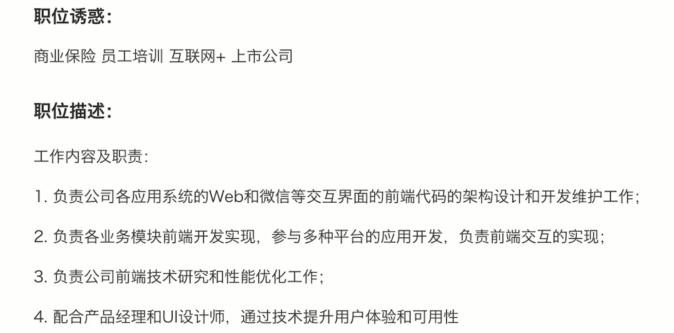
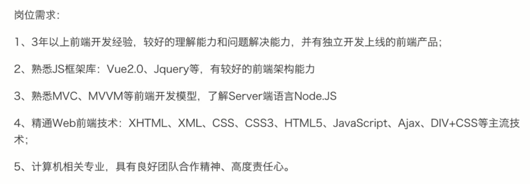
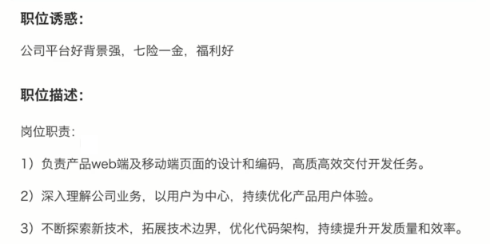
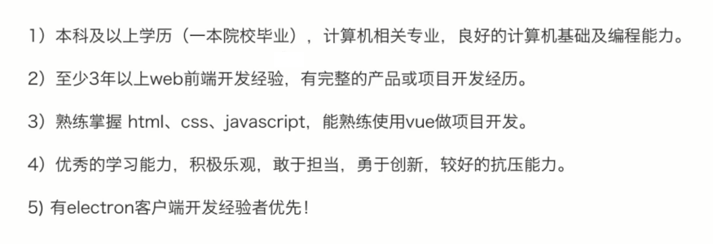

# 前置准备

- 不急于学知识
- 先了解一下什么是面试
- 面试之前需要准备什么

## 主要内容

- 面试的环节和流程
- JD 分析
- 如何写简历
- 准备工作和注意事项

## 面试的环节和流程

- 什么是面试
- 如何拿到简历
- 面试流程

什么是面试

- 经过组织者精心设计
- 以交谈和观察为主要手段
- 评价知识、能力和经验，综合素质

如何拿到简历

- 员工内推
- 猎头推荐
- hr 收集(主动搜索、接收邮件)

面试流程

- 一面：基础知识
- 二面(交叉面试(2~3 轮))：基础知识、框架原理、项目经验（计算机原理、算法等）
- 三面：TL
- HR 面：阳光积极乐观回答就行

校招和社招的区别

- 校招看中基础知识和能力，主要在一面
- 社招看中经验，主要在二面（基础知识要过关）
- 社招工作时间越长，越偏重经验

## JD 分析

JD 是什么
- JD 是用人单位发布的招聘信息
- 职位描述
- 岗位要求
- 企业信息规模、薪资范围等

从 JD 中能看到什么
- 工作内容
- 技术栈
- 经验要求

不要过于在意 JD
- JD 是 HR 发布的
- HR 和技术人员可能沟通不及时
- 不能完全相信 JD 的要求

JD 示例







## 如何写简历

- 简历包含的内容
- 简历中需要注意的问题

划重点
- 简历就像高考作文 - 阅卷时间非常短
- 内容简洁
- 直击重点，表现出自己的优势

简历包含的内容：
- 个人信息
  - 必备：姓名、性别、电话、邮箱、籍贯
  - 年龄可不写(能从教育经历评估出来)
  - 头像无所谓
- 教育经历
  - 写上最高学历即可
  - 学校、专业、入学和毕业时间
- 专业技能
  - 表现出自己的核心竞争力
  - 内容不要太多，3、5 条即可
  - 太基础的不要写，例如会用 vscode
- 工作经历
  - 如实写
  - 写明公司、职位、入职时间即可，多写无益
  - 如果有空窗期，如实写明
- 项目经历
  - 写 2-4 个具有说服力的项目(视工作时间)
  - 项目描述，技术栈，个人角色
  - 技巧：可以把别人的项目写上，只有你能 hold 住
- 博客和开源
  - 有博客或者开源作品，会让你更具竞争力
  - 切忌：需要真的有内容，不可临时抱佛脚
  - 可以从现在开始，慢慢积累

比如：

1. 熟悉 HTML、CSS、JS，熟悉 ES6+；
2. 熟悉 React 技术栈
3. 小程序...
4. 了解 nodejs
5. 熟悉移动端适配
6. 前端构建流程，可独立配置

注意事项：
- 界面不要太花哨，简洁明了即可
- 注意用词，"精通"、"熟练"、"熟悉"等慎用
- 不可造假，会被拉入黑名单(项目经历哪里，不是造假)

## 示例

专业技能
1. 熟悉 HTML、CSS、JS、 ES6+ 及 H5、C3 新特性;
2. 熟悉 React 技术栈，antd、fusion ui 库；
3. 熟悉 webpack 构建工具，可独立配置构建流程；
4. vue、nodejs
5. 移动端...
6. 持续集成...

```txt
熟悉 JS、ES6、H5 新特性、CSS3；熟悉 jQuery；
vue、element-ui、cube-ui
掌握 webpack 打包工具，能对构建速度和项目体积进行优化；
掌基本的linux 命令，能够部署项目
```

工作经历

2018.11-2020.10 xxx 公司 前端开发工程师

工作描述：
1. 配合设计人员开发网站的前端开发，完成客户的需求与功能；
2. 参与核心代码的规范与书写，解决项目开发过程中的技术问题；
3. 与后端工程师协商数据接口文档，完成与后台数据的交互；
4. 完成项目需求的开发、自测及重构工作；

项目经历：

xxx 平台

项目描述：xxx 项目是一个后台管理系统，它是一个数据展示平台，主要运用 react 技术栈，配合 antd 实现了具体的业务；

负责部分：xxx 模块、yyy 模块

技术栈：react、router、redux、antd；

角色及职责：

1. 使用 axios 进行网络请求
2. 使用 antd ui 库进行页面组件；
3. 加密、js 小数相加等

项目心得：

1. xxx
2. xxx

## 面试前的准备工作

- 看 JD，是否需要临时准备一下
- 打印纸质简历，带着纸和笔
- 最好带着自己的电脑，现场可能手写代码

## 面试前的注意事项

- 要有时间观念，如果迟到或者推迟，要提前说
- 衣着适当，不用正装，也不要太随意
- 为何离职？--- 不要吐槽前东家，说自己的原因
- 能加班吗？--- 能！除非你特别自信，能找到更好的机会
- 不要挑战面试官，即便他错了
- 遇到不会的问题，要表现出自己积极的一面

## 链接

- http://www.imooc.com/article/300475
- http://www.imooc.com/article/309313
- http://www.imooc.com/article/289377
- http://www.imooc.com/t/4427201#Article
