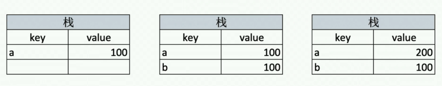
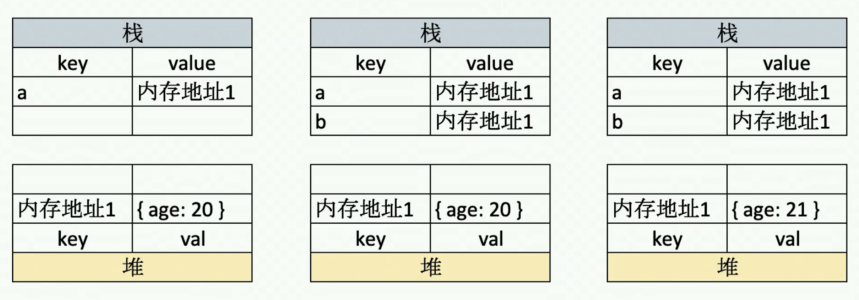

# JS 基础 - 变量类型和计算

问题

- typeof 能得到哪些类型
- 何时使用 === 和 ==
- 值类型和引用类型的区别
- 手写深拷贝

知识点：

- 变量类型
- 变量计算
- 类型转换：truly 变量、falsely 变量

## 变量类型

- 值类型 vs 引用类型
- typeof 运算符
- 深拷贝

值类型

```js
var a = 100;
var b = a;
b = 200;
console.log(a); // 100
```

引用类型

```js
var a = { age: 20 };
var b = a;
b.age = 21;
console.log(a.age); // 21
```

分析：





常见值类型：

```js
let a // undefind
const s = 'abc';
const n = 100;
const b = true;
const sm = Symbol('s');
```

常见引用类型：

```js
const obj = {x: 100};
const arr = ['a', 'b', 'c'];

const n = null; // 特殊引用类型，指针指向为空地址

function fn() {} // 特殊引用类型，但不用于存储数据，所以没有"拷贝、复制函数"一说
```

内存中存储方式:

- 值类型
- 引用类型：对象、数组、函数

## typeof 运算符

- 识别所有值类型
- 识别函数
- 判断是否是引用类型(不可再细分)

```js
// 识别所有值类型
let a;                  typeof a;    // undefind
const str = 'abc';      typeof str;  // string
const n = 100;          typeof n;    // number
const b = true;         typeof b;    // boolean
const sm = Symbol('s'); typeof s;    // symbol

// 识别函数
typeof console.log      // function
typeof function () {}   // function

// 判断是否是引用类型(不可再细分)
typeof null         // object
typeof ['a', 'b']   // object
typeof { x: 100 }   // object
```

1. undefined
2. boolean
3. string
4. number
5. symbol
6. function
7. object
8. bigint

## 深拷贝

- 注意判断值类型和引用类型
- 注意判断是数组还是对象
- 递归

```js
/**
 * 深拷贝
 * @param {Object} obj 要拷贝的对象
 */
function deepClone(obj = {}) {
  if (typeof obj !== 'object' || obj == null) {
    // obj 是 null ，或者不是对象和数组，直接返回
    return obj;
  }

  // 初始化返回结果
  let result;
  if (obj instanceof Array) {
    result = [];
  } else {
    result = {};
  }

  for (let key in obj) {
    // 保证 key 不是原型的属性
    if (obj.hasOwnProperty(key)) {
      // 递归调用！！！
      result[key] = deepClone(obj[key]);
    }
  }

  // 返回结果
  return result;
}
```

```js
const obj1 = {
  age: 20,
  name: 'xxx',
  address: {
    city: 'beijing',
  },
  arr: ['a', 'b', 'c'],
};

const obj2 = deepClone(obj1);
obj2.address.city = 'shanghai';
obj2.arr[0] = 'a1';
console.log(obj1.address.city);
console.log(obj1.arr[0]);
```

## 变量计算

- 字符串拼接
- ==
- if 语句和逻辑运算

```js
// 字符串拼接
const a = 100 + 10; // 110
const b = 100 + '10'; // '10010'
const c = true + '10'; // 'true10'

// == 运算符
100 == '100'; // true
0 == ''; // true
0 == false; // true
false == ''; // true
null == undefined; // true

// 除了 == null 之外，其他都一律使用 ===
const obj = {x: 100};
if (obj.a == null) {
}

// 相当于
if (obj.a === null || obj.a === undefined) {
}
```

if 语句和逻辑运算

- truly 变量： !!a === true 的变量
- falsely 变量： !!a === false 的变量

```js
// 以下是 falsely 变量。除此之外都是 truly 变量
!!0 === false;
!!NaN === false;
!!'' === false;
!!null === false;
!!undefined === false;
!!false === false;
```

if 语句

```js
// truly 变量
const a = true;
if (a) {
  // ...
}

const b = 100;
if (b) {
  // ...
}

// falsely 变量
const c = '';
if (c) {
  // ...
}

const d = null;
if (d) {
  // ...
}

let e;
if (e) {
  // ...
}
```

逻辑判断

```js
console.log(10 && 0); // 0
console.log('' && 'abc'); // 'abc'
console.log(!window.abc); // true
```
