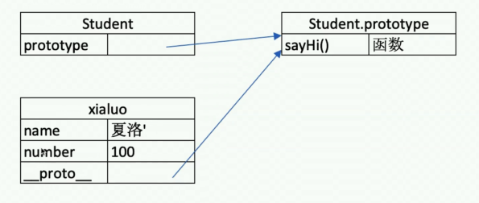
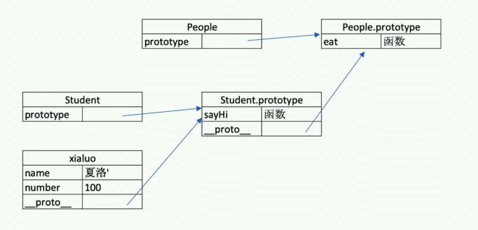
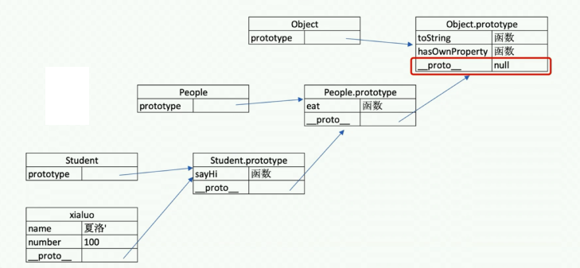

# JS 基础 - 原型和原型链

问题

- 如何准确判断一个变量是不是数组？
- 手写一个简易的 JQuery，考虑插件和扩展性
- class 的原型本质，怎么理解？

知识点：

- class 和继承
- 类型判断 instanceof
- 原型和原型链

## class

- constructor
- 属性
- 方法

```js
// 类
class Student {
  constructor(name, number) {
    this.name = name;
    this.number = number;
    // this.gender = 'male'
  }
  sayHi() {
    console.log(`姓名 ${this.name} ，学号 ${this.number}`);
    // console.log(
    //     '姓名 ' + this.name + ' ，学号 ' + this.number
    // )
  }
  // study() {

  // }
}

// 通过类 new 对象/实例
const xialuo = new Student('夏洛', 100);
console.log(xialuo.name);
console.log(xialuo.number);
xialuo.sayHi();

const madongmei = new Student('马冬梅', 101);
console.log(madongmei.name);
console.log(madongmei.number);
madongmei.sayHi();
```

## class 继承

- extends
- super
- 扩展或重写方法

```js
// 父类
class People {
  constructor(name) {
    this.name = name;
  }
  eat() {
    console.log(`${this.name} eat something`);
  }
}

// 子类
class Student extends People {
  constructor(name, number) {
    super(name);
    this.number = number;
  }
  sayHi() {
    console.log(`姓名 ${this.name} 学号 ${this.number}`);
  }
}

// 子类
class Teacher extends People {
  constructor(name, major) {
    super(name);
    this.major = major;
  }
  teach() {
    console.log(`${this.name} 教授 ${this.major}`);
  }
}

// 实例
const xialuo = new Student('夏洛', 100);
console.log(xialuo.name);
console.log(xialuo.number);
xialuo.sayHi();
xialuo.eat();

// 实例
const wanglaoshi = new Teacher('王老师', '语文');
console.log(wanglaoshi.name);
console.log(wanglaoshi.major);
wanglaoshi.teach();
wanglaoshi.eat();
```

## JS 原型（隐式原型和显示原型）

```js
xialuo instanceof Student   // true
xialuo instanceof People    // true
xialuo instanceof Object    // true

[] instanceof Array         // true
[] instanceof Object         // true

{} instanceof Object         // true
```

原型

```js
// class 实际上是函数，可见是语法糖
typeof People; // 'function'
typeof Student; // 'function'

// 隐式原型和显示原型
console.log(xialuo.__proto__);
console.log(xialuo.prototype);
console.log(xialuo.__proto__ === xialuo.prototype); // true
```



原型关系：

- 每个 class 都有显示原型 prototyppe
- 每个实例都有隐式原型 `__proto__`
- 实例的 `__proto__` 指向对应 class 的 prototyppe

基于原型的执行规则：

- 获取实例 xialuo.name 或执行方法 xialuo.sayhi() 时
- 先在自身属性和方法寻找
- 如果找不到则自动去 `__proto__` 中查找

## 原型链 与 instanceof

```js
console.log(Student.prototype.__proto__);
console.log(People.prototype);
console.log(People.prototype === Student.prototype.__proto__);
```



```js
xialuo.hasOwnProperty('name'); // true
xialuo.hasOwnProperty('sayHi'); // false
```



`instanceof 是基于原型链实现的`

- class 是 ES6 规范，由 ECMA 委员会发布
- ECMA 只规定语法规则，即我们代码的书写规范，不规定如何实现
- 以上实现方式都是 V8 引擎的实现方式，也是主流的

## 简易 jQuery

```js
class jQuery {
  constructor(selector) {
    const result = document.querySelectorAll(selector);
    const length = result.length;
    for (let i = 0; i < length; i++) {
      this[i] = result[i];
    }
    this.length = length;
    this.selector = selector;
  }
  get(index) {
    return this[index];
  }
  each(fn) {
    for (let i = 0; i < this.length; i++) {
      const elem = this[i];
      fn(elem);
    }
  }
  on(type, fn) {
    return this.each((elem) => {
      elem.addEventListener(type, fn, false);
    });
  }
  // 扩展很多 DOM API
}

// 插件
jQuery.prototype.dialog = function (info) {
  alert(info);
};

// "造轮子"
class myJQuery extends jQuery {
  constructor(selector) {
    super(selector);
  }
  // 扩展自己的方法
  addClass(className) {}
  style(data) {}
}

// const $p = new jQuery('p')
// $p.get(1)
// $p.each((elem) => console.log(elem.nodeName))
// $p.on('click', () => alert('clicked'))
```
