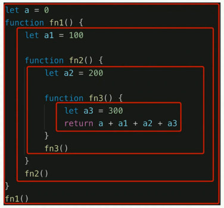

# JS 基础 - 作用域和闭包

问题

- this 的不同应用场景,如何取值
- 手写 bind 函数
- 实际开发中闭包的应用场景
- 创建 10 个 a 标签，点击时弹出对应序号

知识点

- 作用域和自由变量
- 闭包
- this

## 作用域



- 全局作用域
- 函数作用域
- 块级作用域(ES6 新增)

```js
if (true) {
  let a = 100;
}
```

## 自由变量

- 一个变量在当前作用域没有定义，但是被使用了
- 向上级作用域，一层一层依次寻找，直至找到为止
- 如果到全局作用域都没有找到，则报错 xxx s not defined

## 闭包

作用域应用的特殊场景，有两种表现：

- 函数作为返回值
- 函数作为参数传递

闭包的作用：封装变量，收敛权限

函数作为返回值

```js
function create() {
  const a = 100;
  return function () {
    console.log(a);
  };
}

const fn = create();
const a = 200;
fn(); // 100
```

函数作为参数被传递

```js
function print(fn) {
  const a = 200;
  fn();
}
const a = 100;
function fn() {
  console.log(a);
}
print(fn); // 100
```

自由变量查找规则：`所有的自由变量的查找，是在函数定义的地方，向上级作用域查找; 不是在执行的地方!!!`

## this

- 作为普通函数
- 使用 call apply bind
- 作为对象方法被调用
- 在 class 方法中调用
- 箭头函数

this 是在函数执行的时候确定的

```js
function fn1() {
  console.log(this);
}
fn1(); // window

fn1.call({x: 100}); // { x: 100 }

const fn2 = fn1.bind({x: 200});
fn2(); // { x: 200 }
```

```js
const zhangsan = {
    name: '张三',
    sayHi() {
        // this 即当前对象
        console.log(this);
    }
    wait() {
        setTimeout(function() {
            // this === window
            console.log(this);
        })
    }
}

const zhangsan = {
    name: '张三',
    sayHi() {
        // this 即当前对象
        console.log(this);
    }
    wait() {
        setTimeout(() => {
            // this 即当前对象
            console.log(this);
        })
    }
}
```

```js
class People {
  constructor(name) {
    this.name = name;
    this.age = 20;
  }
  sayHi() {
    console.log(this);
  }
}
const zhangsan = new People('张三');
zhangsan.sayHi(); // People 张三 对象
```

```js
xialuo.__proto__.sayHi();
// 姓名 undefined 学号 undefined
xialuo.sayHi();

xialuo.__proto__.sayHi.call(xialuo);
// 姓名 夏洛 学号 100
```

## 题解

this 的不同应用场景

- 作为普通函数
- 使用 call apply bind
- 作为对象方法被调用
- 在 class 方法中调用
- 箭头函数

手写 bind 函数

```js
// 模拟 bind
Function.prototype.bind1 = function () {
  // 将参数拆解为数组
  const args = Array.prototype.slice.call(arguments);

  // 获取 this（数组第一项）
  const t = args.shift();

  // fn1.bind(...) 中的 fn1
  const self = this;

  // 返回一个函数
  return function () {
    return self.apply(t, args);
  };
};

function fn1(a, b, c) {
  console.log('this', this);
  console.log(a, b, c);
  return 'this is fn1';
}

const fn2 = fn1.bind1({x: 100}, 10, 20, 30);
const res = fn2();
console.log(res);
```

闭包的实际应用

```js
// 闭包隐藏数据，只提供 API
function createCache() {
  const data = {}; // 闭包中的数据，被隐藏，不被外界访问
  return {
    set: function (key, val) {
      data[key] = val;
    },
    get: function (key) {
      return data[key];
    },
  };
}

const c = createCache();
c.set('a', 100);
console.log(c.get('a'));
```

创建 10 个 a 标签，点击时弹出对应序号

```js
let a;
for (let i = 0; i < 10; i++) {
  a = document.createElement('a');
  a.innerHTML = i + '<br>';
  a.addEventListener('click', function (e) {
    e.preventDefault();
    alert(i);
  });
  document.body.appendChild(a);
}
```
