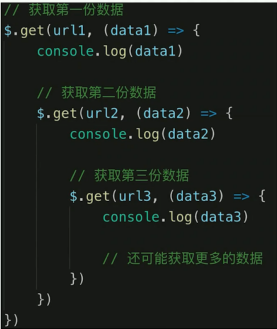

# JS 基础 - 异步

问题：
- 同步和异步的区别是什么？
- 为什么会有异步？
- 手写用 Promise 加载一张图片
- 前端使用异步的场景有哪些？

```js
console.log(1);
setTimeout(function () {
  console.log(2);
}, 1000);
console.log(3);
setTimeout(function () {
  console.log(4);
}, 0);
console.log(5);

// 1 3 5 4 2
```

知识点：
- 单线程和异步，异步和同步的区别
- 前端异步的应用场景：网络请求、定时任务
- Promise 解决 callback hell

## 单线程和异步

- JS 是单线程语言，只能同时做一件事
- 浏览器和 nodejs 已支持 JS 启动`进程`，如 Web Worker
- JS 和 DOM 渲染共用同一个线程，因为 JS 可以修改 DOM 结构
- 遇到等待 (网络请求，定时任务) 不能卡住
- 需要异步
- 回到 callback 函数形式

## 同步和异步

```js
// 异步 (callback 回调函数)
console.log(100);
setTimeout(function () {
  console.log(200);
}, 1000);
console.log(300);

// 100  300  200
```

```js
// 同步
console.log(100);
alert(200);
console.log(300);
```

- 基于 JS 是单线程语言
- 异步`不会`阻塞代码执行
- 同步`会`阻塞代码执行

## 应用场景

- 网络请求，如 ajax、图片加载
- 定时任务，如 setTimeout

```js
// ajax
console.log('start');
$.get('/data.json', function (res) {
  console.log(res);
});
console.log('end');
```

```js
// 加载图片
console.log('start');
let img = document.createElement('img');
img.onload = function () {
  console.log('loaded');
};
img.src = '/xxx.png';
console.log('end');
```

```js
// setTimeout
console.log(100);
setTimeout(function () {
  console.log(200);
}, 1000);
console.log(300);
```

```js
// setInterval
console.log(100);
setInterval(function () {
  console.log(200);
}, 1000);
console.log(300);
```

## callback hell



## Promise


## 解题

同步和异步的区别是什么
- 基于 JS 是单线程语言
- 异步`不会`阻塞代码执行
- 同步`会`阻塞代码执行

手写用 Promise 加载一张图片

```js
function loadImg(src) {
  const p = new Promise((resolve, reject) => {
    const img = document.createElement('img');
    img.onload = () => {
      resolve(img);
    };
    img.onerror = () => {
      const err = new Error(`图片加载失败 ${src}`);
      reject(err);
    };
    img.src = src;
  });
  return p;
}

// const url = 'https://img.mukewang.com/5a9fc8070001a82402060220-140-140.jpg';
// loadImg(url)
//     .then(img => {
//         console.log(img.width);
//         return img;
//     })
//     .then(img => {
//         console.log(img.height);
//     })
//     .catch(ex => console.error(ex));

const url1 = 'https://img.mukewang.com/5a9fc8070001a82402060220-140-140.jpg';
const url2 = 'https://img3.mukewang.com/5a9fc8070001a82402060220-100-100.jpg';

loadImg(url1)
  .then((img1) => {
    console.log(img1.width);
    return img1; // 普通对象
  })
  .then((img1) => {
    console.log(img1.height);
    return loadImg(url2); // promise 实例
  })
  .then((img2) => {
    console.log(img2.width);
    return img2;
  })
  .then((img2) => {
    console.log(img2.height);
  })
  .catch((ex) => {
    console.error(ex);
  });
```

前端使用异步的场景有哪些：
- 网络请求，如 ajax、图片加载
- 定时任务，如 setTimeout

Promise 解决 callback hell
