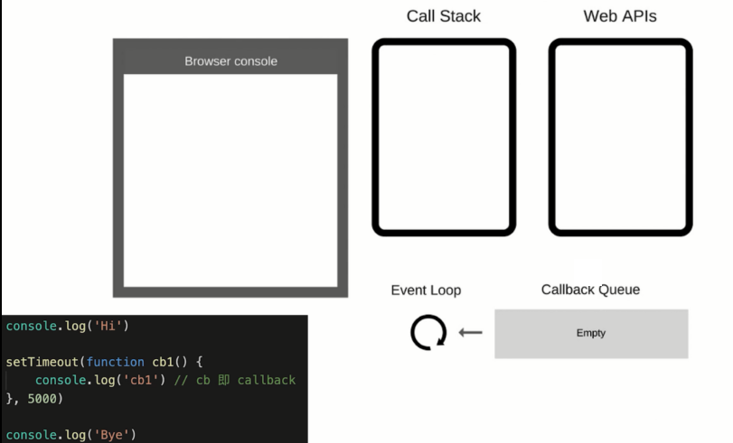
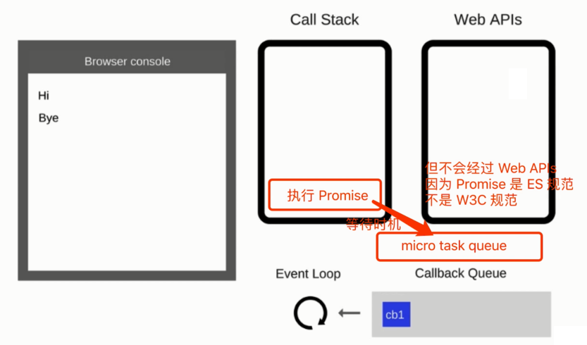
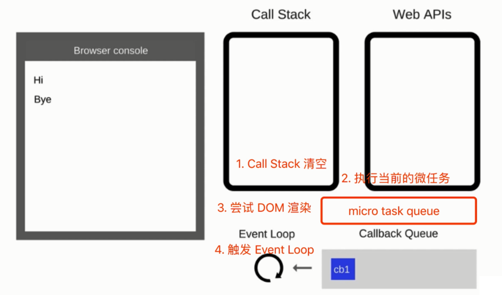

# JS 异步进阶

异步

- 单线程
- callback
- 应用场景
- Promise
- Event Loop
- async await
- 宏任务与微任务

## 题目

- 请描述 Event Loop (事件循环/事件轮训)的机制，可画图
  1. Event Loop 过程
  2. 和 DOM 渲染的关系
  3. 宏任务和微任务在 Event Loop 过程中的不同处理
- 什么是宏任务和微任务，两者有什么区别？
  - 宏任务：setTimeout、setInterval、Ajax、 DOM 事件
  - 微任务：Promise、async/await（对于前端来说）
  - 微任务比宏任务执行时机要早
- Promise 有哪三种状态，如何变化？
  - 三种状态: pending、resolved、rejected
  - 不可逆

### Promise catch 连接 then

```js
// 第一题
Promise.resolve()
  .then(() => {
    console.log(1);
  })
  .catch(() => {
    console.log(2);
  })
  .then(() => {
    console.log(3);
  });
// 1 3

// 第二题
Promise.resolve()
  .then(() => {
    console.log(1);
    throw new Error('erro1');
  })
  .catch(() => {
    console.log(2);
  })
  .then(() => {
    console.log(3);
  });
// 1 2 3

// 第三题
Promise.resolve()
  .then(() => {
    console.log(1);
    throw new Error('erro1');
  })
  .catch(() => {
    console.log(2);
  })
  .catch(() => {
    // 注意这里是 catch
    console.log(3);
  });
// 1 2
```

### async/await 语法问题

```js
async function fn() {
  return 100;
}
(async function () {
  const a = fn(); // ??               // promise
  const b = await fn(); // ??         // 100
})();
```

```js
(async function () {
  console.log('start');
  const a = await 100;
  console.log('a', a);
  const b = await Promise.resolve(200);
  console.log('b', b);
  const c = await Promise.reject(300);
  console.log('c', c);
  console.log('end');
})(); // 执行完毕，打印出那些内容？
```

### Promise 和 setTimeout 顺序

```js
console.log(100);
setTimeout(() => {
  console.log(200);
});
Promise.resolve().then(() => {
  console.log(300);
});
console.log(400);
// 100 400 300 200
```

### 执行顺序问题

```js
setTimeout( function() {
  console.log('setTimeout');
}, 0 )

async function async1() {
  console.log('async1 start');
  await async2();
  console.log('async1 end');
}

async function async2() {
  console.log('async2');
}

console.log('script start');

async1();

console.log('script end');
```

很经典的一道题

```js
async function async1() {
  console.log('async1 start'); // 2
  await async2(); // 这一句会同步执行，返回 Promise ，其中的 `console.log('async2')` 也会同步执行
  console.log('async1 end'); // 6   ; 上面有 await ，下面就变成了“异步”，类似 cakkback 的功能（微任务）
}

async function async2() {
  console.log('async2'); // 3
}

console.log('script start'); // 1

setTimeout(function () {
  // 异步，宏任务
  console.log('setTimeout'); // 8
}, 0);

async1();

new Promise(function (resolve) {
  // 返回 Promise 之后，即同步执行完成，then 是异步代码
  console.log('promise1'); // Promise 的函数体会立刻执行 // 4
  resolve();
}).then(function () {
  // 异步，微任务
  console.log('promise2'); // 7
});

console.log('script end'); // 5

// 同步代码执行完之后，屡一下现有的异步未执行的，按照顺序
// 1. async1 函数中 await 后面的内容 —— 微任务
// 2. setTimeout —— 宏任务
// 3. then —— 微任务
```

要点：

- 同步代码执行完毕(event loop - call stack 被清空)
- 执行微任务
- 尝试触发 DOM 渲染
- 触发 Event loop，执行宏任务

## Event Loop

- JS 是单线程运行的
- 异步要基于回调来实现
- Event Loop 就是异步回调的实现原理

JS 如何执行？

- 从前到后，一行一行执行
- 如果某一行执行报错，则停止下面代码的执行
- 先把同步代码执行完，再执行异步

```js
console.log('Hi');

setTimeout(function cb1() {
  console.log('cb1'); // cb 即 callback
}, 5000);

console.log('Bye');
```



总结：

- 同步代码，一行一行放在 Call Stack 执行
- 遇到异步，会先“记录”下，等待时机(定时、网络请求等)
- 时机到了，就移动到 Callback Queue
- 如 Call Stack 为空（即同步代码执行完） Event Loop 开始工作；
- 轮训查找 Callback Queue，如有则移动到 Call Stack 执行；
- 然后继续轮训查找(永动机一样)

DOM 事件也使用回调，基于 Event Loop

```html
<button id="btn1">提交</button>

<script>
  console.log('Hi');

  $('#btn1').click(function (e) {
    console.log('button clicked');
  });

  console.log('Bye');
</script>
```

### Promise

- 三种状态
- 状态和 then catch
- 常用 API

回顾一下 Promise 的基本使用

```js
// 加载图片
function loadImg(src) {
  const p = new Promise((resolve, reject) => {
    const img = document.createElement('img');
    img.onload = () => {
      resolve(img);
    };
    img.onerror = () => {
      const err = new Error(`图片加载失败 ${src}`);
      reject(err);
    };
    img.src = src;
  });
  return p;
}
const url = 'https://img.mukewang.com/5a9fc8070001a82402060220-140-140.jpg';
loadImg(url)
  .then((img) => {
    console.log(img.width);
    return img;
  })
  .then((img) => {
    console.log(img.height);
  })
  .catch((ex) => console.error(ex));
```

### 三种状态

- 三种状态： pending、resolved、rejected
- pending -> resolved 或者 pending -> rejected
- 变化不可逆

（画图表示转换关系，以及转换不可逆）

```js
// 刚定义时，状态默认为 pending
const p1 = new Promise((resolve, reject) => {});

// 执行 resolve() 后，状态变成 resolved
const p2 = new Promise((resolve, reject) => {
  setTimeout(() => {
    resolve();
  });
});

// 执行 reject() 后，状态变成 rejected
const p3 = new Promise((resolve, reject) => {
  setTimeout(() => {
    reject();
  });
});
```

```js
// 直接返回一个 resolved 状态
Promise.resolve(100);
// 直接返回一个 rejected 状态
Promise.reject('some error');
```

## 状态和 then catch

状态变化会触发 then catch —— 这些比较好理解

- pending 不会触发任何 then catch 回调
- 状态变为 resolved 会触发后续的 then 回调
- 状态变为 rejected 会触发后续的 catch 回调

```js
const p1 = Promise.resolve(100);
console.log('p1', p1);

p1.then(data => {
    console.log('data:', data);
}).catch(err => {
    console.log('err:', err);
})

const p2 = Promise.reject('err');
console.log('p2', p2);

p2.then(data => {
    console.log('data2:', data);
}).catch(err => {
    console.log('err2:', err);
})
```

then catch 会继续返回 Promise ，**此时可能会发生状态变化！！！**

### then 和 catch 改变状态

- then 正常返回 resolved，里面有报错则返回 rejected
- catch 正常返回 resolved，里面有报错则返回 rejected

```js
// then() 一般正常返回  resolved 状态的  promise
const p1 = Promise.resolve().then(() => {
  return 100;
});
console.log('p1', p1); // resolved 状态的 promise，触发后续 then 回调
p1.then(() => {
  console.log('123');
});

// then() 里抛出错误，会返回  rejected 状态的  promise
const p2 = Promise.resolve().then(() => {
  throw new Error('err');
});
console.log('p2', p2); // rejected 状态的  promise，触发后续 catch 回调

p2.then(() => {
  console.log('456'); // 不能触发
}).catch((err) => {
  console.error('err p2', err); // 触发这里
});

// catch() 不抛出错误，会返回 resolved 状态的  promise
const p3 = Promise.reject().catch(() => {
  console.error('catch some error');
});
console.log('p3', p3); // 注意： resolved 状态的 promise；触发 then 回调

p3.then(() => {
  console.log('789');
});

// catch() 抛出错误，会返回 rejected 状态的  promise
const p4 = Promise.reject('my error').catch(() => {
  console.error('catch some error');
  throw new Error('err');
});
console.log('p4', p4); // rejected 状态的  promise，触发 catch 回调

p4.then(() => {
  console.log('233'); // 不能触发
}).catch((err) => {
  console.error('err p4', err); // 触发这里
});
```

看一个综合的例子：

```js
// 第一题
Promise.resolve()
  .then(() => {
    console.log(1);
  })
  .catch(() => {
    console.log(2);
  })
  .then(() => {
    console.log(3);
  });
  // 1  3 ，最终返回 resolved 状态的 promise

// 第二题
Promise.resolve()
  .then(() => {
    // 返回 rejected 状态的 promise
    console.log(1);
    throw new Error('erro1');
  })
  .catch(() => {
    // 返回 resolved 状态的 promise
    console.log(2);
  })
  .then(() => {
    console.log(3);
  });
  //  1   2   3；最终返回 resolved 状态的 promise

// 第三题
Promise.resolve()
  .then(() => {
    // 返回 rejected 状态的 promise
    console.log(1);
    throw new Error('erro1');
  })
  .catch(() => {
    // 返回 resolved 状态的 promise
    console.log(2);
  })
  .catch(() => {
    //   这里不会被执行
    console.log(3);
  });
  //  1   2
```

## async/await

背景

- 异步回调 callback hell
- Promise then catch 链式调用，但也是基于回调函数
- async/await 是同步语法，彻底消灭回调函数

async/await

- 语法介绍
- 和 Promise 的关系
- 异步本质
- for...of

**有很多 async 的面试题，例如**

- async 直接返回，是什么
- async 直接返回 promise
- await 后面不加 promise
- 等等，需要找出一个规律

### 语法介绍

用同步的方式，编写异步。

```js
function loadImg(src) {
  const promise = new Promise((resolve, reject) => {
    const img = document.createElement('img');
    img.onload = () => {
      resolve(img);
    };
    img.onerror = () => {
      reject(new Error(`图片加载失败 ${src}`));
    };
    img.src = src;
  });
  return promise;
}

async function loadImg1() {
  const src1 = 'http://www.imooc.com/static/img/index/logo_new.png';
  const img1 = await loadImg(src1);
  return img1;
}

async function loadImg2() {
  const src2 = 'https://avatars3.githubusercontent.com/u/9583120';
  const img2 = await loadImg(src2);
  return img2;
}

(async function () {
  // 注意：await 必须放在 async 函数中，否则会报错
  try {
    // 加载第一张图片
    const img1 = await loadImg1();
    console.log(img1);
    // 加载第二张图片
    const img2 = await loadImg2();
    console.log(img2);
  } catch (ex) {
    console.error(ex);
  }
})();
```

### 和 Promise 的关系

- async/await 是消灭异步回调的终极武器
- 但和 Promise 并不互斥
- 反而，两者相辅相成

async/await 和 Promise 的关系：

- 执行 async 函数，返回的是 Promise 对象
- await 相当于 Promise 的 then
- try ... catch 可捕获异常，替代了 Promise 的 catch

`执行 async 函数返回结果都是 Promise 对象（如果函数内没返回 Promise ，则自动封装一下）`

```js
async function fn2() {
  return new Promise(() => {});
}
console.log(fn2());

async function fn1() {
  return 100;
}
console.log(fn1()); // 相当于 Promise.resolve(100)
```

- await 后面跟 Promise 对象：会阻断后续代码，等待状态变为 resolved ，才获取结果并继续执行
- await 后续跟非 Promise 对象：会直接返回

```js
(async function () {
  const p1 = new Promise(() => {});
  await p1;
  console.log('p1'); // 不会执行
})();

(async function () {
  const p2 = Promise.resolve(100);
  const res = await p2; // await 相当于 Promise 的  then
  console.log(res); // 100
})();

(async function () {
  const res = await 100; //  await 相当于 Promise.resolve(100);
  console.log(res); // 100
})();

(async function () {
  const p3 = Promise.reject('some err');
  const res = await p3; // 报错，可用 try...catch 捕获
  console.log(res); // 不会执行
})();
```

- try...catch 捕获 rejected 状态

```js
(async function () {
  const p4 = Promise.reject('some err'); // rejected 状态
  try {                                 // try...catch 相当于 Promise 的 catch
    const res = await p4;
    console.log(res);
  } catch (ex) {
    console.error(ex);
  }
})();
```

**总结**来看：

- async 封装 Promise
- await 处理 Promise 成功
- try...catch 处理 Promise 失败

### 异步本质

- async/await 是消灭异步回调的终极武器
- await 是同步写法，但本质还是异步调用
- async/await 是语法糖，异步的本质还是回调函数
- JS 还是单线程，还得是有异步，还得基于 Event Loop

```js
async function async1() {
  console.log('async1 start'); // 2  重要
  // await 后面的都可以看做是 callback 里的内容·，即异步
  // 类似 Event Loop，setTimeout(cb)
  // setTimeout(function () { console.log('async1 end') })
  // Promise.resolve().then(() => console.log('async1 end'))
  await async2();
  // 关键在这一步，它相当于放在 callback 中，最后执行
  console.log('async1 end'); // 5
}

async function async2() {
  console.log('async2'); // 3 重要
}

console.log('script start'); // 1
async1();
console.log('script end'); // 4
// 同步代码已经执行完毕（Event Loop）
```

再来复杂一点，继续看：

```js
async function async1() {
  console.log('async1 start'); // 2
  await async2();
  // 下面三行都是异步回调
  console.log('async1 end'); // 5
  await async3();
  // 下面又是回调哦
  console.log('async1 end 3'); // 7
}

async function async2() {
  console.log('async2'); // 3
}

async function async3() {
  console.log('async3'); // 6
}

console.log('script start'); // 1
async1();
console.log('script end'); // 4
```

即，只要遇到了 `await` ，后面的代码都相当于放在 callback 里。

### for...of

- for ... in（以及 forEach for）是常规的同步遍历
- for...of 常用于异步的遍历

```js
// 定时算乘法
function muti(num) {
  return new Promise((resolve) => {
    setTimeout(() => {
      resolve(num * num);
    }, 1000);
  });
}

// 使用  forEach ，是 1s 之后打印出所有结果，即 3 个值是一起被计算出来的
function test1() {
  const nums = [1, 2, 3];
  nums.forEach(async (x) => {
    const res = await muti(x);
    console.log(res);
  });
}
test1();

// 使用  for...of ，可以让计算挨个串行执行
async function test2() {
  const nums = [1, 2, 3];
  for (let x of nums) {
    // 在 for...of 循环体的内部，遇到 await 会挨个串行计算
    const res = await muti(x);
    console.log(res);
  }
}
test2();
```

## 宏任务(macroTask)和微任务(microTask)

- 什么是宏任务，什么是微任务
- Event Loop 和 DOM 渲染
- 宏任务和微任务的区别

### 介绍

- 宏任务：setTimeout、setInterval、Ajax、 DOM 事件
- 微任务：Promise、async/await（对于前端来说）
- **微任务比宏任务执行时机要早**

```js
console.log(100);
// 宏任务
setTimeout(() => {
  console.log(200);
});
// 微任务
Promise.resolve().then(() => {
  console.log(300);
});
console.log(400);
// 100 400 300 200
```

## Event Loop 和 DOM 渲染

- JS 是单线程的，而且和 DOM 渲染共用一个线程
- JS 执行的时候，得留一些时机供 DOM 渲染

再次回顾 Event Loop 的过程

- 每一次 Call Stack 结束，都会触发 DOM 渲染（不一定非得渲染，就是给一次 DOM 渲染的机会！！！）
- 然后再触发 Event Loop

Call Stack 空闲时：

1. 尝试 DOM 渲染
2. 触发 Event Loop

```js
const $p1 = $('<p>一段文字</p>');
const $p2 = $('<p>一段文字</p>');
const $p3 = $('<p>一段文字</p>');
$('#container').append($p1).append($p2).append($p3);

console.log('length', $('#container').children().length);
alert('本次 Call Stack 结束，DOM 结构已更新，但尚未触发渲染');
// （alert 会阻断 js 执行，也会阻断 DOM 渲染，便于查看效果）
// 到此，即本次 Call Stack 结束后（同步任务都执行完了），浏览器会自动触发渲染，不用代码干预

// 另外，按照 Event Loop 触发 DOM 渲染时机，setTimeout 时 alert ，就能看到 DOM 渲染后的结果了
setTimeout(function () {
  alert('setTimeout 是在下一次 Call Stack ，就能看到 DOM 渲染出来的结果了');
});
```

Event Loop 和 DOM 渲染：

- 每次 Call Stack 清空（即每次轮训结束），即同步任务执行完
- 都会有 DOM 重新渲染的机会，DOM 结构如有改变则重新渲染
- 然后再触发下一次 Event Loop

## 宏任务和微任务的区别

- 宏任务：DOM 渲染后再触发，如 setTimeout
- 微任务：DOM 渲染前会触发，如 Promise

```js
// 修改 DOM
const $p1 = $('<p>一段文字</p>');
const $p2 = $('<p>一段文字</p>');
const $p3 = $('<p>一段文字</p>');
$('#container').append($p1).append($p2).append($p3);

// // 微任务：渲染之前执行（DOM 结构已更新）
Promise.resolve().then(() => {
  const length = $('#container').children().length;
  alert(`micro task ${length}`); // DOM 渲染了吗？ - No
});

// 宏任务：渲染之后执行（DOM 结构已更新）
setTimeout(() => {
  const length = $('#container').children().length;
  alert(`macro task ${length}`); // DOM 渲染了吗？ - Yes
});
```





再深入思考一下：为何两者会有以上区别，一个在渲染前，一个在渲染后？

- 微任务：是 ES 语法规定的
- 宏任务：由浏览器规定的

- 微任务：ES 语法标准之内，JS 引擎来统一处理。即，不用浏览器有任何关于，即可一次性处理完，更快更及时。
- 宏任务：ES 语法没有，JS 引擎不处理，浏览器（或 nodejs）干预处理。

## 总结

描述 event loop 机制

- 回顾 event loop 的过程
- 和 DOM 渲染的关系
- 微任务和宏任务在 event loop 过程中的不同处理

event loop 过程

- 同步代码，一行一行放在 Call Stack 执行
- 遇到异步，会先“记录”下，等待时机(定时、网络请求等)
- 时机到了，就移动到 Callback Queue
- 如 Call Stack 为空，即同步代码执行完 Event Loop 开始工作；
- 轮训查找 Callback Queue，如有则移动到 Call Stack 执行；
- 然后继续轮训查找(永动机一样)

DOM 事件和 Event Loop

- JS 是单线程的
- 异步(setTimeout，ajax 等)使用回调，基于 Event Loop
- DOM 事件也使用回调，基于 Event Loop

Promise 进阶

- 三种状态，状态的表现及变化
- then 和 catch 对状态的影响
- then 和 catch 的链式调用

async/await

- 异步终极武器
- async/await 和 Promise 的关系
- for ... of 的使用

宏任务(macroTask)和微任务(microTask)

- 什么是宏任务，什么是微任务？各有那些？
- 宏任务、微任务和 DOM 渲染的关系
- 宏任务、微任务和 DOM 渲染，在 Event loop 的过程
- 宏任务和微任务的区别：微任务触发时机更早
