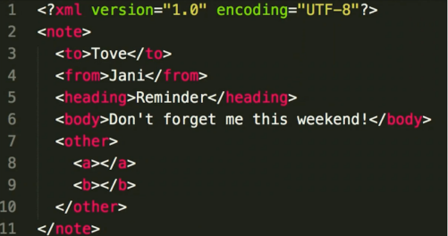
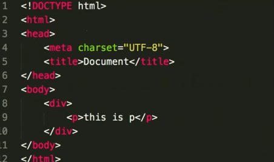

# JS-Web-API-DOM

- JS 基础知识，规定语法（ECMA 262 标准）
- JS WEB API，网页操作的 API （W3C 标准）
- 前者是后者的基础

问题

- DOM 是那种数据结构: 树(DOM 树)
- DOM 操作的常用 API
- attr 和 property 的区别
- 一次性插入多个 DOM 节点，考虑性能

知识点

- DOM 的本质
- DOM 节点操作
- DOM 结构操作
- DOM 性能

## DOM 的本质

- vue 和 React 框架应用广泛，封装了 DOM 操作
- 但 DOM 操作一直是基础、必备知识
- 不做只懂框架不懂基础的前端...
- 不要被框架、工具限制了自己的能力





Document Object Model，简称 DOM

## DOM 节点操作

- 获取 DOM 节点
- attribute
- property

```js
const div1 = document.getElementById('div1');
console.log('div1', div1);

const divList = document.getElementsByTagName('div'); // 集合
console.log('divList.length', divList.length);
console.log('divList[1]', divList[1]);

const containerList = document.getElementsByClassName('container'); // 集合
console.log('containerList.length', containerList.length);
console.log('containerList[1]', containerList[1]);

const pList = document.querySelectorAll('p');
console.log('pList', pList);

const pList = document.querySelectorAll('p');
const p1 = pList[0];
```

### DOM 节点的 property

通过 js 属性来获取和修改

```js
const pList = document.querySelectorAll('p');
const p1 = pList[0];
// property 形式
p1.style.width = '100px'; // 修改样式
console.log(p1.style.width); // 获取样式
p1.className = 'red'; // 修改 class
console.log(p1.className); // 获取 class
console.log(p1.nodeName); // 获取 nodeName
console.log(p1.nodeType); // 获取 nodeType
```

### DOM 节点的 attribute

标签属性的形式

```js
// attribute
p1.setAttribute('data-name', 'test-name');
console.log(p1.getAttribute('data-name'));
p1.setAttribute('style', 'font-size: 50px;');
console.log(p1.getAttribute('style'));
```

### property 和 attribute 区别

- property：修改对象属性，不会体现到 html 结构中
- attribute：修改 html 标签属性，会改变 html 结构
- 两者都有可能引起 DOM 重新渲染

## DOM 结构操作

- 新增、插入节点
- 获取子元素列表、获取父元素
- 删除子元素

```js
const div1 = document.getElementById('div1');
const div2 = document.getElementById('div2');

// 新建节点
const newP = document.createElement('p');
newP.innerHTML = 'this is newP';
// 插入节点
div1.appendChild(newP);

// 移动节点
const p1 = document.getElementById('p1');
div2.appendChild(p1);

// 获取父元素
console.log(p1.parentNode);

// 获取子元素列表
const div1ChildNodes = div1.childNodes;
console.log(div1.childNodes);
const div1ChildNodesP = Array.prototype.slice
  .call(div1.childNodes)
  .filter((child) => {
    if (child.nodeType === 1) {
      return true;
    }
    return false;
  });
console.log('div1ChildNodesP', div1ChildNodesP);

// 删除元素
div1.removeChild(div1ChildNodesP[0]);
```

## DOM 性能

- DOM 操作非常 "昂贵", 避免频繁的 DOM 操作
- 对 DOM 查询做缓存
- 精频繁操作改为一次性操作

```js
const list = document.getElementById('list');

// 创建一个文档片段，此时还没有插入到 DOM 结构中
const frag = document.createDocumentFragment();

for (let i = 0; i < 20; i++) {
  const li = document.createElement('li');
  li.innerHTML = `List item ${i}`;

  // 先插入文档片段中
  frag.appendChild(li);
}

// 都完成之后，再统一插入到 DOM 结构中
list.appendChild(frag);

console.log(list);
```
