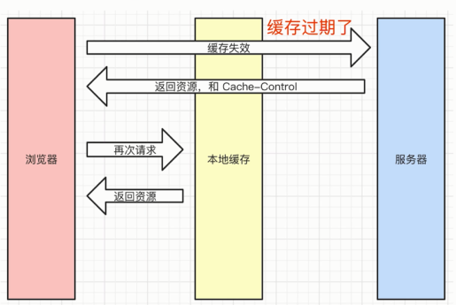

# HTTP

- 前端工程师开发界面
- 需要调用后端接口，提交、获取数据 --- HTTP 协议
- 要掌握好 ajax

问题
- http 常见的状态码有哪些？
- http 常见的 header 有哪些？
- 什么是 Restful-API
- 描述一下 http 缓存机制（重要）

## 状态码

- 状态码分类
- 常见状态码
- 关于协议和规范

状态码分类：
- 1xx 服务器收到请求
- 2xx 请求成功，如 200
- 3xx 重定向，如 302
- 4xx 客户端错误，如 404
- 5xx 服务端错误，如 500

常见状态码：
- 200 成功
- 301 永久重定向（配合 location，浏览器自动处理）
- 302 临时重定向（配合 location，浏览器自动处理）
- 304 资源未被修改
- 404 资源未找到
- 403 没有权限
- 500 服务器错误
- 504 网关超时

关于协议和规范
- 就是一个约定
- 要求大家都跟着执行
- 不要违反规定，例如 IE 浏览器

## http methods

- 传统 methods
- 现在的 methods
- Restful API

传统 methods：
- get 获取服务器的数据
- post 向服务器提交数据
- 简单的网页功能，就这两个功能

现在的 methods：
- get 获取数据
- post 新建数据
- patch/put 更新数据
- delete 删除数据

Restful API：
- 一种新的 API 设计方式(早已推广使用)
- 传统 API 设计：把每一个 url 当做一个功能
- Restful API 设计，把每一个 url 当做一个唯一的资源

如何设计成一个资源
- 尽量不用 url 参数
  - 传统 API 设计：/api/list?pageInde=2
  - Restful API 设计：/api/list/2
- 用 method 表示操作类型
  - 传统的
    - post 请求：/api/create-blog
    - post 请求：/api/update-blog?id=100
    - get 请求：/api/get-blog?id=100
  - Restful API
    - post 请求：/api/blog
    - patch 请求：/api/blog/100
    - get 请求：/api/blog/100

## http headers

- 常见的 Request Headers
- 常见的 Response Headers

Request Headers：
- Accept：客户端可以处理的内容类型
- Accept-Encoding：客户端能够理解的内容编码方式，如 gzip
- Accept-Language：客户端可以理解的自然语言，如 zh-CN
- Connection: keep-alive 一次 TCP 连接重复使用
- cookie
- Host
- User-Agent(简称UA) 浏览器信息
- Content-Type 发送数据的格式，如 application/json

Response Headers：
- Content-Type 返回数据的格式，如 application/json
- Content-Length 返回数据的大小，多少字节
- Content-Encoding——返回数据的压缩算法。如 gzip
- Set-Cookie

自定义 header
- 数据加密验证相关

缓存相关的 headers：
- Cache-Control
- Expires
- Last-Modified
- If-Modified-Since
- Etag
- IF-None-Match

## http 缓存

- 关于缓存的介绍
- http 缓存策略（强制缓存、协商缓存）
- 刷新操作方式，对缓存的影响

关于缓存
- 什么是缓存？
- 为什么要需要缓存？
- 哪些资源可以被缓存？- 静态资源(js、css、img)

### **强制缓存**

cache-Control
- Response Headers 中
- 控制强制缓存的逻辑
- 例如 cache-Control: max-age=3146000 （单位是秒）

cache-Control 的值：
- max-age
- no-cache：不做客户端缓存
- no-store
- private：最终用户做缓存
- public：中间设备缓存

关于 Expires：
- 同在 Response Headers 中
- 同为控制缓存过期
- 已被 cache-Control 代替（同时存在时以 cache-Control 为准）

### **协商缓存**

- 服务器端缓存策略
- 服务端判断客户端资源，是否和服务端资源一样
- 一致则返回 304 ，否则返回 200 和最新的资源

资源标识
- 在 Response Headers 中，有两种
- Last-Modified 资源最后的修改时间
- Etag 资源的唯一标识（一个字符串，类似于指纹信息）

Last-Modified

Etag

Last-Modified 和 Etag 共存

- 会优先使用 Etag
- Last-Modified 只能精确到秒级
- 如果资源被重复生成，而内容不变，则 Etag 更精准

**完整流程**：

## 刷新操作

- 正常操作： 地址栏输入 url，跳转链接，前进后退等
  - 强制缓存有效，协商缓存有效
- 手动刷新：F5，点击刷新按钮，右击菜单刷新
  - 强制缓存失效，协商缓存有效
- 强制刷新：Ctrl + F5
  - 强制缓存失效，协商缓存失效

## 链接

https://segmentfault.com/a/1190000018234763
