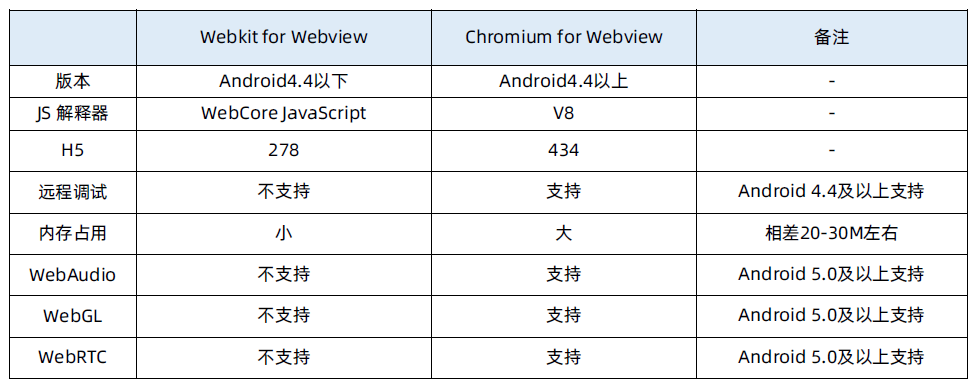
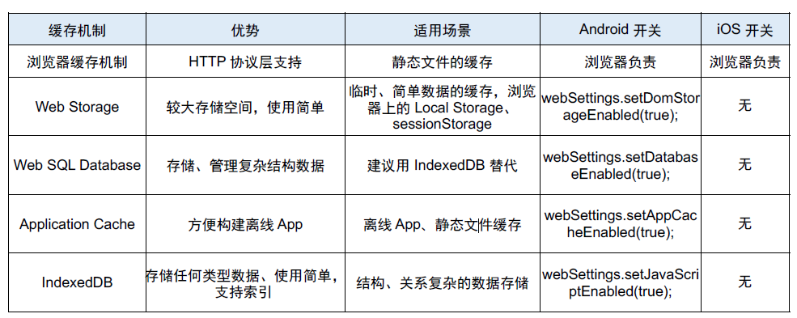
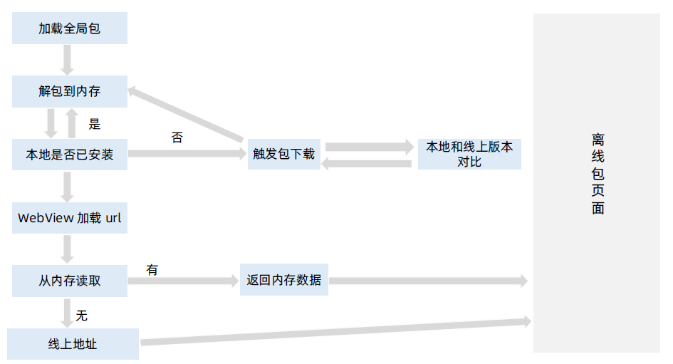
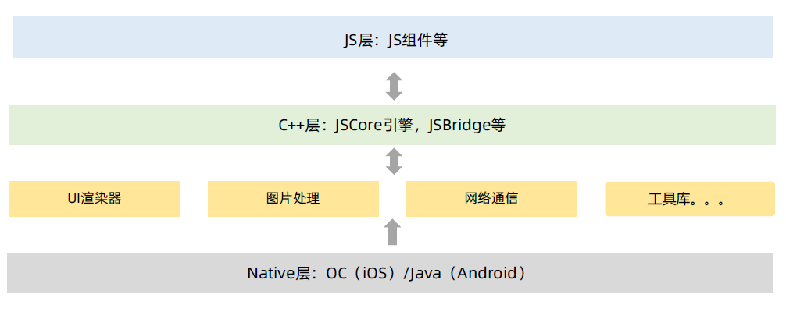
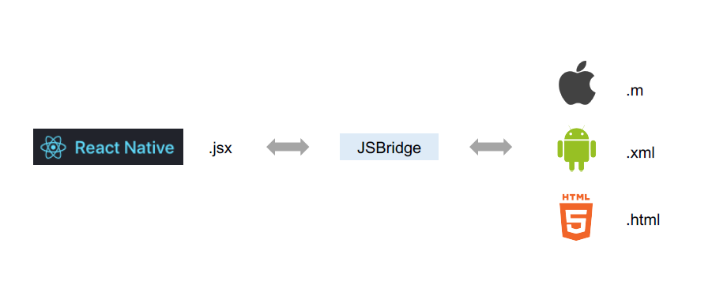
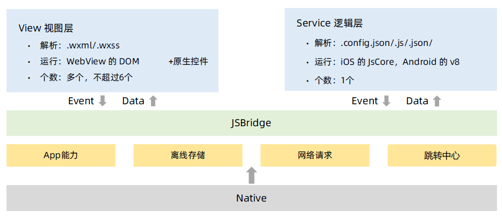
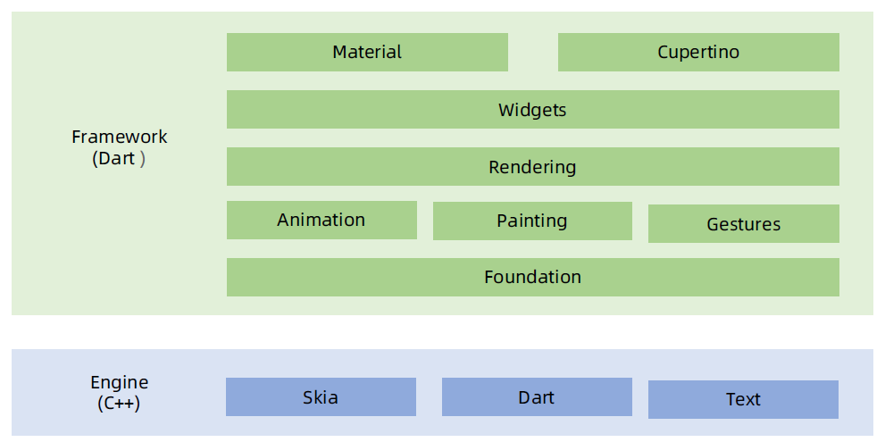
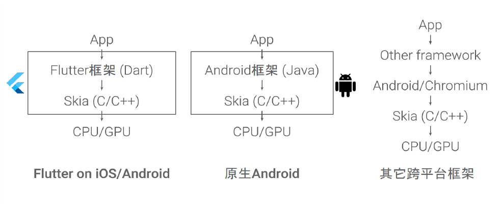

# 原生 App 优化

## WebView：如何选择合适的 WebView 内核？

### iOS UIWebView

优点：
1. 从 iOS 2 开始就作为 App 内展示 Web 内容的容器
2. 排版布局能力强

不足：
1. 内存泄露
2. 极高内存峰值
3. Touch Delay（300ms延迟）
4. JavaScript 的运行性能和通信限制
5. 2018年 iOS 12 以后已经被标记为 Deprecated 不再维护

### iOS WKWebView

优势：
1. 苹果在 WWDC 2014 上推出的新一代 WebView 组件
2. WKWebView 的内存开销比 UIWebView 小很多
3. 在性能、稳定性、占用内存方面有很大提升
4. 高达 60fps 的滚动刷新率
5. 自身就支持了右滑返回手势
6. 支持了更多的 HTML 的属性
7. 内存占用是 UIWebView 的1/4~1/3
8. 加载速度比 UIWebView 提升了一倍左右
9. 更为细致地拆分了 UIWebViewDelegate 中的方法
10. 允许 JavaScript 的 Nitro 库加载并使用（ UIWebView 中限制）大大提高了页面 JS 执行速度。
11. 可以和JS 直接互调函数，不像 UIWebView 需要第三方库 WebViewJavaScriptBridge 来协助处理和 JS 的交互。

不足：
1. 不支持页面缓存，需要自己注入 Cookie，而 UIWebView 是自动注入 Cookie。
2. 无法发送 POST 参数问题

### Android WebKit 和 Chromium



Android 第三方:

X5 内核
1. **速度快：相比系统 WebView 的网页打开速度有 30+% 的提升**
2. 省流量：使用云端优化技术使流量节省 20+%
3. 更安全：安全问题可以在 24 小时内修复
4. 更稳定：经过亿级用户的使用考验，CRASHE 率低于 0.15%
5. **兼容好：无系统内核的碎片化问题，更少的兼容性问题**
6. 体验优：支持夜间模式、适屏排版、字体设置等浏览增强功能
7. 功能全：在 H5、ES6 上有更完整支持
8. **更强大：集成强大的视频播放器，支持视频格式远多于系统 WebView**
9. 视频和文件格式的支持 X5 内核多于系统内核
10. 防劫持是 X5 内核的一大亮点

### 选型建议

- iOS：WKWebView
- Android：X5

## 浏览器优化：如何设置全局 WebView？

启动过程
- 当 App 首次打开时，默认是并不初始化浏览器内核的；
- 当创建 WebView 实例的时候，才会启动浏览器内核（打开时间需要 70~700ms），并创建 WebView 的基础框架。

实施步骤
- 使用全局 WebView 进行优化；
- 在客户端刚启动时，就初始化一个全局的 WebView 待用，并隐藏；
- 当用户访问了 WebView 时，直接使用这个 WebView 加载对应网页，并展示。

具体流程
1. 在初始页面上创建全局 WebView ；
1. 根据页面跳转流向，确定目标网页；
1. 利用全局 WebView，加载目标网页对应的基础文件；
1. 向服务器发送请求消息，请求目标网页对应的网页数据；
1. 将请求到的网页数据渲染到初始页面上；
1. 运行状态切换为退出状态时，销毁 WebView 。

技术好处：
- 减少首次打开 WebView 时间

不足之处：
- 额外的一点内存消耗

## 浏览器优化：如何实现导航栏预加载？

原来：
- 在 WebView 加载完成之后进行初始化

现在：
- 和 WebView 并行一起加载

## 浏览器优化：如何打通登录态？

原来：
- HTML5 页面上接口每次查询，Cookies 里是否有登录态，无登录态 HTML5 跳转统一登陆页，app 拦截统一登陆页，进入原生登陆，原生登陆成功，在浏览器写登录态 Cookies。

现在：
- Cookies 由 app 发统一登录接口并埋上登录态 Cookies ，并且在 Cookies 有效时间内无需再次请求登陆接口。

## 浏览器优化：如何实现 URL 预加载？

原来
- 所有准备好再请求页面

现在
- 准备和请求页面同步进行，URL load 和动画并行加载。

## 浏览器优化：如何提升滚动条的使用体验？

原来：
- 采用系统自带进度条

现在：
- 模拟 WiFi 下页面加载过程，让用户感觉页面加载变快了

## 浏览器优化：如何对 JS-SDK 进行优化？

原来：
1. Scheme：长度有限制
2. iframe：依赖 JSSDK.js 文件

现在：
- WebKit：无依赖 JSSDK.js 文件，直接调用

## 浏览器优化：目前主流的缓存策略有哪些？



## HTML5 离线化：主流的技术实现方案有哪些？

离线包类型
- 全局离线包：包含公共的资源，可供多个应用共同使用
- 私有离线包：只可以被某个应用单独使用

离线包架构



离线包下载
- 如果用户处于移动网络下，不会在后台下载离线包；
- 如果当前用户点击 app，离线包没有下载好，用户就要等待离线包下载好才能用。

离线包运行模式
- 请求包信息：从服务端请求离线包信息存储到本地数据库的过程。离线包信息包括离线包的下载地址、离线包版本号、加密/签名信息等。
- 下载离线包：把离线包从服务端下载到手机。
- 安装离线包：下载目录，拷贝到手机安装目录。

大厂离线包方案
- 美团：LsLoader - 通用移动端 WebApp 离线化方案
- 腾讯：Alloykit - 手Q 离线包
- 阿里：极致的 Hybrid - 航旅离线包再加速

## 混合式开发： React Native 内核及优势介绍

愿景
- Learn once, write anywhere.
- 学习一次，写在任何地方。

技术优势
- 技术：
    - 代码共享，iOS 和 Android（甚至 HTML5）只编写一套代码；
    - 性能方面，与 Native 几乎相同；
    - 动画方面，React Native 提供了非常流畅的动画，因为在渲染之前代码已转换为原生视图。
- 效率：
    - 调试时，无需每次代码变更都在编译器打包，可即时查看更改；
    - iOS、Android 2 人力变更成 1 人力。
- 发版：
    - 支持热更新，不用每次发版都发布应用商店；
    - 发版时间自由控制，支持 iOS、Android 两平台同一时间发布。

### 底层内核





RN：helloWorld.jsx
```js
<Text>
    Hello World!
</Text>
```

iOS：helloWorld.m
```c
UILabel *text = [[UILabel alloc]
initWithFrame:CGRectMake(self.view.frame.size.width/2-50,
self.view.frame.size.height/2-25, 100, 50)];
text.text = @"Hello World!";
text.textAlignment = NSTextAlignmentCenter;
text.numberOfLines = 0;
text;
```

Android：helloWorld.xml
```js
<TextView
    android:layout_width="wrap_content"
    android:layout_height="wrap_content"
    android:text="Hello World!"
    app:layout_constraintBottom_toBottomOf="parent"
    app:layout_constraintLeft_toLeftOf="parent"
    app:layout_constraintRight_toRightOf="parent"
    app:layout_constraintTop_toTopOf="parent" />
```

Web：helloWorld.html
```html
<div>
    Hello World!
</div>
```

行业背景
- 应用商店发版问题
- 两端研发不同步问题

选型建议
- 首次发布：2015年1月
- Github Starts：8.33w（2019年底）
- 社区活跃：非常活跃
- 组件：很丰富
- 学习曲线：低
- Native 性能：好
- 综合建议：React 技术全家桶业务建议选用 RN

## 混合式开发：小程序内核及优势介绍

愿景
- 触手可及：用户扫一扫或者搜一下即可打开应用
- 用完即走：不用关心是否安装太多应用

技术优势
- H5 相比 App 开发，开发门槛更低
- 优于 H5，接近 Native 体验
- 相机、位置、网络、存储等丰富的原生能力
- 顶部下拉、搜索、扫码等入口，用完即走，简单方便
- 不用像 App 那样下载，直接打开退出即可，支持热更新

底层内核



行业背景
- App 平台侧：
    - 流量变现
    - 小程序生态
    - 类应用分发市场
- 企业应用侧：
    - 移动流量枯竭，新流量红利
    - 解决部分获客难问题，极低的拉新成本
    - 大幅降低开发成本
    - 业务上更多的试错机会

选型建议
- 首次发布：2017年1月（微信小程序）
- Github Starts：闭源
- 社区活跃：还可以
- 组件：非常丰富
- 学习曲线：非常低
- Native 性能：还可以
- 综合建议：平台类产品，现在有流量输出给商家端；多个 App，实现业务互通；和 RN、Flutter 相比，更推荐小程序

## 混合式开发：Flutter 内核及优势介绍

愿景
- A portable toolkit for building beautiful experiences wherever you mightwant to paint pixels on the screen.
- 一个拥有美好构建体验的便携式的工具包，可以让你在屏幕的任何地方绘制像素。

技术优势
- 编写一次，即可部署各终端: Web、Android/iOS、Mac/Linux/Windows、Fuchsia OS
- 底层使用 Skia 图形引擎，图形性能媲美原生应用
- 界面像一款全屏应用程序或 2D 游戏
- 速度快，使用本机 ARM 二进制文件，提前编译，不需要 JVM

底层实现：





选型建议
- 2017 年 5 月
- Github Starts：8.16w（2019年底）
- 社区活跃一般
- 组件是专用小部件，不够丰富
- 学习曲线相对较高，从新熟悉 Dart 语言
- Native 性能最好
- 综合建议：考虑性能，业务面向多终端，App 团队人足够，建议选择
