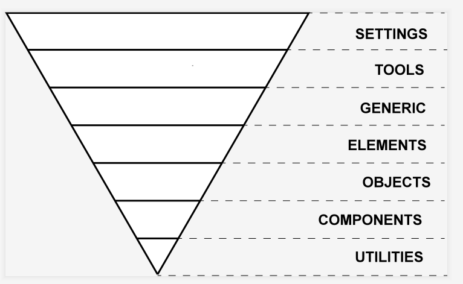

# 蘑菇街之 CSS 架构搭建

## vue 3 项目创建于初始配置

- Vue CLI 4.x、Node >= v8.9
- Vue 全家桶：Vue3、Vuex、Vue-Router、Axios
- 本地 Mockjs

## Mockjs

- 模拟后端接口数据，提高前端开发效率
- 线上平台：RAP2、Easy-Mock
- 本地 Mockjs

RAP2：http://rap2.taobao.org/

## CSS 设计模式

### OOCSS

- OO：面向对象
- 原则一：容器与内容分离
- 原则二：结构（基础对象）与皮肤分离
- 原则三：面向设计开发

- Vue 中的组件 = OOCSS
- OOCSS 应用：Grid 栅格系统、布局组件等

### BEM

- http://getbem.com/

- 块 block、 元素 element `__` 、修饰符 modifier `--`
- 作用：命名规范，让页面结构更清晰
- 进阶版的 OOCSS

```css
.block { /* styles */ }
.block__element { /* styles */ }
.block--modifier { /* styles */ }
```

```css
.person {}
.person__hand {}
.person--female {}
.person--female__hand {}
.person__hand--left {}
```

### SMACSS

- 分类：Base、Layout、Modules、State、Theme
- 好处：易维护、易复用、易扩展 ...
- 命名规范：.L-header、.is-hideen. 、.theme-nav


- normalize.css：https://github.com/necolas/normalize.css/

- [SMACSS 官网](http://smacss.com/)
- [SMACSS 中文翻译](https://github.com/jeffwcx/translate-smacss-zh)

## ITCSS

- 分层：七层
- 与 SMACSS 区别：层次分的更细
- [awesome-itcss](https://github.com/ahmadajmi/awesome-itcss)

ITCSS的主要原则之一是将CSS代码库分为几个部分（称为layer），这些部分采用倒三角形的形式：



倒三角形从上到下的每个部分：

1. 设置 –预处理程序变量和方法（无实际CSS输出）
2. 工具 – Mixins和函数（无实际CSS输出）
3. 常规 – CSS重置，其中可能包括Eric Meyer的重置， Normalize.css或您自己的一批代码
4. 元素 –没有类的单个HTML元素选择器
5. 对象 -通常遵循OOCSS方法的页面结构类
6. 组件 –用于设置任何页面元素和所有页面元素样式的美学类（通常与对象类的结构结合使用）
7. Trumps –最重要的样式，用于覆盖三角形中的任何其他内容

**Settings**

- 定义一些公共变量
- 公共变量：颜色、边框、字体大小、阴影、层级

```css
$color-primary: #FF5777;
$color-white: #FFFFFF;
$color-black: #000000;
```

**Tools**

- 引入 SassMagic 工具库：提供了常用的 mixin，function。

mixin，function 等等

```css
@mixin sample-mixin () {
  ...
}
```

到 Tools 为止，不会生成具体的 css

**Generic**

- 使用 reset，normalize 等，重置浏览器样式

```css
*,
*::before,
*::after {
  box-sizing: border-box;
}
```

**Base**

type selector 比如 link, p 等等，只有这一层才使用 type selector

- 对各类元素基础样式进行补充

```css
p {
  margin: 0
  line-height: 1.5;
}
```

**Objects**

Cosmetic-free，不使用比如 color、border-color、background-color 之类的
使用这个 CSS 你在浏览器上面只可以看一片空白

主要用来做画面的 layout

```css
.o-container {
  box-sizing: border-box;
  margin: 0 auto;
}
```

**Components**
UI 组件

到这个部分，可以和搞设计的商量下具体有哪些组件需要实现，可以分给多个人来同时实现

```css
/* # button组件 */

.c-btn {
  display: flex;
  justify-content: center;
  align-items: center;
  ...

  &--primary {
    background-color: #ff5959;
    color: #fff;
  }

  &--large {
    font-size: 16px;
    padding: 16px 14px;
    ...
  }
}
```

HTML 类似这样

```html
<a class="c-btn c-btn--primary" href="#">sample</a>
<a class="c-btn c-btn--primary c-btn--large" href="#">sample</a>
```

**细化组件**

在实际开发中，由于是用的 responsive web design

所以加了一层来放每个页面专用的部分

因为每个 component 在不同的页面需要不同的 media-query 来进行具体调整

**文件结构**

```txt
├── components
│   ├── _button.scss
│   ├── _grid.scss
├── pages
│   └── _top.scss
│   └── _guide.scss
```

**Trumps**

放各种 helper

最主要的作用是用在不适合或者不容易放在 Component 的时候

比如 margin，很可能不应该放 Component，这时候可以用 Trumps 来微调，这样可以防止你的 Component 变得非常大

只有这一层才可以使用! important，以此来避免多个! important 的混乱局面

```css
.u-color {
  &--white {
    color: $white !important;
  }
}

.u-hidden {
  display: hidden !important;
}
```

**文件结构**

目前发现两种文件结构：

1. 每个 layer 一个文件夹 https://github.com/ahmadajmi/itcss

2. 名字的前缀用 layer 的名字 https://github.com/itcss/itcss-netmag/tree/master/css

目前采用的是第二种，感觉 CSS 多了以后相对容易管理

### ACSS

- 一个样式属性一个类
- 好处：极强的复用性、维护成本低
- 坏处：破坏了 CSS 命名的语义化

tailwindcss

- https://github.com/tailwindlabs/tailwindcss\
- https://tailwindcss.com/docs
- https://www.tailwindcss.cn/docs
- https://github.com/aniftyco/awesome-tailwindcss

## CSS架构方案的选择

由 ITCSS、BEM、ACSS 去打造一套 CSS 架构方案

- settings
- tools
- base
- object
- theme
- gobal.css

### Components 层代码

- OOCSS -> BEM （进阶版 OOCSS）
- 经典组件：栅格、布局组件
- 自定义组件

### ACSS 层代码

- 让样式极限复用
- 解决 ACSS 无语义化缺点：属性选择器
- Settings 与 Acss 层的关系

