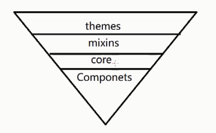
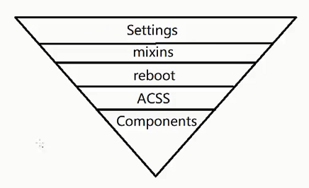

# 经典框架之 CSS 源码分析

## ElementUI 之 CSS 架构揭秘

- https://github.com/ElemeFE/element

## Ant Design 之 CSS 架构揭秘

- https://github.com/ant-design/ant-design
- style：https://github.com/ant-design/ant-design/tree/master/components/style

css 架构：

- themes
- mixins
- core
- Components



### CSS 架构

1. themes
主题：这个目录通常用于存放不同主题的样式。例如，你可能会有一个“亮色主题”和一个“暗色主题”。每个主题可以包含一组特定的颜色、字体和其他视觉样式。

    用途：
    - 提供可重用的主题样式。
    - 方便在多个页面或项目中切换主题。

2. mixins
混入：这个目录用于存放可重用的 CSS 混入（mixins）。混入是一种在多个地方重用相同样式的方法，可以减少代码重复。

    用途：
    - 封装常用的 CSS 功能，如响应式设计、渐变背景等。
    - 提高代码的可维护性和可读性。

3. core
核心：这个目录通常包含项目的基础样式，如重置样式、基础布局、排版等。

    用途：
    - 提供项目的基础样式。
    - 确保项目在不同浏览器和设备上的一致性。

4. Components
组件：这个目录用于存放项目的各个组件样式。组件可以是按钮、表单、导航栏等任何可重用的 UI 元素。

    用途：
    - 封装组件的样式和行为。
    - 提高代码的可重用性和可维护性。

```
/css
  /themes
    light-theme.css
    dark-theme.css
  /mixins
    responsive.scss
    gradient.scss
  /core
    reset.css
    layout.css
    typography.css
  /components
    button.css
    form.css
    navbar.css
```

## Bootstrap 之 CSS 架构揭秘

- https://github.com/twbs/bootstrap
- https://getbootstrap.com/docs/5.0/getting-started/introduction/
- 使用 ITCSS 架构
    - https://github.com/twbs/bootstrap/blob/main/scss/_reboot.scss
    - OOCSS



## TailWind 框架

- https://github.com/tailwindlabs/tailwindcss
- https://www.tailwindcss.cn/docs
- ACSS 原子类
