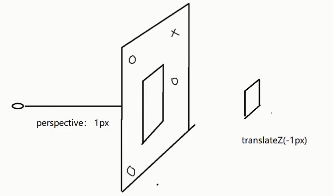

# CSS 奇淫巧计

## CSSModules

方案：

1. 不同的父选择器方案
2. BEM 方案
3. SMACSS 方案
4. scoped 方案
5. 终极方案 CSSModules

## CSS-in-JS

- 关注点分离
- **关注点混合**：CSS-in-JS

React 对 CSS 的封装非常弱

使用内联样式，不支持伪类、伪元素、后代选择器、媒体查询等 CSS 特性

导致了一系列第三方库（styled-components），用来加强 React 的 CSS 操作，他们统称为 `CSS IN JS`。

**目的**：组件代码放在一起，好维护

vue 中：vue-styled-components

## CSS 视差滚动



```css
.page {
    perspective: 1px;
    padding: 0;
    height: calc(100vh);
    overflow: auto;
}
.img {
    position: absolute;
    left: 30%;
    transform: translate(-2px) scale(4);
    /* transform: translate(-1px) scale(2); */
}
```
