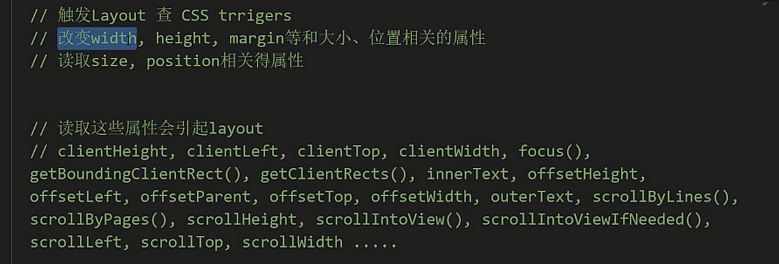

# 打造高性能 CSS 动画

## 通过渲染原理看动画

## 高性能 CSS 动画

- 硬件加速
- requestAnimationFrame
- 目标 16ms

### CSS Triggers

- https://csstriggers.com/
- https://github.com/kisstkondoros/csstriggers

CSS Triggers 提供在线的页面解析参考，程序员可通过此参考了解哪些 CSS 属性触发了重绘和合成，但不引发布局，这些是浏览器在渲染网页时的执行过程。

- Layout：浏览器生成每个元素的几何形状和位置
- Paint：浏览器将每个元素的像素解析为图层
- Composite：浏览器在屏幕上绘制图层。

合成操作是浏览器执行的最廉价操作，如果你的 CSS 动画的代码反复触发合成和重绘操作的属性，则很难将 60fps（每秒帧数）作为平滑网页动画的关键数字。

### 硬件加速

- 也叫作 GPU 加速
- GPU 擅长对 texture 进行偏移、放大缩小、旋转等
- GPU 渲染时跳过 Layout、paint，只触发 Composite，速度极快

Layer 模型：

- CSS 属性为元素生成 Layer
- Layer 会作为 texture 上传到 GPU

 Layer 触发条件：

- 3d 或者 perspective transform 属性
- 使用 animation、transition 改变 opacity、transform 的元素
- video、canvas、flash、CSS filters 等

### requestAnimationFrame

- 动画流畅： 1/60 FPS，约等于 16.7 ms 内，把一帧内容准备好
- 自动调节频率，一个时间间隔只包含一帧
- requestAnimationFrame(callBack)

### 目标 16ms

## CSS Time

