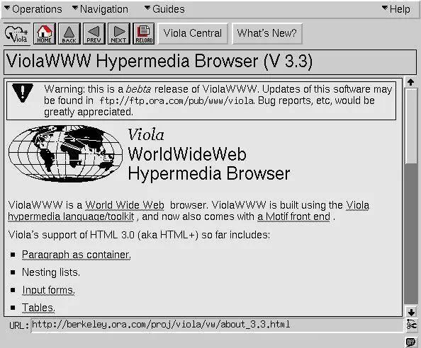
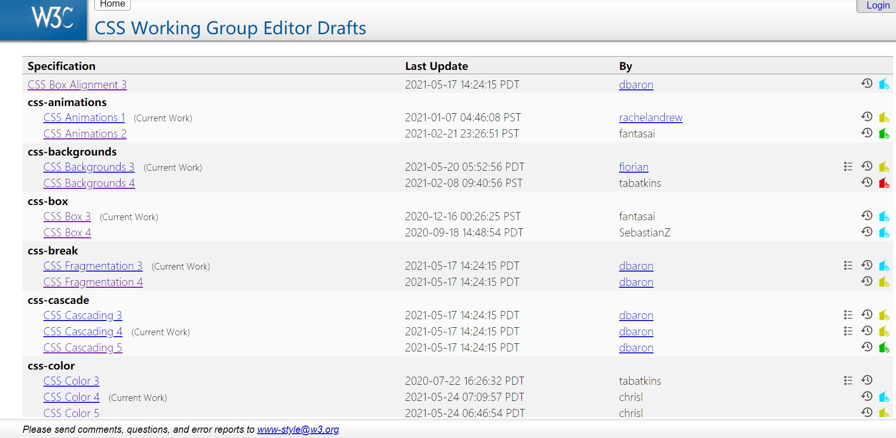

# 介绍

- 整体的前端井喷式的发展，单一布局已经无法满足需求
- 新框架诞生也脱离不开 CSS 布局

目标：

- 学习现代布局四大核心技术
  - flex 弹性布局
  - grid 网格布局
  - 移动端适配布局
  - 响应式布局
- 与设计师配合
  - 设计图相关概念
  - PhotoShop 切图详解
  - 标注工具：蓝湖、PxCook
  - 智能平台：imgCook
- 核心知识点：
  - 弹性、网格、浮动、定位
  - 媒体查询、响应式、rem、vm
  - display、逻辑属性、方法论、命名规范
  - 信息标注、PxCook、BFC、...
- 布局方案：
  - 不定项居中、均分列、视距差、等高
  - 粘性页脚、两列与三列、溢出项、超大图
  - 叠加、组合排序、瀑布流、图文混排
  - 自适应行列、多栏、栅格、...
- 案例：
  - Swiper 轮播图
  - 知乎导航
  - 百度热词风云榜
  - B 站移动端首页
  - 小米商品导航菜单
  - Ghost 博客系统
  - 网易移动端首页
- Ant Design Pro 管理系统
  - 整体框架搭建及代码区分
  - 侧边栏 flex 布局
  - 侧边栏交互行为
  - 主体区域 flex 布局
  - 信息展示 grid 布局
  - 设置区域模块与元件
  - 设置区域交互行为
  - 信息展示响应式布局
  - 导航菜单响应式交互

## 常见布局

- 定宽+居中
- 两列：左侧固定+右侧自适应
- 移动端适配
- 响应式布局

## CSS 发展史与 CSS 模块划分

### HTML 的诞生

1991 年 8 月 6 日，诞生了人类有史以来的第一个网站（即：[http://info.cern.ch](http://info.cern.ch)），作者是万维网之父[蒂姆·伯纳斯·李](https://baike.baidu.com/item/蒂姆·伯纳斯·李)。当然网站的形态跟现在完全不一样，因为它没有样式，简单地说，它只有文字和图像两种，并没有其他的信息元素。

	
  
早期的HTML网页

### CSS 的诞生

在那个遥远的年代，人们也渴望 web 网页变得更漂亮，于是在 1994 年[哈肯·维姆·莱](https://baike.baidu.com/item/哈肯·维姆·莱)和[伯特·波斯](https://baike.baidu.com/item/伯特·波斯)共同提出了层叠样式表（Cascading Style Sheets，即 CSS）的概念。CSS 从此成为了网页开发的标准之一，对于网页排版印刷、美感以及亲和力有着深远的影响和意义。

在这两年之后，[W3C](https://baike.baidu.com/item/w3c)的 CSS 工作小组(即哈肯·维姆·莱团队)推出了 CSS1.0 规范，后来陆续发布了 CSS2.1 规范和 CSS3.0 规范草案及其他迭代版本。

	
    
W3C CSS2.1规范文档

### CSS 的版本

CSS2.1 规范和 CSS3.0 规范草案指导 Web 开发者写了很多年的 CSS。直到后来，大概 2015 年左右，W3C 的 CSS 工作小组发现 CSS 发展的越来越快，有关于 CSS 方面的特性增加了不少，而且不同的特性推进速度都有所不同。也就这个时候，W3C 的 CSS 工作小组为了能更好的维护和管理 CSS 的特性，该组织决定不再以 CSS 的版本号，比如我们熟悉的 CSS1.0、CSS2.1、CSS3.0 这样的方式来管理 CSS。而是将每个 CSS 功能特性拆分成独立的功能模块，并且以 Level 1, Level2，Level 3 等方式来管理 CSS 规范中的特性。

也就是说以后不会再出现 CSS4.0 的版本，而是具体指向某个模块的 Level 版本，例如：CSS 选择器模块已经发展到 Level 4 了。可以通过 W3C 官网查看到 CSS 模块的各种 Level 版本，或查看[https://drafts.csswg.org/](https://drafts.csswg.org/)：

	
  
CSS模块的划分

### CSS 的研究方向

大体上 CSS 的学习可以朝着三个方向进行研究，分别是：特效、工程化、布局。比如说特效：可以学习动画、3D、渐变等；工程化：可以学习 sass、less、postcss 等；布局：可以学习 flex、grid、响应式等。

## 常用软件安装

1. VS Code 编辑器，下载地址：https://code.visualstudio.com/
2. Chrome 浏览器下载地址：https://www.google.cn/chrome/
3. PhotoShop CC 2019 工具，下载地址：https://www.adobe.com/products/photoshop.html
