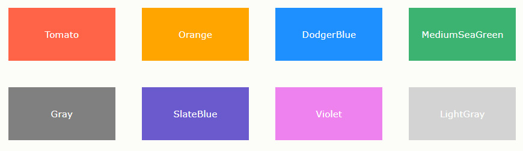
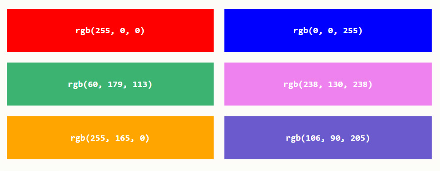
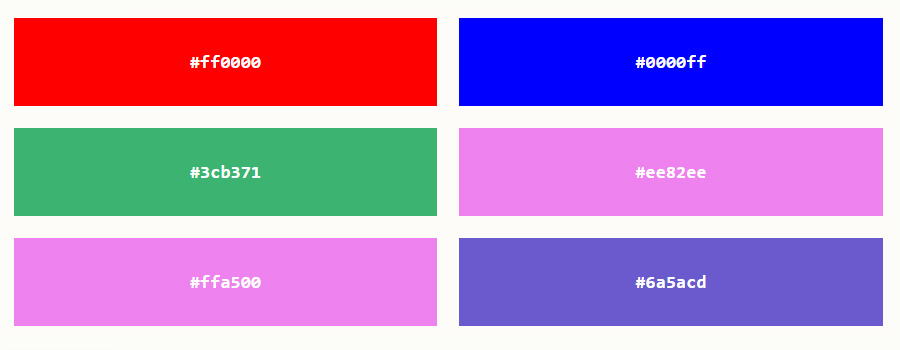
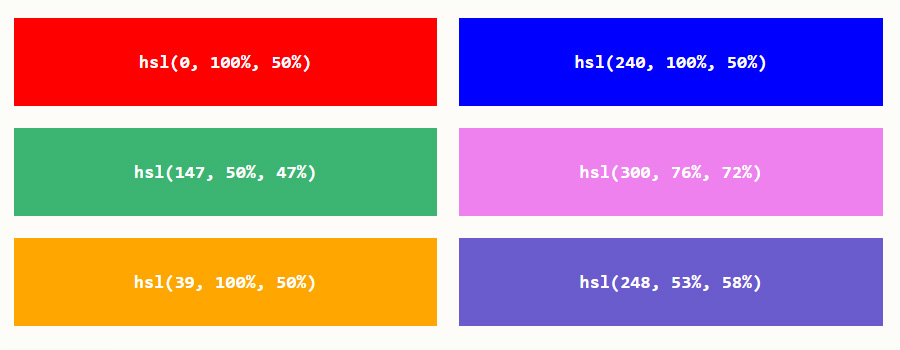
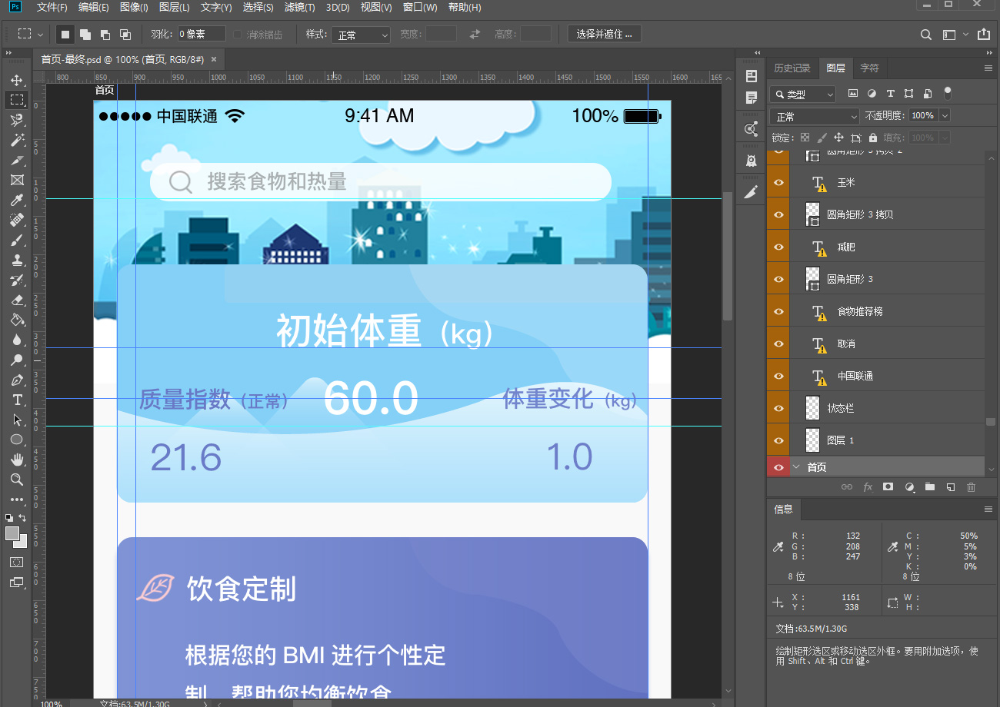
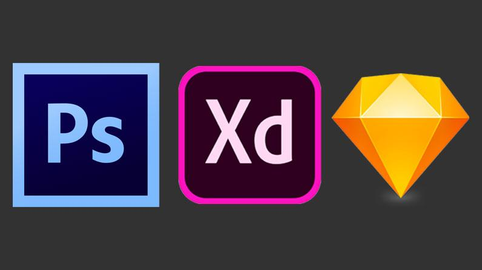

# CSS 还原 UI 设计

## 简介

- 尺寸
- 位置
- 颜色
- 文字

## 长度单位

### 长度

CSS 中使用的每个属性都允许拥有一个或一组值，例如：`color : red;` 代码中，其中 color 为属性，red 为值。在 CSS 中有很多属性是用来控制位置和尺寸的，所以它们的值必须是一个表示长度的数值，而数值是需要添加单位的。

CSS 中有两种长度单位——绝对长度单位和相对长度单位。重要的是要知道它们之间的区别，以便理解它们控制的元素将变得有多大。

### 绝对长度单位

以下都是绝对长度单位——它们与其他任何东西都没有关系，通常被认为总是相同的大小。

| 单位 | 名称 |
| ------ | ------ |
| cm | 厘米 |
| mm | 毫米 |
| in | 英寸 |
| pt | 点 |
| px | 像素 |

这些绝对长度单位中，除了 px 像素经常使用外，其他并不常用。

### 相对长度单位

相对长度单位相对于其他一些东西，比如父元素的字体大小，或者视图端口的大小。使用相对单位的好处是，经过一些仔细的规划，您可以使文本或其他元素的大小与页面上的其他内容相对应。以下列出了常见相对单位。

| 单位 | 名称 |
| ------ | ------ |
| em | 在 font-size 中使用是相对于父元素的字体大小，在其他属性中使用是相对于自身的字体大小 |
| ex | 字符 “x” 的高度 |
| ch | 数字 “0” 的宽度 |
| rem | 根元素的字体大小 |
| lh | 元素的 line-height |
| vw | 视窗宽度的 1% |
| vh | 视窗高度的 1% |
| vmin | 视窗较小尺寸的 1% |
| vmax | 视图大尺寸的 1% |

像 rem 和 vw 单位会在移动端布局中所使用。

## 颜色与颜色分类

在 CSS 中指定颜色的方法有很多，其中一些是最近才实现的。在 CSS 中，相同的颜色值可以在任何地方使用，无论您指定的是文本颜色、背景颜色还是其他颜色。

现代计算机的标准颜色系统是 24 位的，它允许通过不同的红、绿、蓝通道的组合显示大约 1670 万种不同的颜色，每个通道有256个不同的值(256 x 256 x 256 = 16,777,216)。让我们来看看在 CSS中指定颜色的一些方法。

### 颜色关键词

可以直接在代码中使用颜色单词进行赋值，例如：`color : red `，这是一种指定颜色的简单易懂的方式。

	
    
部分颜色关键词

### RGB颜色

在CSS中，可以使用公式`rgb(red, green, blue)`将颜色指定为RGB值。每个参数 (red、green 以及 blue) 定义了 0 到 255 之间的颜色强度。

要显示黑色，请将所有颜色参数设置为 0，如下所示：`rgb(0, 0, 0)`；要显示白色，请将所有颜色参数设置为 255，如下所示：`rgb(255, 255, 255)`。

	
    
部分RGB颜色

### HEX颜色

在 CSS 中，可以使用 `#rrggbb` 格式的十六进制值指定颜色。其中 rr（红色）、gg（绿色）和 bb（蓝色）是介于 00 和 ff 之间的十六进制值（与十进制 0-255 相同）。

	
    
部分HEX颜色

### HSL颜色

在 CSS 中，可以使用色相、饱和度和明度（HSL）来指定颜色，格式如下：`hsla(hue, saturation, lightness)`。

色相（hue）是色轮上从 0 到 360 的度数。0 是红色，120 是绿色，240 是蓝色。饱和度（saturation）是一个百分比值，0％ 表示灰色阴影，而 100％ 是全色。亮度（lightness）也是百分比，0％ 是黑色，50％ 是既不明也不暗，100％是白色。

	
    
部分HSL颜色

## UI 设计图的源文件种类

### 布局与UI设计图

开发一个网页，通常需要先有一套 UI 设计图，然后 web 前端开发人员会根据设计图进行元素尺寸、位置、颜色等信息的获取，从而根据这些信息来完成 CSS 布局。

### 什么是设计图源文件

通常我们认知中的 JPG、PNG、GIF 等图片格式，属于设计图的效果展示类文件，并不属于真正的源文件。源文件是可以查看到图片的所有的图层，通道、参考线、注解和颜色模式等信息，开发人员通过操作源文件，可以更加方便的控制图片，并快速的获取到图片信息。

下面展示一下，PSD 源文件在 PhotoShop 软件中打开的样子：

	
    
PSD源文件

### 常见的源文件有哪些

1. .psd 格式源文件，通过 [PhotoShop](https://www.adobe.com/products/photoshop.html) 工具制作。
2. .sketch 格式源文件，通过 [Sketch](https://www.sketch.com/) 工具制作。
3. .xd 格式源文件，通过 [Xd](https://www.adobe.com/products/xd.html) 工具制作。

	
    
Ps Xd Sketch

通常在项目中，UI 设计师会提供给我们 UI 设计图的源文件，web 前端开发人员会根据源文件进行切图处理和信息获取。

## PhotoShop 还原 UI 设计

- 安装 PS CC 2019
- 尺寸、文字、颜色等信息的获取
- 切图操作：启动生成器，勾选图形资源
- 操作：
    - 矩形选框+信息面板
    - 吸管工具

## 蓝湖 App 快速标注信息

蓝湖是一款产品文档和设计图的共享平台，帮助互联网团队更好地管理文档和设计图。蓝湖可以在线展示Axure，自动生成设计图标注，与团队共享设计图，展示页面之间的跳转关系。蓝湖支持从 Sketch、Ps一键共享、在线讨论，而且蓝湖只需简单几步就能将设计图变成一个可以点击的演示原型，蓝湖还支持分享给同事，让他也可以在手机中查看设计效果。蓝湖已经成为新一代产品设计的工作方式。

官网：https://lanhuapp.com/

类似 APP：measure、zeplin 等

## PxCook 自动标注工具

pxcook 像素大厨是款适合设计师们使用的一款免费、交互流畅以及全平台支持的标注切图软件。功能多样化且非常实用，操作上也很是简单，它能够支持对 PS 和 Sketch 设计元素尺寸、元素距离、文本样式与颜色的智能标注，并且还支持智能切图。

- https://www.fancynode.com.cn/pxcook

移动端支持较好，可选择 1x、2x 倍图

## imgcook 设计稿智能平台

imgcook 是阿里巴巴集团在前端智能化方向的落地产品，专注以 Sketch、PSD、静态图片等形式的视觉稿作为输入，通过智能化技术一键生成可维护的前端代码，包含视图代码、数据字段绑定、组件代码、部分业务逻辑代码。

未来期望 imgcook (图像大厨) 能够利用智能化手段，成为一位 P5 级别的前端工程师，在对设计稿轻约束的前提下实现高度还原，释放前端生产力，助力前端与设计师高效协作，让您关注更具挑战性的事情！

未来期望能做到：

- 100% 还原：对设计师而言，减少视觉走查成本。
- 100% 兼容：对测试而言，减少 UI 适配成本。
- 极速上线：最重要的是对前端而言，可自动生成视图代码、数据字段绑定、组件代码和部分业务逻辑代码；以天猫双十一会场为例，目前生成代码的可用率为 79.43%（imgcook 生成被保留上线后代码 / 总模块总线上代码）

官网：
- https://www.imgcook.com/
- https://github.com/imgcook/imgcook

## 总结

- Web 前端开发工程师如何跟 UI 设计师配合
- 了解常见三种设计稿源文件，即 PSD、Sketch、Xd
- 使用对应的软件进行 UI 还原
- 标注信息工具：蓝湖APP、PxCook
- 智能代码生成平台：imgcook
