# 布局中的尺寸与位置

## 介绍

目的：

- 尺寸：
    - CSS 盒模型的组成
    - 块级盒子与内联盒子
    - 自适应盒模型的特性
    - 标准盒模型与怪异盒模型
- 位置：
    - 浮动样式
    - 浮动特性注意点
    - 定位样式
    - 定位特性注意点
- 其他：
    - 详解display属性
    - 书写模式与逻辑属性
    - BFC块级格式化上下文
    - 标签默认样式及清除

## CSS 盒模型的组成

在 CSS 中，所有的元素都被一个个的 “盒子(box)” 包围着，理解这些盒子的基本原理，是我们使用 CSS 实现精准布局、处理元素排列的关键

盒子的组成：content 内容、padding 内填充、border 边框、margin 外边距

CSS 盒模型的组成：

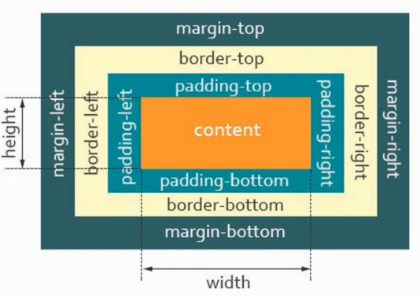

CSS 盒模型的注意点：

1. padding 不能为负值，而 margin 可以为负值
2. 背景色会平铺到非 margin 的区域
3. margin-top 传递的现象及解决方案
4. margin 上下叠加的现象及解决方案

## 块级盒子与内联盒子

在 CSS 中我们广泛的使用两种盒子 ---- 块级盒子(block box) 和内联盒子(inline box) 。这两种盒子会在页面中表现出不同的行为模式。

- 块级盒子：div、p、h1 ...
- 内联盒子：span、a、strong ...

块级盒子的特性：
1. 独占一行
2. 支持所有样式
3. 不写宽度的时候，跟父容器的宽度相同
4. 所占据区域是一个矩形

内联盒子的特性：
1. 盒子不会产生换行
2. 有些样式是不支持的，如：width、height 等
3. 不写宽度的时候，宽度由内容决定
4. 所占的区域不一定是矩形
5. 内联标签之间是有空隙的

## 自适应盒模型的特性

自适应盒模型指的是，当盒子不设置宽度时，盒模型相关组成部分的处理方式是如何的

子元素的盒模型是：父元素的 content 内容 = 子元素的盒模型

```html
<style>
    .box1 {
        width: 300px;
        height: 200px;
        background: pink;
    }

    /* .box2 {
        width: 300px;
        height: 100px;
        background: skyblue;
        padding:10px;
        border:5px black solid;
        margin:10px;
    } */
    .box2 {
        /* width: 300px; */
        height: 100px;
        background: skyblue;
        padding:10px;
        border:5px black solid;
        margin:10px;
    }
</style>

<div class="box1">
    <div class="box2">盒子的内容</div>
</div>
```

## 标准盒模型与怪异盒模型

在标准的盒模型中，如果给和盒模型设置 width 和 height ，实际设置的是 context box。padding 和 border 再加上设置的宽高一起来决定整个盒子的大小。


在怪异盒模型中，所有的宽高都是可见宽度，所以内容宽度时该宽度减去边框和填充部分

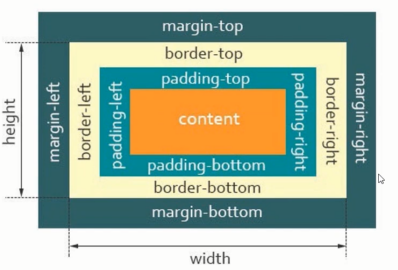

box-sizing：
- cintent-box：width、height -> content
- border-box：width、height -> content + padding + border

```css
box-sizing: border-box;
```

应用：
1. 量取尺寸时不用再去计算一些值
2. 解决一些需要设置百分比和盒模型值

## 浮动样式

当元素被浮动时，会**脱离文档流**，根据 float 的值向左或者向右移动，直到它的外边界碰到父元素的内边界或另一个浮动元素的外边界为止，是 CSS 布局中实现左右布局的一种方式。

文档流：文档流是元素在 Web 页面上的一种呈现方式，按照出现的先后顺序进行排序。

**高度塌陷**：解决方案清除浮动

清除浮动的方案：
1. clear 属性
2. BFC
3. 空标签
4. .clearfix::after{}

```css
/* clear: both; */
/* clear: left; */
/* clear: right; */

.clearfix::after{
    content : "";
    clear: both;
    display: block;
}
```

## 浮动特性注意点

- 只会影响后面的元素
- 文本不会被浮动元素覆盖
- 具备内联盒子特性：宽度由内容决定
- 具备块级盒子特性：支持所有样式
- 浮动放不下，会自动换行

## 定位样式

CSS position 属性用于指定一个元素在文档中定位方式，其中 top、right、bottom、left 属性决定该元素的最终位置。

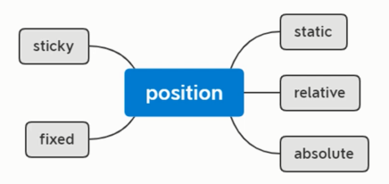

## 定位特性注意点

相对定位及特性：

- 相对定位的元素是在文档中的正常位置偏移给定的值
- 不影响其他元素布局
- 相对于自身进行偏移

绝对定位及特性：

- 绝对定位的元素脱离了文档流，绝对定位元素不占据空间
- 具备内联盒子特性：宽度由内容决定
- 具备块级盒子特性：支持所有样式
- 绝对定位元素相对于最近的非 static 祖先元素定位。当这样的祖先元素不存在时，则相对于可视区定位

固定定位及特性：

- 固定定位与绝对定位相似，但会固定在可视区中
- 具备内联盒子特性：宽度由内容决定
- 具备块级盒子特性：支持所有样式
- 固定定位元素不受祖先元素影响

粘性定位及特性：

- 粘性定位可以被认为是相对定位和固定定位的混合。元素在跨越特定阈值前为相对定位，之后为固定定位

z-index:

- 后面写的元素默认在最上层

## display 属性

### display 属性的作用

在 CSS 中 display 属性表示“显示框类型”，即不同的盒模型。简单来说，可以把块级盒子转成内联盒子，也可以把内联盒子转成块级盒子。

```html
<style>
.box1{ display:inline; background:gold;}
.box2{ display:block; background:skyblue;}
</style>
<div class="box1">块1</div>
<div class="box1">块2</div>
<span class="box2">内联1</span>
<span class="box2">内联2</span>
```

<div align=center>
	
    <div>改变盒模型类型</div>
</div>

可以看到，div 具备了内联盒子的特性，而 span 则具备了块级盒子的特性。当然 display 远比这些复杂的多，后面的弹性布局、网格布局等都是跟 display 有着紧密关系。

display 属性大概可分为以下几类进行学习：

<div align=center>
	
    <div>display属性分类</div>
</div>

### display-outside(外部值)

<div align=center>
	
    <div>display属性分类</div>
</div>

外部值就是定义自身元素的外部表现，而不影响其内的子元素。
- `block`：表示块级盒子 像 `<p>`、`<div>` 等默认就是块级盒子。
- `inline`：表示内联盒子 像 `<span>`、`<i>` 等默认就是内联盒子。
- `run-in`：实验性质的属性，浏览器支持不好。

### display-inside(内部值)

<div align=center>
	
    <div>内部值</div>
</div>

和外部值相反，内部值就是定义子元素布局的。像 flex、grid 这些设置都会影响到子元素的布局形式。

- `flow-root`：一个 BFC 的块级盒子。
- `table`：带有内部表格布局的块级盒子。
- `flex`：带有内部弹性布局的块级盒子。
- `grid`：带有内部网格布局的块级盒子。

### display-listitem(列表值)

<div align=center>
	
    <div>列表值</div>
</div>

`list-item` 属性值是生成一个容纳内容和单独的列表行内元素盒的块级盒子，目的是为了用 div 去代替 `<ul> <li>` 标签之类的，`<li>` 元素默认就是 `list-item`;

### display-internal(属性值)

<div align=center>
	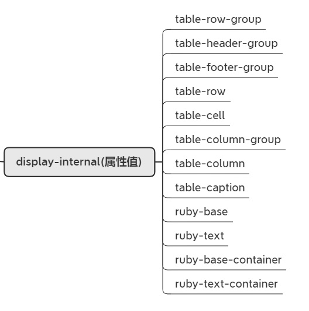
    <div>属性值</div>
</div>

一些和 table 布局、ruby 搭配一起控制页面布局的属性值，因为使用的比较少，暂不探讨。

### display-box(显示值)

<div align=center>
	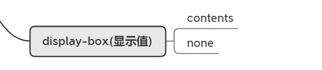
    <div>显示值</div>
</div>

- `contents`：只影响其内容的样式生效，比如：字体大小、文字颜色等；但是像背景色、边框是不会生效的。
- `none`：从盒子树中移除，包括其所有后代元素。

### display-legacy(混合值)

<div align=center>
	
    <div>混合值</div>
</div>

- `inline-block`：对外表现成内联盒子，对内表现成块级盒子
- `inline-table`：对外表现成内联盒子，对子元素表现成表格盒子
- `inline-flex`：对外表现成内联盒子，对子元素表现成弹性盒子
- `inline-grid`：对外表现成内联盒子，对子元素表现成网格盒子

下面看一下 `inline-block` 的特性：

```html
<style>
.box{ display:inline-block; width:100px; height:100px; background:gold;}
</style>
<div class="box">块1</div>
<div class="box">块2</div>
<span class="box">内联1</span>
<span class="box">内联2</span>
```

<div align=center>
	
    <div>inline-block特性</div>
</div>

可以看到，盒子即具备了块级盒子的特性(支持宽高)又具备了内联盒子的特性(横向排列)。 关于`inline-flex`、`inline-grid`的特性会在相关章节中进行讲解。

### global(全局值)

<div align=center>
	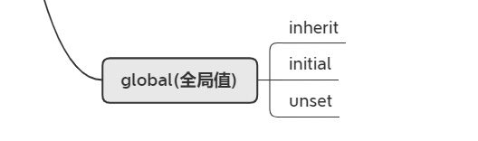
    <div>全局值</div>
</div>

- `inherit`：继承父元素的 display 属性
- `initial`：不管父元素怎么设定，恢复到浏览器最初始时的 display 属性
- `unset`：unset 混合了 inherit 和 initial。如果父元素设值了，就用父元素的设定，如果父元素没设值，就用浏览器的缺省设定。

## 书写模式与逻辑属性

### **书写模式**

绝大多数国家的阅读方式都是从左到右进行的，但是也有一小部分国家的阅读方式，可能是从右向左或从上到下。比如阿拉伯国家就是从右向左进行阅读的，所以在网页排版的时候，就要考虑到这个情况，尤其是国际站。

<div align=center>
	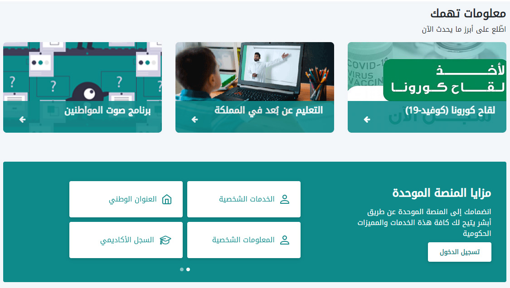
    <div>沙特阿拉伯政府截图</div>
</div>

书写模式即 writing-mode 属性，可以帮助以上下阅读的国家去展示网页内容。它定义了文本水平或垂直排布以及在块级元素中文本的行进方向。

可选值有：
- horizontal-tb 水平方向自上而下的书写方式
- vertical-rl 垂直方向自右而左的书写方式
- vertical-lr 垂直方向自左而右的书写方式
- sideways-rl 内容垂直方向从上到下排列
- sideways-lr 内容垂直方向从下到上排列

<div align=center>
	
    <div>writing-mode属性</div>
</div>

注：目前 sideways-rl 和 sideways-lr 的兼容性并不是很好。

### **逻辑属性**

如果一套代码想实现国际化，处理不同国家的排版方式时，就会导致无法实现。代码如下：

```html
<style>
body{
    border:1px black solid;
    height:100px;
}
div{
    border:1px red solid;
    float:left;
    margin-left:30px;
}
</style>
<div>hello world</div>
<div>hello world</div>
```

<div align=center>
	
    <div>从左到右阅读</div>
</div>

接下来给 body 添加垂直方向自左而右的书写方式，可以发现布局出现了混乱，height 属性依然只针对高度，而 margin-left 属性也依然只针对左间距。

```css
body{
    border:1px black solid;
    height:100px;
    writing-mode:vertical-lr;  /* 新增样式 */
}
```

<div align=center>
	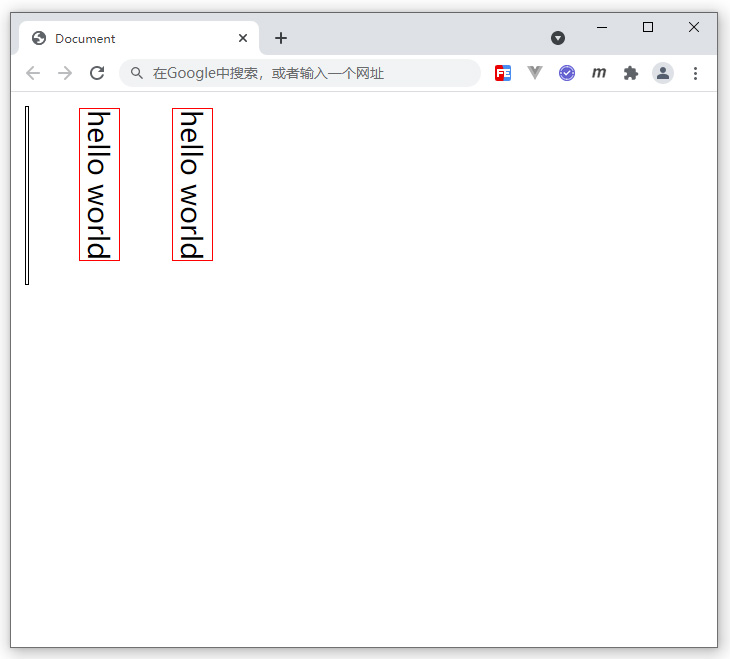
    <div>从上到下阅读</div>
</div>

那么如何更好的处理不同的书写模式呢？就要配合逻辑属性了。逻辑属性是从逻辑角度控制布局，而不是从物理、方向或维度来控制。

简单来说，物理属性和值指的是 width、height、left、top、right、bottom 等值；而逻辑属性和值指的是 start、end、inline-start、inline-end、block-start、block-end 等值。其中 block 表示垂直方向，inline 表示水平方式，在不同的书写模式下，block 和 inline 所代表的方向是会发生变化的。理解逻辑属性对于理解弹性布局和网格布局也有非常大的帮助。

下面用逻辑属性和值修改一下之前代码中出现的问题。

```css
body{
    border:1px black solid;
    block-size:100px;    /* 修改样式 height:100px; */
    writing-mode:vertical-lr;
}
div{
    border:1px red solid;
    float:left;
    margin-inline-start:30px;    /* 修改样式 margin-left:30px; */
}
```

<div align=center>
	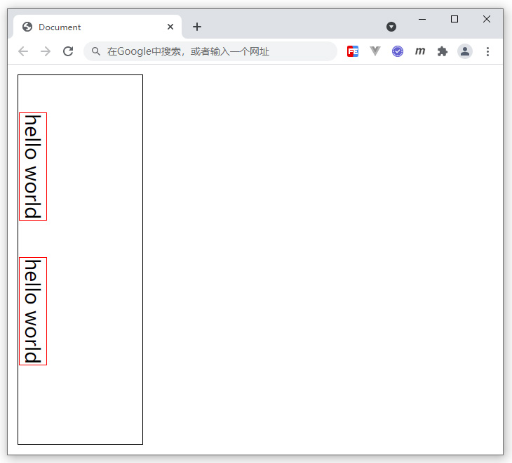
    <div>从上到下阅读</div>
</div>

下面再举一个例子

```html
<style>
section {
    text-align: start;  /* start 逻辑值 */
}
h2 {
    border-inline-start: .3em solid #ccc;    /* border-inline-start 逻辑属性 */
    padding-inline-start: .5em;     /* padding-inline-start 逻辑属性 */
}
</style>
<section dir="auto">
    <h2>第一章<h2>
    <div>本章介绍了逻辑属性和逻辑值，这是一个演示示例。div>
<section>
<section dir="auto">
    <h2>الفصل الأول<h2>
    <div>يقدم هذا الفصل القيم المنطقية والمنطقية ، والتي هي مثال توضيحي.div>
<section>
```

<div align=center>
	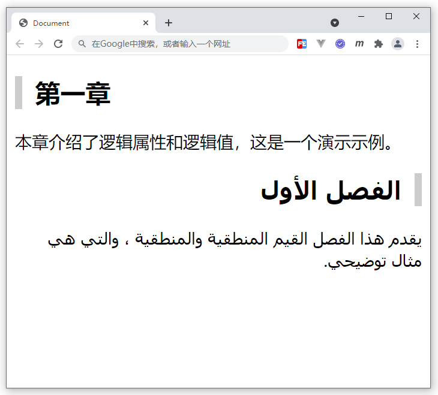
    <div>逻辑属性案例</div>
</div>

注：dir 属性可以设置元素的显示方向，是从左往右 (ltr)，还是从右往左 (rtl)，当设置 auto 时会自动根据当前语言决定排列方向，dir 属性非常适合那些从右向左进行阅读的国家，例如：阿拉伯语，波斯语，希伯来语等。

## BFC 块级格式化上下文

### BFC概念

BFC 即 Block Formatting Contexts(块级格式化上下文)，它是 W3C CSS2.1 规范中的一个概念。它是页面中的一块渲染区域，并且有一套渲染规则，它决定了其子元素将如何定位，以及和其他元素的关系和相互作用。

具有 BFC 特性的元素可以看作是隔离了的独立容器，容器里面的元素不会在布局上影响到外面的元素，并且 BFC 具有普通容器所没有的一些特性。

通俗一点来讲，可以把 BFC 理解为一个封闭的大箱子，箱子内部的元素无论如何翻江倒海，都不会影响到外部。

### BFC触发条件

满足以下条件之一，即可触发 BFC：
- float 的值不是 none
- position 的值不是 static 或者 relative
- display 的值是 inline-block、table-cell、flex、table-caption 或者 inline-flex
- overflow 的值不是 visible

下面的 box 盒子就是一个 BFC 独立容器：
```css
.box{
    width: 100px;
    height: 100px;
    overflow: hidden;   /* 触发了BFC，形成独立盒子 */
}
```

### BFC的应用

在前面的盒模型出现 margin 时，出现了传递和叠加的问题，这里可以采用 BFC 规范来解决，原理就是让盒子形成一个独立的容器，无论里面的子元素如何折腾，都不影响到外面的元素。

```html
<style>
.box1 {
    width: 200px;
    height: 200px;
    background: pink;
    overflow: hidden;    /* 触发了BFC，形成独立盒子 */
}
.box2{
    width: 100px;
    height: 100px;
    background: skyblue;
    margin-top: 30px;
}
</style>
<div class="box1">
    <div class="box2"></div>
</div>
```

<div align=center>
	
    <div>BFC解决传递问题</div>
</div>

```html
<style>
section{
    overflow: hidden;    /* 触发了BFC，形成独立盒子 */
}
.box1 {
    width: 200px;
    height: 200px;
    background: pink;
    margin-bottom: 40px;
}

.box2 {
    width: 100px;
    height: 100px;
    background: skyblue;
    margin-top: 30px;
}
</style>
<section>
    <div class="box1"></div>
</section>
<section>
    <div class="box2"></div>
</section>
```

<div align=center>
	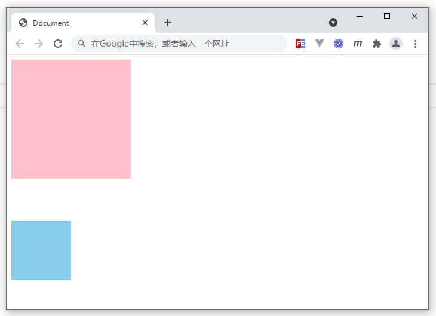
    <div>BFC解决叠加问题</div>
</div>

BFC 还可以解决前面浮动遇到了父容器高度塌陷的问题，也就是不管里面子元素是否浮动，都不会因为脱离文档流对容器高度造成影响。

```html
<style>
.box1 {
    width: 200px;
    border: 1px black solid;
    overflow: hidden;     /* 触发了BFC，形成独立盒子 */
}
.box2 {
    width: 100px;
    height: 100px;
    background: pink;
    float: left;
}
</style>
<div class="box1">
    <div class="box2"></div>
</div>
```

<div align=center>
	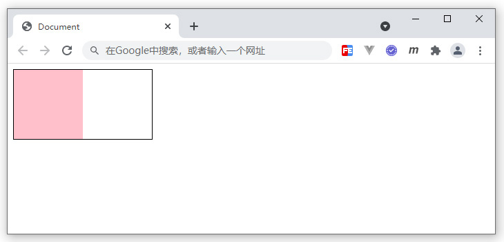
    <div>BFC解决浮动高度塌陷</div>
</div>

**在现代布局 flex 和 grid 中，是默认自带 BFC 规范的，所以可以解决非 BFC 盒子的一些问题，这就是为什么 flex 和 grid 能成为更好的布局方式原因之一。**

## 标签默认样式及清除

### 标签默认样式

一些 HTML 标签在浏览器中会有默认样式，例如：body 标签会有 margin:8px；ul 标签会有 margin:16px 0; 及 padding-left:40px。

当我们在切图软件中进行尺寸或位置测量的时候，把测量出来的数值设置到对应的标签上时，可能会受到当前标签默认样式的影响，从而页面显示效果跟设计图效果不符。

### 清除默认样式

通常在网页开发中，要去掉这些影响尺寸和位置的默认样式及其他影响布局的默认值。可以参考[CSS Tools: Reset CSS](https://meyerweb.com/eric/tools/css/reset/)方案。

```css
html, body, div, span, applet, object, iframe,
h1, h2, h3, h4, h5, h6, p, blockquote, pre,
a, abbr, acronym, address, big, cite, code,
del, dfn, em, img, ins, kbd, q, s, samp,
small, strike, strong, sub, sup, tt, var,
b, u, i, center,
dl, dt, dd, ol, ul, li,
fieldset, form, label, legend,
table, caption, tbody, tfoot, thead, tr, th, td,
article, aside, canvas, details, embed, 
figure, figcaption, footer, header, hgroup, 
menu, nav, output, ruby, section, summary,
time, mark, audio, video {
	margin: 0;
	padding: 0;
	border: 0;
	font-size: 100%;
	font: inherit;
	vertical-align: baseline;
}
/* HTML5 display-role reset for older browsers */
article, aside, details, figcaption, figure, 
footer, header, hgroup, menu, nav, section {
	display: block;
}
body {
	line-height: 1;
}
ol, ul {
	list-style: none;
}
blockquote, q {
	quotes: none;
}
blockquote:before, blockquote:after,
q:before, q:after {
	content: '';
	content: none;
}
table {
	border-collapse: collapse;
	border-spacing: 0;
}
```

由于 Reset CSS 相对“暴力”，不管你有没有用，统统重置成一样的效果，且影响的范围很大，所以更加“平和”的一种方式 [Normalize CSS](https://github.com/necolas/normalize.css/blob/master/normalize.css) 诞生了。

Normalize CSS 可以看成是一种 Reset CSS 的替代方案。创造 Normalize CSS 有下面这几个目的：

- 保护有用的浏览器默认样式而不是完全去掉它们
- 一般化的样式：为大部分 HTML 元素提供
- 修复浏览器自身的 bug 并保证各浏览器的一致性
- 优化 CSS 可用性：用一些小技巧
- 解释代码：用注释和详细的文档来

```css
html {
  line-height: 1.15; /* 1 */
  -webkit-text-size-adjust: 100%; /* 2 */
}
body {
  margin: 0;
}
main {
  display: block;
}
h1 {
  font-size: 2em;
  margin: 0.67em 0;
}
hr {
  box-sizing: content-box; /* 1 */
  height: 0; /* 1 */
  overflow: visible; /* 2 */
}
pre {
  font-family: monospace, monospace; /* 1 */
  font-size: 1em; /* 2 */
}
a {
  background-color: transparent;
}
abbr[title] {
  border-bottom: none; /* 1 */
  text-decoration: underline; /* 2 */
  text-decoration: underline dotted; /* 2 */
}
b,
strong {
  font-weight: bolder;
}
code,
kbd,
samp {
  font-family: monospace, monospace; /* 1 */
  font-size: 1em; /* 2 */
}
small {
  font-size: 80%;
}
sub,
sup {
  font-size: 75%;
  line-height: 0;
  position: relative;
  vertical-align: baseline;
}
sub {
  bottom: -0.25em;
}
sup {
  top: -0.5em;
}
img {
  border-style: none;
}
button,
input,
optgroup,
select,
textarea {
  font-family: inherit; /* 1 */
  font-size: 100%; /* 1 */
  line-height: 1.15; /* 1 */
  margin: 0; /* 2 */
}
button,
input { /* 1 */
  overflow: visible;
}
button,
select { /* 1 */
  text-transform: none;
}
button,
[type="button"],
[type="reset"],
[type="submit"] {
  -webkit-appearance: button;
}
button::-moz-focus-inner,
[type="button"]::-moz-focus-inner,
[type="reset"]::-moz-focus-inner,
[type="submit"]::-moz-focus-inner {
  border-style: none;
  padding: 0;
}
button:-moz-focusring,
[type="button"]:-moz-focusring,
[type="reset"]:-moz-focusring,
[type="submit"]:-moz-focusring {
  outline: 1px dotted ButtonText;
}
fieldset {
  padding: 0.35em 0.75em 0.625em;
}
legend {
  box-sizing: border-box; /* 1 */
  color: inherit; /* 2 */
  display: table; /* 1 */
  max-width: 100%; /* 1 */
  padding: 0; /* 3 */
  white-space: normal; /* 1 */
}
progress {
  vertical-align: baseline;
}
textarea {
  overflow: auto;
}
[type="checkbox"],
[type="radio"] {
  box-sizing: border-box; /* 1 */
  padding: 0; /* 2 */
}
[type="number"]::-webkit-inner-spin-button,
[type="number"]::-webkit-outer-spin-button {
  height: auto;
}
[type="search"] {
  -webkit-appearance: textfield; /* 1 */
  outline-offset: -2px; /* 2 */
}
[type="search"]::-webkit-search-decoration {
  -webkit-appearance: none;
}
::-webkit-file-upload-button {
  -webkit-appearance: button; /* 1 */
  font: inherit; /* 2 */
}
details {
  display: block;
}
summary {
  display: list-item;
}
template {
  display: none;
}
[hidden] {
  display: none;
}
```

在后面案例部分，会采用 Normalize CSS 和 Reset CSS 结合代码，形成一个更加强大的方案，文件命名为 reset.css，代码如下：

```css
@charset "utf-8";

/* --------------------重置样式-------------------------------- */

body,
h1,
h2,
h3,
h4,
h5,
h6,
hr,
p,
blockquote,
dl,
dt,
dd,
ul,
ol,
li,
button,
input,
textarea,
th,
td {
    margin : 0;
    padding: 0
}

/*设置默认字体*/
body {
    font-size  : 14px;
    font-style : normal;
    font-family: -apple-system, BlinkMacSystemFont, segoe ui, Roboto, helvetica neue, Arial, noto sans, sans-serif, apple color emoji, segoe ui emoji, segoe ui symbol, noto color emoji;
}

/*字体太小用户体检不好，让small恢复12px*/
small {
    font-size: 12px
}

h1 {
    font-size: 18px
}

h2 {
    font-size: 16px
}

h3 {
    font-size: 14px
}

h4,
h5,
h6 {
    font-size: 100%
}

ul,
ol {
    list-style: none
}

a {
    text-decoration : none;
    background-color: transparent
}

a:hover,
a:active {
    outline-width  : 0;
    text-decoration: none
}

/*重置表格*/
table {
    border-collapse: collapse;
    border-spacing : 0
}

/*重置hr*/
hr {
    border: 0;
    height: 1px
}

/*图形图片*/
img {
    border-style: none
}

img:not([src]) {
    display: none
}

svg:not(:root) {
    overflow: hidden
}

/*下面的操作是针对于html5页面布局准备的，不支持ie6~8以及其他低版本的浏览器*/
html {
    /*禁用系统默认菜单*/
    -webkit-touch-callout   : none;
    /*关闭iphone & Android的浏览器纵向和横向模式中自动调整字体大小的功能*/
    -webkit-text-size-adjust: 100%
}

input,
textarea,
button,
a {
    /*表单或者a标签在手机点击时会出现边框或彩色的背景区域，意思是去除点击背景框*/
    -webkit-tap-highlight-color: rgba(0, 0, 0, 0)
}

/*重置html5元素的默认样式*/
article,
aside,
details,
figcaption,
figure,
footer,
header,
main,
menu,
nav,
section,
summary {
    display: block
}

audio,
canvas,
progress,
video {
    display: inline-block
}

audio:not([controls]),
video:not([controls]) {
    display: none;
    height : 0
}

progress {
    vertical-align: baseline
}

mark {
    background-color: #ff0;
    color           : #000
}

sub,
sup {
    position      : relative;
    font-size     : 75%;
    line-height   : 0;
    vertical-align: baseline
}

sub {
    bottom: -0.25em
}

sup {
    top: -0.5em
}

button,
input,
select,
textarea {
    font-size: 100%;
    outline  : 0
}

button,
input {
    overflow: visible
}

button,
select {
    text-transform: none
}

textarea {
    overflow: auto
}

button,
html [type="button"],
[type="reset"],
[type="submit"] {
    -webkit-appearance: button
}

button::-moz-focus-inner,
[type="button"]::-moz-focus-inner,
[type="reset"]::-moz-focus-inner,
[type="submit"]::-moz-focus-inner {
    border-style: none;
    padding     : 0
}

button:-moz-focusring,
[type="button"]:-moz-focusring,
[type="reset"]:-moz-focusring,
[type="submit"]:-moz-focusring {
    outline: 1px dotted ButtonText
}

[type="checkbox"],
[type="radio"] {
    box-sizing: border-box;
    padding   : 0
}

[type="number"]::-webkit-inner-spin-button,
[type="number"]::-webkit-outer-spin-button {
    height: auto
}

[type="search"] {
    -webkit-appearance: textfield;
    outline-offset    : -2px
}

[type="search"]::-webkit-search-cancel-button,
[type="search"]::-webkit-search-decoration {
    -webkit-appearance: none
}

::-webkit-input-placeholder {
    color  : inherit;
    opacity: .54
}

::-webkit-file-upload-button {
    -webkit-appearance: button;
    font              : inherit
}
```

## 测试与练习

### 以下哪些属于块级盒子的特性？

- A：独占一行
- B：支持所有样式
- C：不写宽度的时候，宽度由内容决定
- D：所占的区域不一定是矩形

答案

选项 AB  ( 不写宽度的时候，跟父容器的宽度相同；所占区域是一个矩形 )

### 根据下面HTML结构，完成图示布局效果，编写对应CSS代码：

```html
<style>
/* 代码编写区域 */

</style>
<div class="main">
    <div class="box1"></div>
    <div class="box2"></div>
</div>
```

<div align=center>
	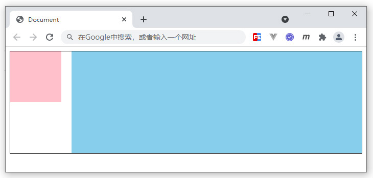
    <div>练习题示例</div>
</div>

要求如下：

1. main 盒子，宽高均自适应，带有黑色边框
2. box1 粉色盒子，固定宽度 100px * 100px
3. box2 浅蓝色盒子，高度 200px，宽度自适应
4. box1 和 box1 之间间距 20px

答案

```css
.main {
    border: 1px black solid;
}
.box1 {
    float: left;
    width: 100px;
    height: 100px;
    background: pink;
}
.box2 {
    height: 200px;
    background: skyblue;
    margin-left: 120px;
}
```
