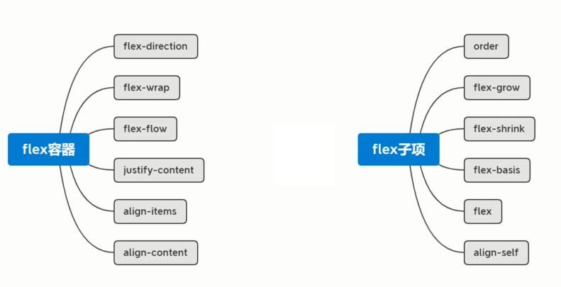
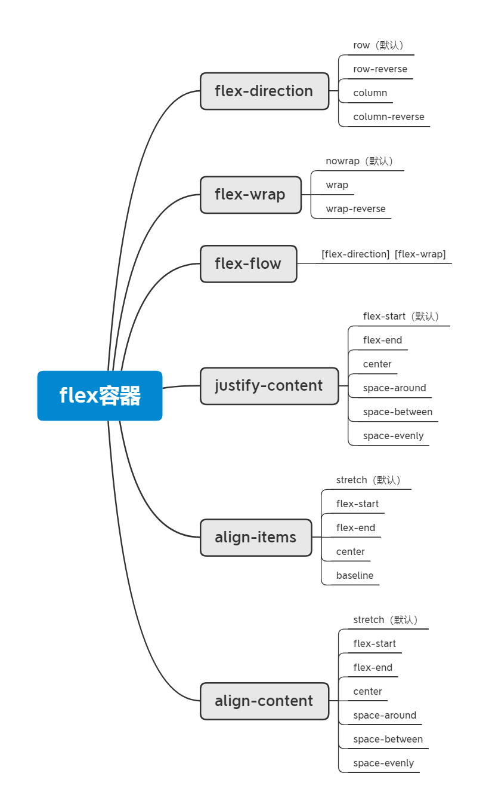
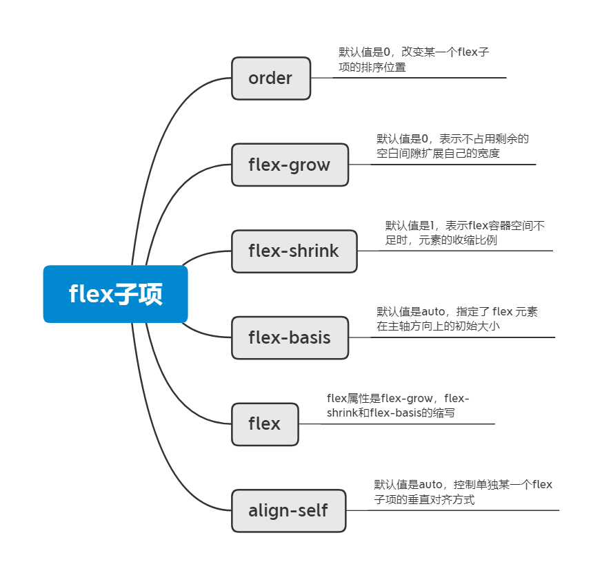
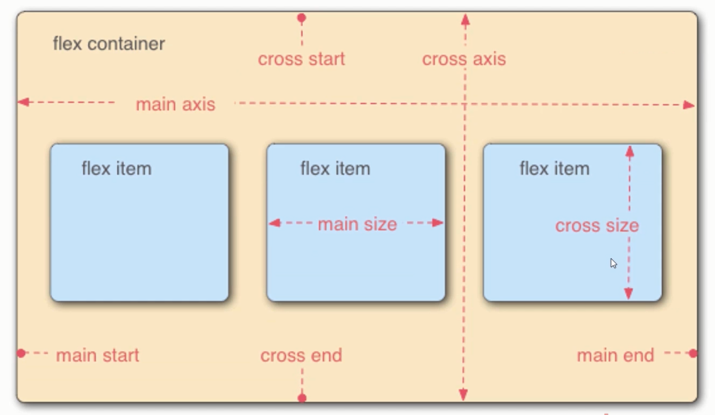
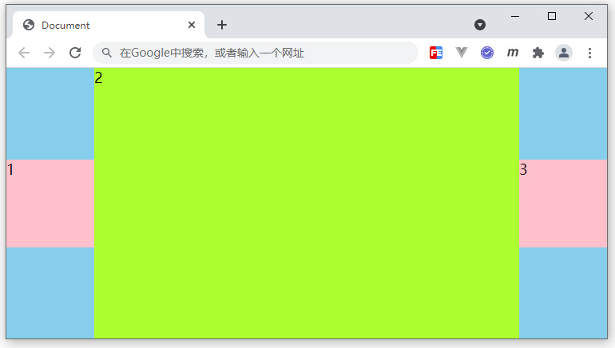

# flex 弹性布局

## 介绍

flex 弹性概念

弹性盒子是一种用于按行或按列布局元素的一维布局方式。元素可以膨胀以填充额外的空间，收缩以适应更小的空间。

Flex 容器：
- 主轴与交叉轴
- 换行与缩写
- 主轴对齐
- 交叉轴对齐

容器布局：
- 内联与块的上下左右居中布局
- 不定项居中布局
- 均分列布局
- 组合嵌套布局

Flex 子项：
- flex-grow 扩展比例
- flex-shrink 收缩比例
- flex-basis 及 flex 缩写
- order 与 align-self

子项布局：
- 等高布局
- 两列与三列布局
- Sticky Footer 布局
- 溢出项布局



flex容器



flex子项



## 主轴与交叉轴



```css
flex-direction: row;
flex-direction: row-reverse;
flex-direction: column;
flex-direction: column-reverse;
```

## 换行与缩写

```css
/* 不折行 */
flex-wrap: nowrap;

/* 折行 */
flex-wrap: wrap;

/* 反向折行 */
flex-wrap: wrap-reverse;
```

缩写：

```css
flex-flow: [flex-direction] [flex-wrap];
```

## 主轴对齐

```css
justify-content: flex-start;
justify-content: flex-end;
justify-content: center;
justify-content: space-around;
justify-content: space-between;
justify-content: space-evenly;
```

## 交叉轴对齐

align-content

```css
align-content: stretch;
align-content: flex-start;
align-content: flex-end;
align-content: center;
align-content: space-around;
align-content: space-between;
align-content: space-evenly;
```

当不折行的情况下，align-content 是不生效的

```css
align-items: stretch;
align-items: flex-start;
align-items: flex-end;
align-items: center;
align-items: baseline;
```

## 内联与块的上下左右居中布局

内联上下左右居中布局

```html
<style>
    /* 方式 1 */
    .box {
        width: 300px;
        height: 200px;
        background: skyblue;
        display: flex;
        align-items: center;
    }

    /* 方式 2 */
    .box {
        width: 300px;
        height: 200px;
        background: skyblue;
        display: flex;
        flex-wrap: wrap; /* 重要 */
        align-content: center;
    }

    /* 方式 3：多行文字时不适用 */
    .box {
        width: 300px;
        height: 200px;
        background: skyblue;
        line-height: 200px;
    }

    /* 方式 4 */
    .box {
        width: 300px;
        height: 200px;
        background: skyblue;
        display:table-cell;
        vertical-align: middle;
    }
</style>

<div class="box">
    测试文字测试文字测试文字测试文字测试文字测试文字测试文字测试文字测试文字测试文字测试文字测试文字测试文字测试文字测试文字测试文字
</div>
```

块的上下左右居中布局

```html
<style>
    /* 方式 1 */
    .box {
        width: 300px;
        height: 200px;
        background: skyblue;
        display: flex;
        justify-content: center;
        align-items: center;
    }
    .box div{
        width:100px;
        height:100px;
        background:pink;
    }

    /* 2 */
    .box {
        width: 300px;
        height: 200px;
        background: skyblue;
        position: relative;
    }
    .box div{
        width:200px;
        height:50px;
        background:pink;
        position: absolute;
        left:50%;
        top:50%;
        transform: translate(-50%,-50%);
    }

    /* 3 */
    .box {
        width: 300px;
        height: 200px;
        background: skyblue;
        position: relative;
        display: flex;
    }
    .box div{
        width:200px;
        height:50px;
        background:pink;
        margin:auto;
    }

    /* 4 */
    .box {
        width: 300px;
        height: 200px;
        background: skyblue;
        position: relative;
    }
    .box div{
        width:200px;
        height:50px;
        background:pink;
        position: absolute;
        left:0;
        top:0;
        right:0;
        bottom:0;
        margin:auto;
    }
</style>

<div class="box">
    <div></div>
</div>
```

## 不定项居中布局

```html
 <style>
     /* flex */
    .box {
        width: 300px;
        height: 150px;
        background: skyblue;
        display: flex;
        justify-content: center;
        align-items: flex-end;
    }

    .box div {
        width: 30px;
        height: 30px;
        background: pink;
        border-radius: 50%;
        margin:5px;
    }

    /* position  */
    .box {
        width: 300px;
        height: 150px;
        background: skyblue;
        position: relative;
    }
    .box section{
        text-align: center;
        width:100%;
        position: absolute;
        bottom:0;
        font-size:0;
    }
    .box div {
        width: 30px;
        height: 30px;
        background: pink;
        border-radius: 50%;
        display: inline-block;
        font-size:16px;
        margin:5px;
    }
</style>

<div class="box">
    <section>
        <div>1</div>
        <div>2</div>
        <div>3</div>
    </section>
</div>
```

## 均分列布局

```html
<!-- flex 方案 -->
<style>
    .main{
        height:200px;
        background:skyblue;
        display: flex;
        justify-content: space-between;
        align-items: flex-end;
        padding:0 20px;
    }
    .main div{
        width:30px;
        height:30px;
        background:pink;
        border-radius: 50%;
    }
</style>
<div class="main">
    <div></div>
    <div></div>
    <div></div>
    <div></div>
    <div></div>
</div>
```

```html
<!-- 浮动方案 -->
<style>
    .main{
        width:500px;
        height:200px;
        background:skyblue;
        overflow: hidden;
        padding:0 20px;
        box-sizing: border-box;
    }
    .main section{
        width:600px;
    }
    .main div{
        width:30px;
        height:30px;
        background:pink;
        border-radius: 50%;
        float:left;
        margin-right:77px;
    }
</style>

<div class="main">
    <section>
        <div></div>
        <div></div>
        <div></div>
        <div></div>
        <div></div>
    </section>
</div>
```

## 子项分组布局

```html
<style>
    .main{
        height:200px;
        background: skyblue;
        display: flex;
        justify-content: space-between;
        align-items: center;
    }
    .main div:nth-of-type(2){
        display: flex;
        margin-left:10px;
    }
    .main .box{
        width:50px;
        height:100px;
        background:pink;
    }
</style>

<div class="main">
    <div class="box">1</div>
    <div>
        <div class="box">2</div>
        <div class="box">3</div>
    </div>
</div>
```

```html
<style>
    .main{
        height:200px;
        background: skyblue;
        display: flex;
        align-items: center;
    }
    .main div{
        width:50px;
        height:100px;
        background:pink;
        margin-right:10px;
    }
    .main div:nth-of-type(3){
        margin-right: auto;
    }
    .main div:nth-of-type(6){
        margin-right: auto;
    }
</style>
<div class="main">
    <div>1</div>
    <div>2</div>
    <div>3</div>
    <div>4</div>
    <div>5</div>
    <div>6</div>
    <div>7</div>
    <div>8</div>
</div>
```

## flex-grow 扩展比例

默认值是 0 ，表示不占用剩余的空白间隙扩展自己的宽度；不能为负数；

```css
flex-grow: 0;  /*  默认的 */
/* 如果比例值为1，就占满剩余的所有空间 */
/* flex-grow: 0.5; */
/* 当比例值大于等于1的时候，都会占满整个空间 */
```

```html
<style>
    .main {
        width: 500px;
        height: 300px;
        background: skyblue;
        display: flex;
    }
    .main div {
        width: 100px;
        height: 100px;
        background: pink;
        /* flex-grow: 0;   默认的 */
        /* 如果比例值为1，就占满剩余的所有空间 */
        /* 400 * 0.5 -> 200 + 100 -> 300 */
        /* flex-grow: 0.5; */
        /* 当比例值大于等于1的时候，都会占满整个空间 */
        flex-grow : 2;
    }

    .main2{
        width: 500px;
        height: 300px;
        background: skyblue;
        display: flex;
    }
    .main2 div:nth-of-type(1){
        width:200px;
        height:100px;
        background:pink;
        flex-grow: 0.2;
    }
    .main2 div:nth-of-type(2){
        width:100px;
        height:100px;
        background:pink;
        flex-grow: 0.1;
    }
</style>

<div class="main">
    <div>1</div>
</div>

<div class="main2">
    <div>1</div>
    <div>2</div>
</div>
```

## flex-shrink 收缩比例

默认值是 1，表示 flex 容器空间不足时，元素的收缩比例

flex-shrink : 1; 自动收缩，跟容器大小相同

flex-shrink : 0.5; 收缩溢出的 0.5


```html
<style>
    .main{
        width:500px;
        height:200px;
        background:skyblue;
        display: flex;
    }
    .main div{
        width:600px;
        height:100px;
        background:pink;
        /* flex-shrink : 1; 自动收缩，跟容器大小相同 */
        /*  flex-shrink: 0; */
        flex-shrink: 0.5;
    }

    .main2{
        width:500px;
        height:200px;
        background:skyblue;
        display: flex;
    }
    .main2 div:nth-of-type(1){
        width:300px;
        height:100px;
        background:pink;
        flex-shrink: 2;
    }
    .main2 div:nth-of-type(2){
        width:400px;
        height:100px;
        background:pink;
        flex-shrink: 1;
    }

    /* 300 + 400 - 500 -> 200 */

    /* 300 - 3/7 * 200
    400 - 4/7 * 200 */

    /* 300 - 6/10 * 200
    400 - 4/10 * 200 */
</style>

<div class="main">
    <div>1</div>
</div>

<div class="main2">
    <div>1</div>
    <div>2</div>
</div>
```

## flex-basis

flex-basis 默认值 auto，指定了flex 元素在主轴方向上的初始大小

```html
<style>
    .main{
        width:500px;
        height:500px;
        background:skyblue;
        display: flex;
    }
    .main div{
        width:100px;
        height:100px;
        background:pink;
        /* 覆盖 width，优先级高于 width */
        /* flex-direction: column; 时，覆盖 height，优先级高于 height */
        flex-basis: 200px;
    }
</style>

<div class="main">
    <div></div>
</div>
```

```html
<style>
    .main{
        width:500px;
        height:500px;
        background:skyblue;
        display: flex;
        align-items: flex-start;
    }
    .main div{
        background:pink;
        flex-basis: 100%;   /* 0% auto 200px 100% */
    }
</style>

<div class="main">
    <div>测试文字</div>
</div>
```

## flex 缩写

flex 属性是 flex-grow, flex-shrink 和 flex-basis 的缩写

```html
<style>
    .main{
        width:500px;
        height:500px;
        background:skyblue;
        display: flex;
        align-items: flex-start;
    }
    .main div{
        background:pink;
        /* flex-grow: 1;
        flex-shrink: 1;
        flex-basis: 0%; */
        /* flex:1; */

        /*  flex-grow: 0;
        flex-shrink: 1;
        flex-basis: 0%; */
        /*  flex:0; */

        /* flex-grow: 1;
        flex-shrink: 1;
        flex-basis: auto; */
        /* flex:auto; */

        /* flex-grow: 1;
        flex-shrink: 0;
        flex-basis: 50%; */
        flex:1 0 50%;
    }
</style>

<div class="main">
    <div>测试文字</div>
</div>
```

## order、align-self

- order
- align-self：默认值是 auto，控制单独某一个 flex 子项的垂直对齐方式

```html
<style>
    .main{
        width:500px;
        height:500px;
        background:skyblue;
        display: flex;
        align-items: center;
    }
    .main div{
        width:100px;
        height:100px;
        background:pink;
    }
    .main div:nth-of-type(1){
        /*  order:1; */
    }
    .main div:nth-of-type(4){
        /*  order:-1; */
        height:50px;
        /* align-self: auto; */  /* center */
        align-self: flex-end;
    }
</style>

<div class="main">
    <div>1</div>
    <div>2</div>
    <div>3</div>
    <div>4</div>
</div>
```

## 等高布局

```html
<style>
    .main{
        width:500px;
        background:skyblue;
        display: flex;
        justify-content: space-between;
    }
    .main div{
        width:100px;
        background:pink;
    }
</style>

<div class="main">
    <div>
        <p>测试内容</p>
        <p>测试内容</p>
        <p>测试内容</p>
        <p>测试内容</p>
    </div>
    <div>
        <p>测试内容</p>
        <p>测试内容</p>
        <p>测试内容</p>
        <p>测试内容</p>
        <p>测试内容</p>
        <p>测试内容</p>
    </div>
</div>
```

```html
<style>
    .main{
        width:500px;
        background:skyblue;
        overflow: hidden;
    }
    .main div{
        width:100px;
        background:pink;
        float:left;
        margin-bottom:-2000px;
        padding-bottom:2000px;
    }
    .main div:nth-of-type(2){
        float:right;
    }
</style>

<div class="main">
    <div>
        <p>测试内容</p>
        <p>测试内容</p>
        <p>测试内容</p>
        <p>测试内容</p>
    </div>
    <div>
        <p>测试内容</p>
        <p>测试内容</p>
        <p>测试内容</p>
        <p>测试内容</p>
        <p>测试内容</p>
        <p>测试内容</p>
    </div>
</div>
```

## 两列与三列布局

```html
<style>
    body{
        margin:0;
    }
    .main{
        height:100vh;
        background:skyblue;
        display: flex;
    }
    .col1{
        width:200px;
        background:pink;
    }
    .col2{
        flex-grow: 1;
        background:springgreen;
    }
    .col3{
        width:100px;
        background: tomato;
    }
</style>

<div class="main">
    <div class="col1"></div>
    <div class="col2"></div>
    <div class="col3"></div>
</div>
```

```html
<style>
    body{
        margin:0;
    }
    .main{
        height:100vh;
        background:skyblue;
    }
    .col1{
        width:200px;
        height:60%;
        float:left;
        background:pink;
    }
    .col2{
        height:100%;
        background:lightcoral;
        margin-left:200px;
        /*  overflow: hidden; */
    }
</style>

<div class="main">
    <div class="col1"></div>
    <div class="col2"></div>
</div>
```

## Sticky Footer 布局

```html
<style>
    body{
        margin:0;
    }
    .main{
        min-height:100vh;
        display: flex;
        flex-direction: column;
    }
    .main .header{
        height:100px;
        background:pink;
    }
    .main .content{
        flex-grow: 1;
    }
    .main .footer{
        height:100px;
        background:skyblue;
    }
</style>

<div class="main">
    <div class="header"></div>
    <div class="content">
        <p>测试内容</p>
        <p>测试内容</p>
        <p>测试内容</p>
        <p>测试内容</p>
        <p>测试内容</p>
        <!-- <p>测试内容</p>
        <p>测试内容</p>
        <p>测试内容</p>
        <p>测试内容</p>
        <p>测试内容</p>
        <p>测试内容</p>
        <p>测试内容</p>
        <p>测试内容</p>
        <p>测试内容</p>
        <p>测试内容</p>
        <p>测试内容</p>
        <p>测试内容</p>
        <p>测试内容</p>
        <p>测试内容</p> -->
    </div>
    <div class="footer"></div>
</div>
```

## 溢出项布局

```html
<style>
    body{
        margin:0;
    }
    .main{
        height:100px;
        background:skyblue;
        display: flex;
        align-items: center;
    }
    .main div{
        width:100px;
        height:80px;
        background:pink;
        margin-right:10px;
        flex-shrink: 0;
    }
</style>

<div class="main">
    <div>1</div>
    <div>2</div>
    <div>3</div>
    <div>4</div>
    <div>5</div>
    <div>6</div>
    <div>7</div>
    <div>8</div>
</div>
```

```html
<style>
    body{
        margin:0;
    }
    .main{
        height:100px;
        background:skyblue;
    }
    .main section{
        width:2000px;
    }
    .main div{
        width:100px;
        height:80px;
        background:pink;
        margin-right:10px;
        float:left;
    }
</style>

<div class="main">
    <section>
        <div>1</div>
        <div>2</div>
        <div>3</div>
        <div>4</div>
        <div>5</div>
        <div>6</div>
        <div>7</div>
        <div>8</div>
    </section>
</div>
```

## 综合案例

- Swiper 轮播图
- 知乎导航

## 总结

- flex 容器相关功能及语法
- flex 容器相关布局
- flex 子项相关功能及语法
- flex 子项相关布局

## 练习

### 以下哪些不是作用在flex容器上的样式？

- [ ] A：flex-grow
- [ ] B：flex-wrap
- [ ] C：flex-direction
- [ ] D：flex-basis

答案

选项 AD  ( flex-grow、flex-basis 是作用在 flex 子项上的 )

### 根据下面HTML结构，完成图示布局效果，编写对应CSS代码

```html
<style>
/* 代码编写区域 */

</style>
<div class="main">
    <div>1</div>
    <div>2</div>
    <div>3</div>
</div>
```

<div align=center>
	
    <div>练习题示例</div>
</div>

要求如下：

1. main 盒子，宽高均自适应可视区，带有浅蓝色背景
2. 1、3子项，宽高 100px，上下居中，分居两侧
3. 2子项，宽度自适应剩余容器，高度自适应父容器
4. 浏览器改变大小时，相关盒子尺寸及位置发生相应变化

参考答案

```css
body {
    margin: 0;
}
.main {
    width: 100vw;
    height: 100vh;
    background: skyblue;
    display: flex;
    align-items: center;
}
.main div:nth-of-type(1) {
    width: 100px;
    height: 100px;
    background: pink;
}
.main div:nth-of-type(2) {
    flex-grow: 1;
    background: greenyellow;
    align-self: stretch;
}
.main div:nth-of-type(3) {
    width: 100px;
    height: 100px;
    background: pink;
}
```
