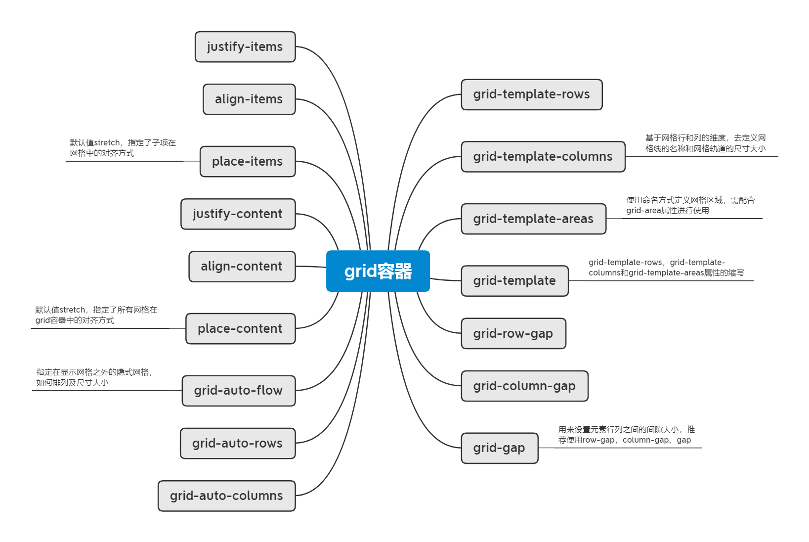
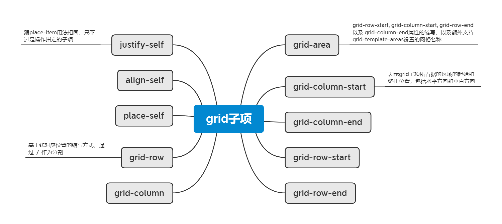
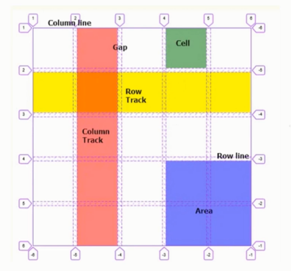
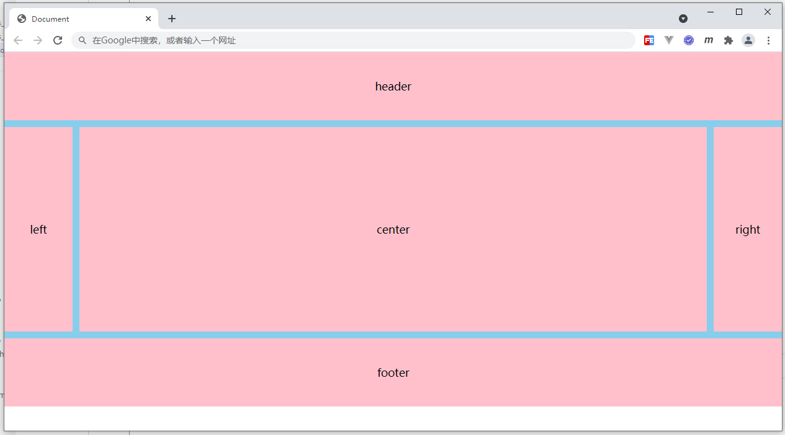

# grid 网格布局

目前网格布局趋势明显，能完成很多之前繁琐的布局形式，可以说是未来布局的重中之重

## grid 网格概念

CSS 网格是一个用于 web 的二维布局系统，利用网格，可以把内容按照行与列的格式进行排版。另外，网格还能非常轻松地实现一些复杂的布局。

grid 容器与子项：
- 定义网格及 fr 单位
- 合并网格及网格命名
- 网格间隙及简写
- 网格对齐方式及简写
- 显式网格与隐式网格
- 基于线的元素放置
- 子项对齐方式
- repeat() 与 minmax()

案例：
- 比定位更方便的叠加布局
- 多种组合排列布局
- 栅格布局
- 容器自适应行列布局

**grid容器**

```txt
grid-template-rows
grid-template-columns
    基于网格行和列的维度，去定义网格线的名称和网格轨道的尺寸大小

grid-template-areas
    使用命名方式定义网格区域，需配合grid-area属性进行使用
grid-template
    grid-template-rows，grid-template-columns和grid-template-areas属性的缩写

grid-row-gap
grid-column-gap
grid-gap
    用来设置元素行列之间的间隙大小，推荐使用row-gap，column-gap、gap

justify-items
align-items
place-items
    默认值stretch，指定了子项在网格中的对齐方式

justify-content
align-content
place-content
    默认值stretch，指定了所有网格在grid容器中的对齐方式

grid-auto-flow
grid-auto-rows
grid-auto-columns
		指定在显示网格之外的隐式网格，如何排列及尺寸大小
```

**grid子项**

```txt
grid-area
    grid-row-start, grid-column-start, grid-row-end 以及 grid-column-end属性的缩写，以及额外支持grid-template-areas设置的网格名称

grid-column-start
grid-column-end
grid-row-start
grid-row-end
    表示grid子项所占据的区域的起始和终止位置，包括水平方向和垂直方向

grid-column
grid-row
    基于线对应位置的缩写方式，通过  /  作为分割

place-self
align-self
justify-self
    跟place-item用法相同，只不过是操作指定的子项
```





## 定义网格及 fr 单位



fr尺寸单位，其来自 "fraction" 或 "fractional unit" 单词的前两个字母，表示整体空间的一部分。

```css
/* 基于网格行和列的维度，去定义网格线的名称和网格轨道的尺寸大小 */
grid-template-rows
grid-template-columns
```

```html
<style>
    .main{
        width:300px;
        height:300px;
        background:skyblue;
        display: grid;
        /* grid-template-columns: 50px 50px 50px;
        grid-template-rows: 50px 50px 50px; */

        /* grid-template-columns: 50px 20% auto;
        grid-template-rows: 50px 50px; */

        grid-template-columns: 150px 1fr 1fr;
        grid-template-rows: 0.3fr 0.3fr;
    }
    .main div{
        background:pink;
    }
</style>

<div class="main">
    <div>1</div>
    <div>2</div>
    <div>3</div>
    <div>4</div>
    <div>5</div>
    <div>6</div>
</div>
```

## 合并网格及网格命名

grid-template-areas：使用命名方式定义网格区域，需配合 grid-area 属性进行使用

grid-template：grid-template-rows，grid-template-columns 和 grid-template-areas 属性的缩写

```html
<style>
    /* .main{
        width:300px;
        height:300px;
        background:skyblue;
        display: grid;
        grid-template-columns: 1fr 1fr 1fr;
        grid-template-rows: 1fr 1fr 1fr;
        grid-template-areas: 
        "a1 a1 a2"
        "a1 a1 a2"
        "a3 a3 a3";
    }
    .main div{
        background:pink;
        border:1px black solid;
        box-sizing: border-box;
    }
    .main div:nth-of-type(1){
        grid-area: a1;
    }
    .main div:nth-of-type(2){
        grid-area: a2;
    }
    .main div:nth-of-type(3){
        grid-area: a3;
    } */

    /* .main{
        width:300px;
        height:300px;
        background:skyblue;
        display: grid;
        grid-template-columns: 1fr 1fr 1fr;
        grid-template-rows: 1fr 1fr 1fr;
        grid-template-areas: 
        "a1 a2 a3";
    }
    .main div{
        background:pink;
        border:1px black solid;
        box-sizing: border-box;
    }
    .main div:nth-of-type(1){
        grid-area: a3;
    } */

    .main{
        width:300px;
        height:300px;
        background:skyblue;
        display: grid;
        /* grid-template-columns: 1fr 1fr 1fr;
        grid-template-rows: 1fr 1fr 1fr;
        grid-template-areas: 
        "a1 a1 a2"
        "a1 a1 a2"
        "a3 a3 a3"; */
        /* 缩写模式 */
        grid-template: 
        "a1 a1 a2" 1fr
        "a1 a1 a2" 1fr 
        "a3 a3 a3" 1fr
        / 1fr 1fr 1fr;
    }
    .main div{
        background:pink;
        border:1px black solid;
        box-sizing: border-box;
    }
    .main div:nth-of-type(1){
        grid-area: a1;
    }
    .main div:nth-of-type(2){
        grid-area: a2;
    }
    .main div:nth-of-type(3){
        grid-area: a3;
    }
</style>

<div class="main">
    <div>1</div>
    <div>2</div>
    <div>3</div>
</div>
```

## 网格间隙及简写

	grid-row-gap
	grid-column-gap
	grid-gap
		用来设置元素行列之间的间隙大小，推荐使用 row-gap，column-gap、gap

```html
<style>
    .main{
        width:300px;
        height:300px;
        background:skyblue;
        display: grid;
        grid-template-columns: 1fr 1fr 1fr;
        grid-template-rows: 1fr 1fr 1fr;
        grid-template-areas: 
        "a1 a1 a2"
        "a1 a1 a2"
        "a3 a3 a3";
        /* grid-row-gap: 20px;
        grid-column-gap: 30px; */
        /* grid-gap: 20px 30px; */
        /* row-gap: 20px;
        column-gap: 30px; */
        gap:20px 30px;
    }
    .main div{
        background:pink;
        border:1px black solid;
        box-sizing: border-box;
    }
    .main div:nth-of-type(1){
        grid-area: a1;
    }
    .main div:nth-of-type(2){
        grid-area: a2;
    }
    .main div:nth-of-type(3){
        grid-area: a3;
    }

    .main2{
        width:300px;
        background:skyblue;
        display: flex;
        flex-wrap: wrap;
        row-gap: 20px;
        column-gap: 30px;
    }
    .main2 div{
        width:100px;
        height:100px;
        background:pink;
    }
</style>

<div class="main">
    <div>1</div>
    <div>2</div>
    <div>3</div>
</div>
<div class="main2">
    <div>1</div>
    <div>2</div>
    <div>3</div>
    <div>4</div>
    <div>5</div>
    </div>
```

## 网格对齐方式及简写

```txt
justify-items
align-items
place-items
    默认值stretch，指定了子项在网格中的对齐方式

justify-content
align-content
place-content
    默认值stretch，指定了所有网格在grid容器中的对齐方式
```

```html
<style>
    .main{
        width:300px;
        height:300px;
        background:skyblue;
        display: grid;
        grid-template-columns: 100px 100px 100px;
        grid-template-rows: 100px 100px 100px;
        /* justify-items: start;
        align-items: end; */
        place-items: end start;
    }
    .main div{
        width:50px;
        height:50px;
        background:pink;
    }

    .main2{
        width:500px;
        height:500px;
        background:skyblue;
        display: grid;
        grid-template-columns: 100px 100px 100px;
        grid-template-rows: 100px 100px 100px;
        /* justify-content: space-evenly;
        align-content: end; */
        place-content: end space-evenly;
    }
    .main2 div{
        background:pink;
    }
</style>

<div class="main">
    <div>1</div>
    <div>2</div>
    <div>3</div>
    <div>4</div>
    <div>5</div>
    <div>6</div>
    <div>7</div>
    <div>8</div>
    <div>9</div>
</div>

<div class="main2">
    <div>1</div>
    <div>2</div>
    <div>3</div>
    <div>4</div>
    <div>5</div>
    <div>6</div>
    <div>7</div>
    <div>8</div>
    <div>9</div>
</div>
```

## 显式网格与隐式网格

```txt
grid-auto-flow
grid-auto-rows
grid-auto-columns
		指定在显示网格之外的隐式网格，如何排列及尺寸大小
```

```html
<style>
    .main{
        width:300px;
        height:300px;
        background:skyblue;
        display: grid;
        /* grid-template-columns: 100px 100px 100px;
        grid-template-rows: 100px; */
        /* 默认：row 就是行产生隐式网格 */
        /* grid-auto-flow: row; */
        /* 可以调节产生隐式网格的高度 */
        /* grid-auto-rows: 100px; */

        grid-template-columns: 100px;
        grid-template-rows: 100px 100px 100px;
        /* column 就是列产生隐式网格 */
        grid-auto-flow: column;
        /* 可以调节产生隐式网格的宽度 */
        grid-auto-columns: 100px;
    }
    .main div{
        background:pink;
        border:1px black solid;
        box-sizing: border-box;
    }

    .main2{
        width:300px;
        height:300px;
        background:skyblue;
        display: grid;
        grid-template-columns: 100px 100px 100px;
        grid-template-rows: 100px;
        grid-auto-flow: row dense;  /* dense 紧密的 */
        grid-auto-rows: 100px;
    }
    .main2 div{
        background:pink;
        border:1px black solid;
        box-sizing: border-box;
    }
    .main2 div:nth-of-type(1){
        grid-column-start: 2;
    }
</style>

<div class="main">
    <div>1</div>
    <div>2</div>
    <div>3</div>
    <div>4</div>
    <div>5</div>
</div>
<hr>
<div class="main2">
    <div>1</div>
    <div>2</div>
    <div>3</div>
    <div>4</div>
    <div>5</div>
</div>
```

## 基于线的元素放置

```txt
grid-column-start
grid-column-end
grid-row-start
grid-row-end
    表示grid子项所占据的区域的起始和终止位置，包括水平方向和垂直方向

grid-column
grid-row
    基于线对应位置的缩写方式，通过  /  作为分割

grid-area
    grid-row-start, grid-column-start, grid-row-end 以及 grid-column-end属性的缩写，以及额外支持grid-template-areas设置的网格名称

place-self
align-self
justify-self
    跟place-item用法相同，只不过是操作指定的子项
```

```html
<style>
    .main{
        width:300px;
        height:300px;
        background:skyblue;
        display: grid;
        grid-template-columns: 1fr 1fr 1fr;
        grid-template-rows: 1fr 1fr 1fr;
    }
    .main div:nth-of-type(1){
        background:pink;
        grid-column-start: 2;
        grid-column-end: 3;
        /* 默认值：auto */
        /* grid-row-start: 1;
        grid-row-end: 2; */
    }
    .main div:nth-of-type(2){
        background:slategray;
    }
</style>

<div class="main">
    <div>1</div>
    <div>2</div>
</div>
```

```html
<style>
    .main{
        width:300px;
        height:300px;
        background:skyblue;
        display: grid;
        /* 线的命名 */
        grid-template-columns:[col1] 1fr [col2] 1fr [col3] 1fr [col4];
        grid-template-rows:[row1] 1fr [row2] 1fr [row3] 1fr [row4];
    }
    .main div:nth-of-type(1){
        width:50px;
        height:50px;
        background:pink;
        justify-self: center;
        align-self: center;
        /* grid-column-start:2;
        grid-column-end:span 2; */
        /*  grid-column-start: col2;
        grid-column-end: col4; */

        /* 缩写方式 */
        /* grid-column: 2 / 3;
        grid-row: 2 / 4; */

        /* 缩写方式 */
        grid-area: 2 / 2 / 3 / 3;
    }
    .main div:nth-of-type(2){
        background:slategray;
    }
</style>

<div class="main">
    <div>1</div>
</div>
```

## repeat() 与 minmax()

repeat() 方法及 auto-fill 可选值，指定可重复的数值

```html
<style>
    .main{
        height:400px;
        background:skyblue;
        display: grid;
        /* grid-template-columns: 100px 100px 100px; */
        /* grid-template-columns: repeat(3, 100px); */ /* 上一行的简写方式 */
        /* grid-template-columns: 150px 100px 100px; */
        /* grid-template-columns: 150px repeat(2, 100px); */
        grid-template-columns: repeat(auto-fill, 100px);
        grid-template-rows: 100px;
    }
    .main div{
        background:pink;
    }
</style>

<div class="main">
    <div>1</div>
    <div>2</div>
    <div>3</div>
    <div>4</div>
</div>
```

minmax() 设置最小和最大值的范围

```html
<style>
    .main{
        height:400px;
        background:skyblue;
        display: grid;
        /* grid-template-columns: 100px 1fr 100px; */
        grid-template-columns: 100px minmax(100px, 1fr) 100px;
        grid-template-rows: 100px;
    }
    .main div{
        background:pink;
        border:1px black solid;
    }
</style>

<div class="main">
    <div>1</div>
    <div>2</div>
    <div>3</div>
</div>
```

```html
<style>
    .main{
        background:skyblue;
        display: grid;
        grid-template-columns: repeat(auto-fill, minmax(200px, 1fr));
        grid-template-rows: 100px;
        grid-auto-rows: 100px;
        grid-gap:20px 20px;
    }
    .main div{
        background:pink;
        border:1px black solid;
    }
</style>

<div class="main">
    <div>1</div>
    <div>2</div>
    <div>3</div>
    <div>4</div>
    <div>5</div>
    <div>6</div>
    <div>7</div>
    <div>8</div>
    <div>9</div>
    <div>10</div>
    <div>11</div>
</div>
```

## 比定位更方便的叠加布局

```html
<style>
    .main{
        width: 530px;
        height: 300px;
        background:skyblue;
        display: grid;
    }
    .main img{
        grid-area: 1/1/1/1;
    }
    .main span{
        grid-area: 1/1/1/1;
        justify-self: end;
        align-self: end;
        margin:5px;
    }
    .main p{
        grid-area: 1/1/1/1;
        align-self: center;
        margin:0;
        padding:0;
        background:rgba(0,0,0,0.5);
        height:30px;
        line-height: 30px;
        color:white;
    }
</style>

<div class="main">
    
    <span>自制</span>
    <p>手机热卖中.....</p>
</div>
```

## 多种组合排列布局

```html
<style>
    .main{
        width:300px;
        height:300px;
        background:skyblue;
        display: grid;
        grid-template-columns: repeat(3,1fr);
        grid-template-rows: repeat(3,1fr);
        gap:5px;
    }
    .main div{
        background:pink;
    }
    .main div:nth-of-type(1){
        /* grid-area: 1/1/span 2/span 2; */
        grid-area: 2/1/span 2/span 2;
    }
</style>

<div class="main">
    <div>1</div>
    <div>2</div>
    <div>3</div>
    <div>4</div>
    <div>5</div>
    <div>6</div>
</div>
```

## 栅格布局

```html
<style>
    .row{
        background:skyblue;
        display: grid;
        grid-template-columns: repeat(12, 1fr);
        grid-template-rows: 50px;
        grid-auto-rows: 50px;
    }
    .row div{
        background:pink;
        border:1px black solid;
    }
    .row .col-1{
        grid-area: auto/auto/auto/span 1;
    }
    .row .col-2{
        grid-area: auto/auto/auto/span 2;
    }
    .row .col-3{
        grid-area: auto/auto/auto/span 3;
    }
    .row .col-4{
        grid-area: auto/auto/auto/span 4;
    }
    .row .col-5{
        grid-area: auto/auto/auto/span 5;
    }
    .row .col-6{
        grid-area: auto/auto/auto/span 6;
    }
    .row .col-7{
        grid-area: auto/auto/auto/span 7;
    }
    .row .col-8{
        grid-area: auto/auto/auto/span 8;
    }
    .row .col-9{
        grid-area: auto/auto/auto/span 9;
    }
    .row .col-10{
        grid-area: auto/auto/auto/span 10;
    }
    .row .col-11{
        grid-area: auto/auto/auto/span 11;
    }
    .row .col-12{
        grid-area: auto/auto/auto/span 12;
    }
</style>

<div class="row">
    <div class="col-6">1</div>
    <div class="col-3">2</div>
    <div class="col-4">3</div>
    <div class="col-5">4</div>
</div>
```

## 容器自适应行列布局

```html
<style>
    /* .main{
        width:300px;
        background:skyblue;
        display: grid;
        grid-template-columns: repeat(3, 1fr);
        grid-auto-rows: 100px;
        gap:5px;
    }
    .main div{
        background:pink;
    } */

    .main{
        height:300px;
        background:skyblue;
        display: inline-grid;
        grid-template-rows: repeat(3, 1fr);
        grid-auto-flow: column;
        grid-auto-columns: 100px;
        gap:5px;
    }
    .main div{
        background:pink;
    }
</style>

<div class="main">
    <div>1</div>
    <div>2</div>
    <div>3</div>
    <div>4</div>
    <div>5</div>
    <div>1</div>
    <div>2</div>
    <div>3</div>
    <div>4</div>
    <div>5</div>
</div>
```

## 综合案例

- 百度热词风云榜
- 小米商品导航菜单

## 总结

- grid 容器相关功能及语法
- grid 子项相关功能及语法
- repeat() 与 minmax()
- grid 常见布局方案

## 练习

### grid-auto-flow 样式的默认值是？

- [ ] A：auto
- [ ] B：row
- [ ] C：column
- [ ] D：dense

答案

选项 B  ( 默认row，自动进行折行排列 )

### 根据下面HTML结构，完成图示布局效果，编写对应CSS代码：

```html
<style>
/* 代码编写区域 */

</style>
<div class="main">
    <div>header</div>
    <div>left</div>
    <div>center</div>
    <div>right</div>
    <div>footer</div>
</div>
```

<div align=center>
	
    <div>练习题示例</div>
</div>

要求如下：

1. 采用网格进行布局，区域之间的间距为10px
2. header、footer区域，宽：自适应，高：100px
3. left、right区域，宽：100px，高：300px
4. center区域，宽：自适应剩余空间，高：300px

答案

```css
body {
    margin: 0;
}
.main {
    background: skyblue;
    display: grid;
    grid-template-columns: 100px 1fr 100px;
    grid-template-rows: 100px 300px 100px;
    gap: 10px;
}
.main div {
    background: pink;
    display: flex;
    align-items: center;
    justify-content: center;
}
.main div:first-of-type {
    grid-area: 1/1/span 1/span 3;
}
.main div:last-of-type {
    grid-area: 3/1/span 1/span 3;
}
```
