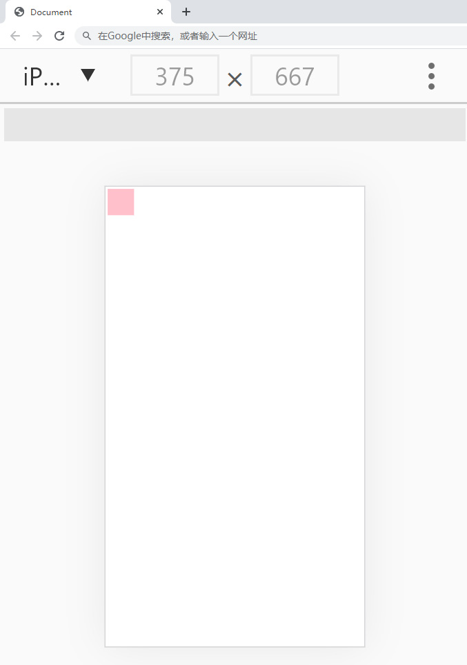
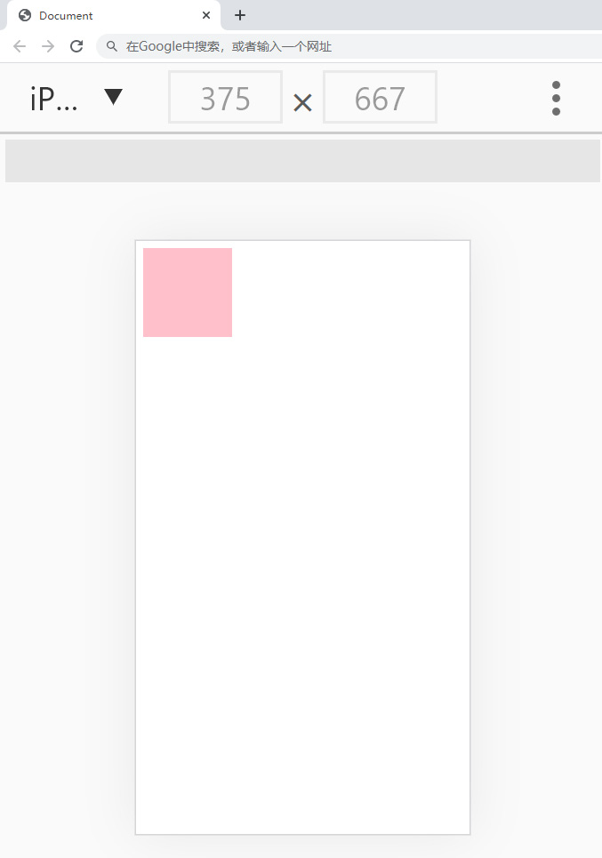
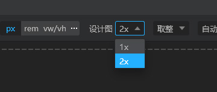
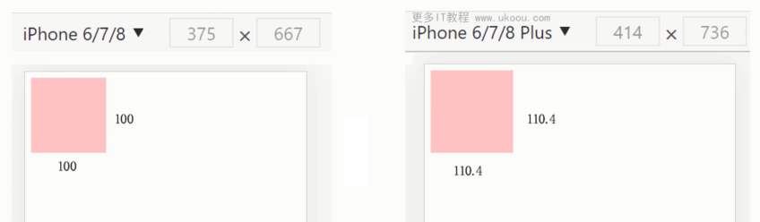

# 移动端适配布局

## 移动端适配概念

随着移动互联网的发展，移动端布局显得非常的重要。移动端布局并不复杂，主要是现实各种设备的等比适配，让所有移动端设备看起来是相同的。

rem 布局方案：
- 移动端 rem 布局原理解析
- 动态计算 font-size
- 测量 rem 数值及插件使用
- 综合案例：网易移动端

vw 布局方案：
- 移动端 vm 布局及插件使用
- vw 综合案例：B站移动端

## 移动端概念及 UI 设计稿尺寸

### 逻辑像素与物理像素

逻辑像素，也叫“设备独立像素”，对于前端来说就是 css 中的像素，举例：iphone6 下的逻辑像素为 375px 。

物理像素，即设备屏幕实际拥有的像素点，一个设备生产出来，他们的像素就已经确定了，举例：iphone6 下的物理像素为 750px。

可以发现 iphone6 下，其物理像素是逻辑像素的2倍，可用“设备像素比”来表示这个比值（即物理像素除以逻辑像素的值），可通过 JavaScript 代码  `window.devicePixelRatio`  来获取设备像素比。

那究竟逻辑像素与物理像素的关系是什么呢？这里首先先确定什么是相对单位，什么又是绝对单位。像m这种绝对单位，定义是什么：米的长度等于氪－86原子的2P10和5d1能级之间跃迁的辐射在真空中波长的1650763.73倍。查到的m的定义如上，也就是说在现实世界中，m是一个固定的长度。

px全称为pixel，像素长度，像素长度，那么就请问了，一个超大屏幕的像素和你笔记本或者手机屏幕的像素大小相同吗？也就是说1px在你手机屏幕上显示出来的长度可能为0.1mm，在露天演出的电子屏幕上长度为5cm，那么0.1mm和5cm相等吗？

感觉px好像是一个相对单位，但是如果放在网页或者设计人眼中，可能就不一定了，上面举得那个例子是物理像素，在物理像素的背景下，px确实是一个相对单位，但是在逻辑像素上就不同了，css中1px指的是逻辑像素，浏览器会将你的逻辑像素转化成物理像素，每个设备之间虽然物理像素点大小不一样，但是用例逻辑像素的单位后，显示的长度就会一样了。

在开发网页的时候，写了10px，在你的设备上，逻辑1px为真实的1.2个像素大小，实际看上去为10cm，没问题，换一个设备，逻辑1px为真实的2.4个像素大小，也就是说另外一个设备像素大小是你的设备一半，那么对于他来说10px就是24个像素了，但是实际大小仍然为10cm，所以说，在有逻辑像素的概念的前提下，px是一个绝对长度单位。(引自：[知乎](https://www.zhihu.com/question/48166345/answer/1631677955))

总结如下：
    - **逻辑像素：CSS中的像素，绝对单位，保证不同设备下元素的尺寸是相同的**。
    - **物理像素：设备屏幕实际拥有的像素点，相对单位，不同设备下物理像素大小不同**。

### viewport 视口

一般移动设备的浏览器都默认设置了一个 viewport 元标签，定义一个虚拟的布局视口（layout viewport），用于解决早期的页面在手机上显示的问题。iOS, Android 基本都将这个视口分辨率设置为 980px，所以PC上的网页基本能在手机上呈现，只不过元素看上去很小，一般默认可以通过手动缩放网页。

<div align=center>
	
    <div>默认viewport</div>
</div>

上面截图中的方块为100px，但是在iphone6设备的默认视口下显示的非常小，因为默认视口为980px。为了解决这个问题，可通过meta标签来修改视口的尺寸大小（vsCode工具初始创建HTML代码时，自动添加）。

```html
<meta name="viewport" content="width=device-width, initial-scale=1.0">
```

 `width=device-width`表示视口宽度为设备的宽，也就是逻辑像素的大小。`initial-scale=1.0`表示初始缩放比例为1，即正常大小。下面是设置了viewport视口后的样子。

<div align=center>
	
    <div>设置viewport</div>
</div>

 viewport可选的值有：

|  属性  |   值   |    描述   |
|  ----  | ----  |  ----     |
| width  |  正整数或devive-width  |   定义视口的宽度，单位为像素 |
| height  | 正整数 |  定义视口的高度，单位为像素，不常用 |
| initial-scale  | 比例值 |  定义初始缩放值 |
| minimum-scale  | 比例值 |  定义缩小最小比例 |
| maximum-scale  | 比例值 |  定义放大最大比例 |
| user-scalable  | yes/on |  定义是否允许用户手动缩放页面，默认值yes |

总结如下：
    - **在移动端布局中，一定要提前设置好视口大小，即vsCode默认添加形式，`<meta name="viewport" content="width=device-width, initial-scale=1.0">`，这样可以保证CSS逻辑像素不会受到缩放处理。**

### 750px的设计稿

通常移动端UI设计稿会按照iphone6的物理像素尺寸大小进行设计，即750px。当然也可以按照逻辑像素进行设计，即375px，但是一般设计师不会这么干，主要为了设计稿更加清晰。

所以前端在量取尺寸的时候，需要除以2，才能适配页面中的CSS逻辑像素值。好在现代UI工具如：蓝湖、PxCook等都具备自动除以2的标注信息方式，后面视频有详细介绍。

<div align=center>
	
    <div>PxCook工具自动除以 2 的标注信息</div>
</div>

那么如何让唯一的一种设计稿尺寸，去适配不同设备的像素呢？让页面元素能够等比进行放大缩小呢？可通过rem和vw这两种相对单位来进行实现，这也是本章的重点学习内容。

总结如下：
    - **移动端UI设计稿尺寸大小为750px，即设备的物理像素，可使效果展示更加清晰。**
    - **移动端需要实现像素换算和设备适配，以及页面元素等比缩放布局等。**

## 移动端 rem 布局原理解析



原理：动态修改 html 节点的 font-size

## 动态计算 font-size

设计稿以 750px 为宽度，其中有个元素是 100px；

如何设置 font-size，使同一段代码在不同的设备上保持一致？

开源方案 lib-flexible：https://github.com/amfe/lib-flexible

```html
<style>
    *{
        margin:0;
        padding:0;
    }
    html{
        /* font-size: 100vw; */   /* 在iphone6 -> 375px */
        font-size: 26.666667vw;   /* 在iphone6 -> 100px */
    }
    body{
        font-size: 0.16rem;   /* rem布局一定要在body重置font-size大小 */
    }
    .box{
        width: 1rem;   /* 页面可视区分成了100vw和100vh */
        height: 1rem;
        background: pink;
    }
</style>

<div class="box">哈哈</div>
```

## 测量 rem 数值及插件使用

- VSCode 工具中的 px to rem 插件：选中之后按 Alt+Z 快捷键就可以一键转换成 rem 了
- 利用蓝湖、PxCook，获取 rem 数值

```html
<style>
    body{
        font-size:26.666667vw;
    }
    /* alt + z : 对选中px单位进行rem转换 */
    /* ps中量取的数值，是物理像素，css中设置的逻辑像素，所以对量取的值进行除以2 */
    .head{
        width:0.72rem;
        height:0.72rem;
        background:red;
    }
    .foot{
        width:2rem;
        margin:3rem;
    }
</style>

<div class="head"></div>
```

## rem 案例

案例：网易移动端

## 移动端 vw 布局及插件使用

- VSCode 工具中的 px to vw 插件：选中之后按 Alt+Z 快捷键就可以一键转换成 vw 了
- 利用 PxCook，获取 vw 数值

什么是视口？

在桌面端，视口指的是在桌面端，指的是浏览器的可视区域；而在移动端，它涉及3个视口：Layout Viewport（布局视口），Visual Viewport（视觉视口），Ideal Viewport（理想视口）。

视口单位中的“视口”，桌面端指的是浏览器的可视区域；移动端指的就是 Viewport 中的 Layout Viewport, “视区”所指为浏览器内部的可视区域大小，即 window.innerWidth/window.innerHeight 大小，不包含任务栏标题栏以及底部工具栏的浏览器区域大小。。

根据CSS3规范，视口单位主要包括以下4个：

1. vw：1vw 等于视口宽度的 1%。
2. vh：1vh 等于视口高度的 1%。
3. vmin：选取 vw 和 vh 中最小的那个。
4. vmax：选取 vw 和 vh 中最大的那个。

vh and vw：相对于视口的高度和宽度，而不是父元素的（CSS 百分比是相对于包含它的最近的父元素的高度和宽度）。1vh 等于 1/100 的视口高度，1vw 等于1/100的视口宽度。

比如：浏览器高度950px，宽度为1920px, 1 vh = 950px/100 = 9.5 px，1vw = 1920px/100 =19.2 px。

vmax 相对于视口的宽度或高度中较大的那个。其中最大的那个被均分为 100 单位的 vmax。

vmin 相对于视口的宽度或高度中较小的那个。其中最小的那个被均分为 100 单位的 vmin。

```html
<style>
    .box{
        /* width: 30vw;
        height: 30vw; */
        width: 26.667vw;
        height: 26.667vw;
        background: pink;
    }
</style>

<div class="box"></div>
```

## vw 案例

案例：B 站移动端

## 总结

- 了解移动端概念：逻辑像素与物理像素、viewport 视口
- 掌握设计图尺寸大小，通过 PS、蓝湖、PxCook 等工具测量数值
- 掌握 rem 布局原理与插件使用
- 掌握 vw 布局原理及插件使用
