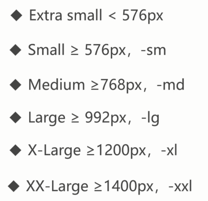

# 响应式布局

大型项目布局的必选方案，理解响应式布局的实现，有利于理解其他相关的框架或技术的运用，是一些 UI 组件中的标配内容

## 响应式布局概念

指网页能自动识别屏幕宽度，并做出相应跳转的网页设计。相应式布局可以为不同终端的用户提供更加舒适的界面和更好的用户体验。

响应式布局相关语法：
- 媒体查询语法
- 媒体查询的编写位置及顺序
- 相应断点（阈值）的设定
- 响应式栅格系统

其他：
- 响应式交互实现
- 响应式框架 Bootstrap

## 媒体查询语法详解


```html
<style>
    /* @media print {
        .box{
            font-size: 60px;
        }
    } */

    /* max-width: 1200px */
    /* @media ( min-width: 700px ) {
        .box {
            width: 200px;
            height: 200px;
            background: pink;
        }
    } */

    /* @media (orientation: portrait) {
        .box {
            width: 200px;
            height: 200px;
            background: pink;
        }
    }

    @media (orientation: landscape) {
        .box {
            width: 200px;
            height: 200px;
            background: skyblue;
        }
    } */

    /* @media screen and ( min-width: 700px ) and (max-width: 1200px) {
        .box {
            width: 200px;
            height: 200px;
            background: pink;
        }
    } */

    /* @media not screen and ( min-width: 700px ) {
        .box {
            width: 200px;
            height: 200px;
            background: pink;
        }
    } */

    @media screen , print and ( min-width: 700px ) {
        .box {
            width: 200px;
            height: 200px;
            background: pink;
        }
    }
</style>

<div class="box">测试文字测试文字</div>
```

link 标签方式：

```html
<link rel="stylesheet" href="./a.css" media="(orientation: portrait)">
<link rel="stylesheet" href="./b.css" media="(orientation: landscape)">
```

## 媒体查询的编写位置及顺序

- 添加到样式表的底部，对 CSS 进行优先级的覆盖
- 移动端 ->PC 端的适配原则：min-width从小到大 (**移动优先的原则**，先编写移动端设备，然后响应式过渡到PC端)
- PC 端 ->移动端的适配原则：max-width从大到小

```html
<style>
    /* .box{
        width:100px;
        height:100px;
        background:blue;
    }

    @media (min-width: 700px) {
        .box{
            background: pink;
        }
    } */

    /* .box{
        width:100px;
        height:100px;
        background:blue;
    }
    */

    /* 如何多条件的时候，min-width编写顺序：从小到大进行适配 */
    /* min-width方式：移动优先的原则，先编写移动端设备，然后响应式过渡到PC端 */
    /* @media (min-width: 700px) {
        .box{
            background: pink;
        }
    }

    @media (min-width: 1000px) {
        .box{
            background: green;
        }
    } */

    /* 如何从PC端响应式过渡到移动端？ max-width , 从大到小区编写 */
    .box{
        width:100px;
        height:100px;
        background:blue;
    }

    @media (max-width: 1000px) {
        .box{
            background: pink;
        }
    }

    @media (max-width: 700px) {
        .box{
            background: green;
        }
    }
</style>

<div class="box">aaaaaa</div>
```

## 响应断点(阈值)的设定




```html
<style>

    .d-none{
        display: none;
    }
    @media (min-width: 576px){
        .d-sm-none{
            display: none;
        }
    }
    @media (min-width: 768px){
        .d-md-none{
            display: none;
        }
    }
    @media (min-width: 992px){
        .d-lg-none{
            display: none;
        }
    }
    @media (min-width: 1200px){
        .d-xl-none{
            display: none;
        }
    }
    @media (min-width: 1400px){
        .d-xxl-none{
            display: none;
        }
    }
</style>

<div class="d-none">11111</div>
<div class="d-sm-none">22222</div>
<div class="d-md-none">33333</div>
<div class="d-lg-none">44444</div>
<div class="d-xl-none">55555</div>
<div class="d-xxl-none">66666</div>
```

## 响应式栅格系统

响应式栅格系统：栅格布局 + 断点设定

```html
<head>
    <style>
        .row{
            background:skyblue;
            display: grid;
            grid-template-columns: repeat(12, 1fr);
            grid-template-rows: 50px;
            grid-auto-rows: 50px;
        }
        .row div{
            background:pink;
            border:1px black solid;
            grid-area: auto/auto/auto/span 12;
        }
        .row .col-1{
            grid-area: auto/auto/auto/span 1;
        }
        .row .col-2{
            grid-area: auto/auto/auto/span 2;
        }
        .row .col-3{
            grid-area: auto/auto/auto/span 3;
        }
        .row .col-4{
            grid-area: auto/auto/auto/span 4;
        }
        .row .col-5{
            grid-area: auto/auto/auto/span 5;
        }
        .row .col-6{
            grid-area: auto/auto/auto/span 6;
        }
        .row .col-7{
            grid-area: auto/auto/auto/span 7;
        }
        .row .col-8{
            grid-area: auto/auto/auto/span 8;
        }
        .row .col-9{
            grid-area: auto/auto/auto/span 9;
        }
        .row .col-10{
            grid-area: auto/auto/auto/span 10;
        }
        .row .col-11{
            grid-area: auto/auto/auto/span 11;
        }
        .row .col-12{
            grid-area: auto/auto/auto/span 12;
        }

        @media (min-width: 576px){
            .row .col-sm-1{
                grid-area: auto/auto/auto/span 1;
            }
            .row .col-sm-2{
                grid-area: auto/auto/auto/span 2;
            }
            .row .col-sm-3{
                grid-area: auto/auto/auto/span 3;
            }
            .row .col-sm-4{
                grid-area: auto/auto/auto/span 4;
            }
            .row .col-sm-5{
                grid-area: auto/auto/auto/span 5;
            }
            .row .col-sm-6{
                grid-area: auto/auto/auto/span 6;
            }
            .row .col-sm-7{
                grid-area: auto/auto/auto/span 7;
            }
            .row .col-sm-8{
                grid-area: auto/auto/auto/span 8;
            }
            .row .col-sm-9{
                grid-area: auto/auto/auto/span 9;
            }
            .row .col-sm-10{
                grid-area: auto/auto/auto/span 10;
            }
            .row .col-sm-11{
                grid-area: auto/auto/auto/span 11;
            }
            .row .col-sm-12{
                grid-area: auto/auto/auto/span 12;
            }
        }

        @media (min-width: 768px){
            .row .col-md-1{
                grid-area: auto/auto/auto/span 1;
            }
            .row .col-md-2{
                grid-area: auto/auto/auto/span 2;
            }
            .row .col-md-3{
                grid-area: auto/auto/auto/span 3;
            }
            .row .col-md-4{
                grid-area: auto/auto/auto/span 4;
            }
            .row .col-md-5{
                grid-area: auto/auto/auto/span 5;
            }
            .row .col-md-6{
                grid-area: auto/auto/auto/span 6;
            }
            .row .col-md-7{
                grid-area: auto/auto/auto/span 7;
            }
            .row .col-md-8{
                grid-area: auto/auto/auto/span 8;
            }
            .row .col-md-9{
                grid-area: auto/auto/auto/span 9;
            }
            .row .col-md-10{
                grid-area: auto/auto/auto/span 10;
            }
            .row .col-md-11{
                grid-area: auto/auto/auto/span 11;
            }
            .row .col-md-12{
                grid-area: auto/auto/auto/span 12;
            }
        }

        @media (min-width: 992px){
            .row .col-lg-1{
                grid-area: auto/auto/auto/span 1;
            }
            .row .col-lg-2{
                grid-area: auto/auto/auto/span 2;
            }
            .row .col-lg-3{
                grid-area: auto/auto/auto/span 3;
            }
            .row .col-lg-4{
                grid-area: auto/auto/auto/span 4;
            }
            .row .col-lg-5{
                grid-area: auto/auto/auto/span 5;
            }
            .row .col-lg-6{
                grid-area: auto/auto/auto/span 6;
            }
            .row .col-lg-7{
                grid-area: auto/auto/auto/span 7;
            }
            .row .col-lg-8{
                grid-area: auto/auto/auto/span 8;
            }
            .row .col-lg-9{
                grid-area: auto/auto/auto/span 9;
            }
            .row .col-lg-10{
                grid-area: auto/auto/auto/span 10;
            }
            .row .col-lg-11{
                grid-area: auto/auto/auto/span 11;
            }
            .row .col-lg-12{
                grid-area: auto/auto/auto/span 12;
            }
        }

        @media (min-width: 1200px){
            .row .col-xl-1{
                grid-area: auto/auto/auto/span 1;
            }
            .row .col-xl-2{
                grid-area: auto/auto/auto/span 2;
            }
            .row .col-xl-3{
                grid-area: auto/auto/auto/span 3;
            }
            .row .col-xl-4{
                grid-area: auto/auto/auto/span 4;
            }
            .row .col-xl-5{
                grid-area: auto/auto/auto/span 5;
            }
            .row .col-xl-6{
                grid-area: auto/auto/auto/span 6;
            }
            .row .col-xl-7{
                grid-area: auto/auto/auto/span 7;
            }
            .row .col-xl-8{
                grid-area: auto/auto/auto/span 8;
            }
            .row .col-xl-9{
                grid-area: auto/auto/auto/span 9;
            }
            .row .col-xl-10{
                grid-area: auto/auto/auto/span 10;
            }
            .row .col-xl-11{
                grid-area: auto/auto/auto/span 11;
            }
            .row .col-xl-12{
                grid-area: auto/auto/auto/span 12;
            }
        }

        @media (min-width: 1400px){
            .row .col-xxl-1{
                grid-area: auto/auto/auto/span 1;
            }
            .row .col-xxl-2{
                grid-area: auto/auto/auto/span 2;
            }
            .row .col-xxl-3{
                grid-area: auto/auto/auto/span 3;
            }
            .row .col-xxl-4{
                grid-area: auto/auto/auto/span 4;
            }
            .row .col-xxl-5{
                grid-area: auto/auto/auto/span 5;
            }
            .row .col-xxl-6{
                grid-area: auto/auto/auto/span 6;
            }
            .row .col-xxl-7{
                grid-area: auto/auto/auto/span 7;
            }
            .row .col-xxl-8{
                grid-area: auto/auto/auto/span 8;
            }
            .row .col-xxl-9{
                grid-area: auto/auto/auto/span 9;
            }
            .row .col-xxl-10{
                grid-area: auto/auto/auto/span 10;
            }
            .row .col-xxl-11{
                grid-area: auto/auto/auto/span 11;
            }
            .row .col-xxl-12{
                grid-area: auto/auto/auto/span 12;
            }
        }
    </style>
</head>
<body>
    <!-- <div class="row">
        <div class="col-3">col-3</div>
        <div class="col-3">col-3</div>
        <div class="col-3">col-3</div>
        <div class="col-3">col-3</div>
    </div>
    <div class="row">
        <div class="col-sm-3">col-sm-3</div>
        <div class="col-sm-3">col-sm-3</div>
        <div class="col-sm-3">col-sm-3</div>
        <div class="col-sm-3">col-sm-3</div>
    </div>
    <div class="row">
        <div class="col-md-3">col-md-3</div>
        <div class="col-md-3">col-md-3</div>
        <div class="col-md-3">col-md-3</div>
        <div class="col-md-3">col-md-3</div>
    </div>
    <div class="row">
        <div class="col-lg-3">col-lg-3</div>
        <div class="col-lg-3">col-lg-3</div>
        <div class="col-lg-3">col-lg-3</div>
        <div class="col-lg-3">col-lg-3</div>
    </div>
    <div class="row">
        <div class="col-xl-3">col-xl-3</div>
        <div class="col-xl-3">col-xl-3</div>
        <div class="col-xl-3">col-xl-3</div>
        <div class="col-xl-3">col-xl-3</div>
    </div>
    <div class="row">
        <div class="col-xxl-3">col-xxl-3</div>
        <div class="col-xxl-3">col-xxl-3</div>
        <div class="col-xxl-3">col-xxl-3</div>
        <div class="col-xxl-3">col-xxl-3</div>
    </div> -->

    <div class="row">
        <div class="col-xxl-3 col-lg-4 col-sm-6">col</div>
        <div class="col-xxl-3 col-lg-4 col-sm-6">col</div>
        <div class="col-xxl-3 col-lg-4 col-sm-6">col</div>
        <div class="col-xxl-3 col-lg-4 col-sm-6">col</div>
        <div class="col-xxl-3 col-lg-4 col-sm-6">col</div>
        <div class="col-xxl-3 col-lg-4 col-sm-6">col</div>
        <div class="col-xxl-3 col-lg-4 col-sm-6">col</div>
        <div class="col-xxl-3 col-lg-4 col-sm-6">col</div>
        <div class="col-xxl-3 col-lg-4 col-sm-6">col</div>
        <div class="col-xxl-3 col-lg-4 col-sm-6">col</div>
        <div class="col-xxl-3 col-lg-4 col-sm-6">col</div>
        <div class="col-xxl-3 col-lg-4 col-sm-6">col</div>
    </div>
</body>
```

## 响应式交互实现

- 利用 :checked 伪类实现
- 利用 JavaScript 脚本

```html
<head>
    <style>
        ul{
            display: none;
        }
        input {
            display: none;
        }
        input:checked + ul{
            display: block;
        }

        @media (min-width: 700px){
            ul{
                display: block;
            }
            span{
                display: none;
            }
        }
    </style>
</head>
<body>
    <label for="menu">
        <span>
            菜单按钮
        </span>
    </label>
    <input id="menu" type="checkbox">
    <ul>
        <li>首页</li>
        <li>教程</li>
        <li>论坛</li>
        <li>文章</li>
    </ul>
</body>
```

## CSS 变量

```css
/* 定义 */
 :root{
    --container: 100%;
}

/* 使用 */
.main{
    width: var(--container);
}
```


## 响应式框架 bootstrap

Bootstrap 是最受欢迎的 HTML、CSS 和 JS 框架，用于开发响应式布局、移动设备优先的 WEB 项目。

在前面提到的，响应断点、栅格系统、交互实现等内容，在Bootstrap框架中都已经提供好了，只需要引入框架文件即可使用。

Bootstrap 文件可通过官方提供的网址：[https://getbootstrap.com/](https://getbootstrap.com/) 进行下载。截止到目前最新的版本为 v5.0.x 。这里强调一点，Bootstrap 框架是基于 jquery 库来设计的，所以除了在 html 文件中引入 Bootstrap 相关文件外，还需要引入 jquery.js 文件，并需要确保文件的引入顺序，具体引入方式如下：

```html
<link rel="stylesheet" href="./bootstrap.css">
<script src="./jquery.js"></script>
<script src="./bootstrap.js"></script>
```

### 响应式断点的设定

Bootstrap 中的断点值设定跟前面视频中讲解的值是一样的：

|  设备描述  |   断点值   |    标识符   |
|  ----  | ----  |  ----     |
| Extra small  |  <576px  |    |
| Small  | ≥576px |  -sm |
| Medium  | ≥768px |  -md |
| Large  | ≥992px |  -lg |
| X-Large  | ≥1200px |  -xl |
| XX-Large  | ≥1400px |  -xxl |

在 Bootstrap 框架中，能够具备响应式断点设定的样式非常多，如：float 浮动、display 显示框、container 容器、text 文本等。

```html
<div class="float-sm-start
            d-lg-block
            container-md
            text-xl-start"></div>
```

### 响应式栅格系统

Bootstrap 中的栅格系统跟前面的也是一样的，不过功能更加的丰富，除了有 12 列响应式栅格系统外，还有栅格位置的控制和对行的栅格化控制等。

可通过 `offset-*-*` 模式对栅格进行偏移，代码如下：

```html
<div class="row">
    <div class="col-3 offset-1 bg-primary p-4"></div>
    <div class="col-3 offset-2 bg-danger p-4"></div>
</div>
```

<div align=center>
	
    <div>offset-*-*偏移</div>
</div>

可以看到第一列距离左边会空出一个栅格的大小，第二列跟第一列之间会空出两个栅格的大小，那么最后剩余的空间为三个栅格。

可通过 `row-*-*` 模式对行进行栅格化控制，代码如下：

```html
<div class="row row-cols-3">
    <div class="col bg-primary p-4 border"></div>
    <div class="col bg-primary p-4 border"></div>
    <div class="col bg-primary p-4 border"></div>
    <div class="col bg-primary p-4 border"></div>
</div>
<div class="row row-cols-4">
    <div class="col bg-danger p-4 border"></div>
    <div class="col bg-danger p-4 border"></div>
    <div class="col bg-danger p-4 border"></div>
    <div class="col bg-danger p-4 border"></div>
</div>
```

<div align=center>
	
    <div>row-*-*响应行</div>
</div>

可以看到第一行只能放置三列，而第二行可以放置四列。

### 常见 bootstrap 组件

在 Bootstrap 框架中提供了很多现成的组件，可直接进行使用并带有交互行为。下面展示其中一个组件，Accordion(手风琴，即折叠列表)组件。

```html
<div class="accordion" id="accordionExample">
    <div class="accordion-item">
        <h2 class="accordion-header" id="headingOne">
            <button class="accordion-button" type="button" data-bs-toggle="collapse" data-bs-target="#collapseOne" aria-expanded="true" aria-controls="collapseOne">
            第一项
            </button>
        </h2>
        <div id="collapseOne" class="accordion-collapse collapse show" aria-labelledby="headingOne" data-bs-parent="#accordionExample">
            <div class="accordion-body">
                第一项的内容
            </div>
        </div>
    </div>
    <div class="accordion-item">
        <h2 class="accordion-header" id="headingTwo">
            <button class="accordion-button collapsed" type="button" data-bs-toggle="collapse" data-bs-target="#collapseTwo" aria-expanded="false" aria-controls="collapseTwo">
            第二项
            </button>
        </h2>
        <div id="collapseTwo" class="accordion-collapse collapse" aria-labelledby="headingTwo" data-bs-parent="#accordionExample">
            <div class="accordion-body">
                第二项的内容
            </div>
        </div>
    </div>
</div>
```

<div align=center>
	
    <div>Accordion组件</div>
</div>

Bootstrap 中的组件是通过，自定义属性 `data-*` 方式来控制交互行为的，例如在Accordion 组件中通过 `data-bs-toggle="collapse" data-bs-target="#collapseOne"` 进行的。

## 响应式案例

- 博客头部实现
- 博客导航实现
- 博客文章列表实现
- 博客辅助列表实现
- 博客尾部实现

## 总结

- 媒体查询语法：类型、特性、运算符、link 标签等
- 媒体查询编写位置及多查询语句的编写顺序
- 响应式相关功能：响应式断点、栅格系统、交互实现等
- 响应式案例：Ghost 博客，适配不同设备

## 测试题

### 响应式布局中的移动优先原则是？

- [ ] A：min-width值从小到大
- [ ] B：min-width值从大到小
- [ ] C：max-width值从小到大
- [ ] D：max-width值从大到小

答案

选项 A  ( min-width值从小到大进行适配 )

### 根据下面HTML结构，完成图示布局效果，编写对应CSS代码：

```html
<style>
/* 代码编写区域 */

</style>
<section class="head">
    <div>logo</div>
    <ul>
        <li>item1</li>
        <li>item2</li>
        <li>item3</li>
        <li>item4</li>
    </ul>
</section>
```

<div align=center>
	
    <div>width < 768px</div>
</div>
<div align=center>
	
    <div>width >= 768px</div>
</div>

要求如下：

1. 断点值为768px，小于768px时.head区域高100px，大于等于768px时.head区域高50px
2. div、ul在小于768px时，垂直排列，内容上下左右居中
3. div、ul在大于等于768px时，水平排列，内容上下居中，左右在两侧
4. item列表项之间间距为50px

答案

```css
* {
    margin: 0;
    padding: 0;
}
ul {
    list-style: none;
}
.head {
    height: 100px;
    background: skyblue;
    display: flex;
    flex-direction: column;
    align-items: center;
}
.head div {
    flex-grow: 1;
    display: flex;
    align-items: center;
}
.head ul {
    flex-grow: 1;
    display: flex;
    justify-content: space-between;
    align-items: center;
    column-gap: 50px;
}
@media (min-width: 768px) {
    .head {
        height: 50px;
        flex-direction: row;
    }
    .head ul {
        flex-grow: 0;
    }
}
```
