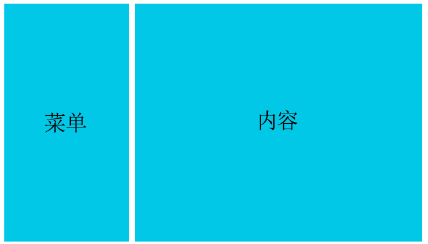
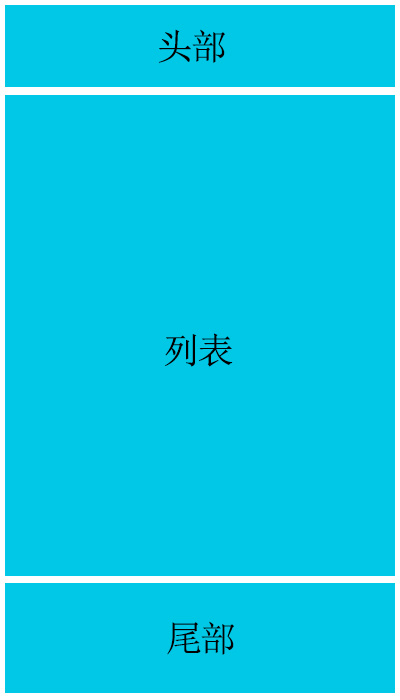

# 实战 Ant Design Pro 管理系统

- 从专业的准备阶段、划分、规范、命名等多角度进行分析
- 响应式、布局方案、网页皮肤、模块划分、元件划分...

## 介绍

目标：
- 综合实战：弹性布局、网格布局、响应式布局等
- 理解项目开发流程及项目开发规范等

准备工作：
- CSS 文件划分及功能分类
- CSS 方法论及样式规范

项目开发：
- 搭建项目
- 侧边栏结构编写
- 侧边栏样式编写
- 侧边栏列表交互
- 侧边栏折叠交互
- 主体头部尾部实现
- 主体网格布局实现
- 设置模块主题色实现
- 设置模块按钮实现
- 设置模块主题色交互
- 设置模块切换按钮交互
- 响应式内容及菜单实现

## CSS 文件划分及功能分类

### **CSS 文件划分**

在中大型项目中，一般会对 CSS 进行文件划分，根据文件的性质与用途，大概会分成：

- **公共型样式**
- **特殊型样式**
- **皮肤型样式**

公共型样式可命名为 global.css 或 common.css 等名字，主要包括网站通用样式编写，例如：重置默认样式 reset、网站通用布局、通用模块和元件、通用响应式系统等。

```css
/* 重置样式 */
省略css代码...
/* 网站通用布局 */
省略css代码...
/* 通用模块 */
省略css代码...
/* 通用元件 */
省略css代码...
/* 通用响应式系统 */
省略css代码...
```

特殊型样式主要是根据当前页面来决定的文件，只针对当前页面做出特殊处理的样式，例如只在首页中用到的样式可放置到 index.css 中，在登录页中用到的样式可放置到 login.css 中。

皮肤型样式是针对网站需要皮肤功能时，把颜色、背景等抽离出来放到文件中的形式，例如 theme-pink.css、theme-skyblue.css 等。

CSS 文件的引入顺序如下：

```html
<link href="assets/css/global.css" rel="stylesheet" type="text/css"/>
<link href="assets/css/index.css" rel="stylesheet" type="text/css"/>
<link href="assets/css/theme.css" rel="stylesheet" type="text/css"/>
```

### **CSS功能分类**

上面提到了公共型样式，在文件中具体包括哪些常见的功能呢？大概可分为如下几类：

- **重置样式**
- **网站通用布局**
- **通用模块**
- **通用元件**
- **通用响应式系统**

重置样式，主要是去除默认样式和统一不同设备下的表现形态。通常为 Reset CSS 代码和 Normalize CSS 代码的结合版本。

网站通用布局主要指的是对网站中出现的大块结构进行排版。如：PC 端中的菜单、内容的左右布局方案；移动端中的头部、列表、尾部的上中下布局方案等。

<div align=center>
	
    <div>菜单、内容的左右布局</div>
</div>

<div align=center>
	
    <div>头部、列表、尾部的上中下布局</div>
</div>

通用模块指的是网页中可以重复使用的较大的整体，比如导航、登录、注册、各种列表、评论、搜索等。

通用原件指的是不可再分的较为小巧的个体，通常被重复用于各种模块中，比如按钮、输入框、loading、图标等。

通用响应式系统指的是在不同设备下要实现响应式布局，当满足了某个断点设定后调用的相应变化样式，比如浮动添加、栅格生效、显示隐藏、版心宽度等。

## CSS 方法论及样式规范

### **CSS 方法论**

方法论是一个哲学术语，会对一系列具体的方法进行分析研究、系统总结并最终提出较为一般性的原则。CSS 方法论是一种面向 CSS、由个人和组织设计、已被诸多项目检验且公认有效的最佳实践。这些方法论都会涉及结构化的命名约定，并且在组织 CSS 时可提供相应的指南，从而提升代码的性能、可读性以及可维护性。(引自：[前端躬行记](https://www.kancloud.cn/pwstrick/fe-questions/1627447))

常见的CSS方法论有：
- **OOCSS**
- **BEM**
- **SMACSS**
- **Atomic CSS**

下面主要采用 BEM + SMACSS 这两种方法论的结合命名约定，所以下面对这两种方法论进行简单介绍。

BEM（Block Element Modifier）是指块级元素修饰符，BEM 分为三部分：
1. 块（Block）是一个独立实体，最高级抽象，例如菜单、文本框等。
2. 元素（Element）是块的组成部分，被包含在块中，无法自成一体，例如菜单项、标题等。
3. 修饰符（Modifier）是块或元素的状态，可更改它们的外观或行为，例如高亮、选中等。

BEM 中的块、元素和修饰符需要全部小写，名称中的单词用连字符（-）分隔，元素由双下划线（__）分隔，修饰符由双连字符（--）分隔。注意，块和元素都既不能是HTML元素名或ID，也不依赖其它块或元素。

```css
.setting-menu{}
.setting-menu--open{}
.setting-menu__head{}
.setting-menu__head--fixed{}
.setting-menu__content{}
```

上面代码中，`.setting-menu`表示一个独立实体，`.setting-menu__head`、`.setting-menu__content{}`表示独立实体的组成部分，`.setting-menu--open{}`是对配置菜单展开状态的一种行为描述，`.setting-menu__head--fixed{}`是对配置菜单头部固定状态的一种行为描述。

SMACSS（Scalable and Modular Architecture for CSS）是指可伸缩及模块化的 CSS 架构，由 Jonathan Snook 在2011年雅虎工作时提出。他在 OOCSS 和 BEM 的基础上添加了五种类别的组件的处理规则，具体如下所列。
1. 基础（Base）是为HTML元素定义默认样式，可以包含属性、伪类等选择器。
2. 布局（Layout）会将页面分为几部分，可作为高级容器包含一个或多个模块，例如左右分栏、栅格系统等。
3. 模块（Module）又名对象或块，是可重用的模块化部分，例如导航栏、产品列表等。
4. 状态（State）描述的是任一模块或布局在特定状态下的外观，例如隐藏、激活等。
5. 主题（Theme）也就是换肤，描述了页面的外观，它可修改前面四个类别的样式，例如链接颜色、布局方式等。

通过相应的命名前缀来完成对类别的表示，`l-`用作布局的前缀，例如.l-inline、.layout-grid等；`m-`模块命名前缀，例如.m-profile、.field等；`is-`用作状态的前缀，例如.is-collapsed、.is-active等；`theme-`用作主题的前缀，例如.theme-a-background、.theme-l-grid等。

在实际工作中，不需要局限于某一个 CSS 方法论，很多时候可以结合使用，共享模块化 CSS的规则。例如遵循 BEM 的命名约定，以及 SMACSS 的分类前缀，具体如下所列。

```css
.m-setting-menu{}
.m-setting-menu--open{}
.m-setting-menu__head{}
.m-setting-menu__head--fixed{}
.m-setting-menu__content{}
```

任何软件设计都存在不完美的地方，CSS方 法论也是一样。比如：命名过长不易维护；HTML 不够简洁等。但是它带来的巨大优势也是非常明显的，比如：样式不容易冲突，尤其是复杂的样式结构；清晰的 CS S架构，对大型 CSS 项目管理维护非常重要等。

### **样式规范**

1. 使用类选择器，放弃 ID 选择器：ID 在一个页面中的唯一性导致了如果以 ID 为选择器来写 CSS，就无法重用。

2. 命名应简约而不失语义：反对过长命名和没有语义的命名，如：`.m-navigation`、`.m-abc`，推荐`.m-nav`。

3. 相同语义的不同类命名：直接加数字或字母区分即可（如：`.m-list`、`.m-list2`、`.m-list3`等，都是列表模块，但是是完全不一样的模块）。

4. 防止污染和被污染：为了防止后代选择器污染，尽量采用 `>` 方式，例如：`-m-nav>li`，而不是`-m-nav li`。

5. 最后一个值也以分号结尾：通常在大括号结束前的值可以省略分号，但是这样做会对修改、添加和维护工作带来不必要的失误和麻烦。

6. 省略值为0时的单位：为节省不必要的字节同时也使阅读方便，我们将0px、0em、0%等值缩写为0。

7. 根据属性的重要性按顺序书写：先显示定位布局类属性，后盒模型等自身属性，最后是文本类及修饰类属性。例如：`.m-box{position:relative;width:600px;margin:0 auto 10px;text-align:center;color:#000;}`。

8. CSS 需要进行格式化和对齐处理：推荐 vsCode 插件：`formate: CSS/LESS/SCSS formatter`。

## 实战项目

- 框架搭建
- 侧边栏结构编写
- 侧边栏样式编写
- 侧边栏列表交互
- 侧边栏折叠交互
- 主体头部尾部实现
- 主体网格布局实现
- 设置模块主题色实现
- 设置模块切换按钮实现
- 设置模块主题色交互
- 设置模块切换按钮交互
- 响应式内容及菜单实现

```css

/*-----------------通用方法-----------------------*/

.show{
    display: block !important;
}
.hide{
    display: none !important;
}

/*-----------------通用布局(g-)-----------------------*/

.g-ant{
    display: flex;
}
.g-ant__sider{
    flex-shrink: 0;
    background: #00152a;
    width: 208px;
    min-height: 100vh;
}
.g-ant__main{
    flex-grow: 1;
}

/*-----------------通用模块(m-)-----------------------*/

.m-logo{
    display: flex;
    align-items: center;
    padding: 16px;
    color: white;
}
.m-logo>img{
    width: 32px;
}

/*-----------------通用元件(u-)-----------------------*/

.u-bar{
    font-size:18px;
    color: white;
    display: block;
    padding: 15px;
    cursor: pointer;
}
/*-----------------响应式系统-----------------------*/

```

自定义滚动条

```css
.g-ant-sider__main::-webkit-scrollbar {
    width : 6px;
    height: 6px;
}

.g-ant-sider__main::-webkit-scrollbar-thumb {
    background   : #51606d;
    border-radius: 3px;
}

.g-ant-sider__main::-webkit-scrollbar-track {
    background   : #263849;
    border-radius: 3px;
}
```
