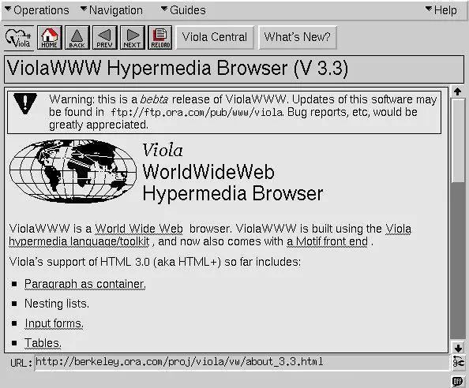
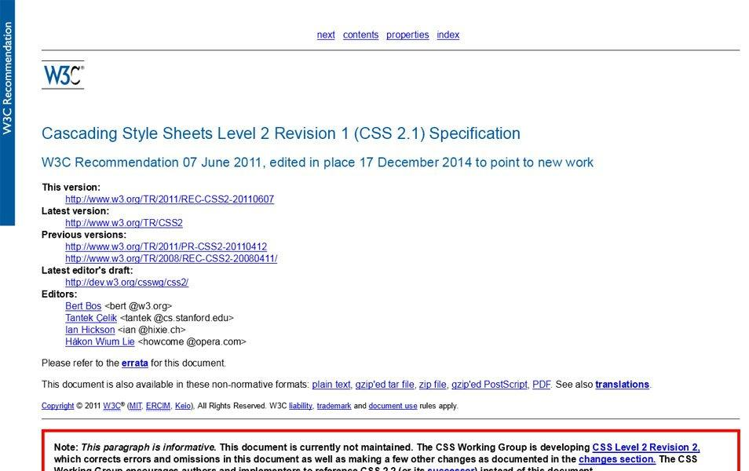
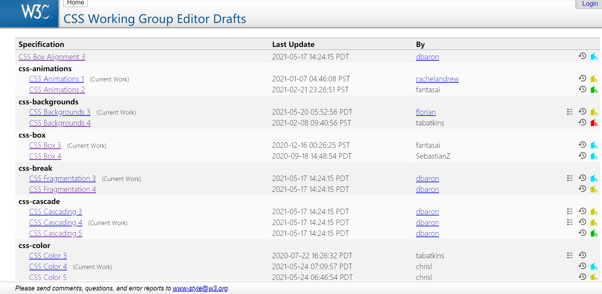

# CSS发展史与CSS模块划分

## HTML的诞生

&emsp;&emsp;1991年8月6日，诞生了人类有史以来的第一个网站（即：[http://info.cern.ch](http://info.cern.ch)），作者是万维网之父[蒂姆·伯纳斯·李](https://baike.baidu.com/item/蒂姆·伯纳斯·李)。当然网站的形态跟现在完全不一样，因为它没有样式，简单地说，它只有文字和图像两种，并没有其他的信息元素。

	
    
早期的HTML网页

## CSS的诞生

&emsp;&emsp;在那个遥远的年代，人们也渴望web网页变得更漂亮，于是在1994年[哈肯·维姆·莱](https://baike.baidu.com/item/哈肯·维姆·莱)和[伯特·波斯](https://baike.baidu.com/item/伯特·波斯)共同提出了层叠样式表（Cascading Style Sheets，即CSS）的概念。CSS从此成为了网页开发的标准之一，对于网页排版印刷、美感以及亲和力有着深远的影响和意义。

&emsp;&emsp;在这两年之后，[W3C](https://baike.baidu.com/item/w3c)的CSS工作小组(即哈肯·维姆·莱团队)推出了CSS1.0规范，后来陆续发布了CSS2.1规范和CSS3.0规范草案及其他迭代版本。

	
    
W3C CSS2.1规范文档

## CSS的版本

&emsp;&emsp;CSS2.1规范和CSS3.0规范草案指导Web开发者写了很多年的CSS。直到后来，大概2015年左右，W3C的CSS工作小组发现CSS发展的越来越快，有关于CSS方面的特性增加了不少，而且不同的特性推进速度都有所不同。也就这个时候，W3C的CSS工作小组为了能更好的维护和管理CSS的特性，该组织决定不在以CSS的版本号，比如我们熟悉的CSS1.0、CSS2.1、CSS3.0这样的方式来管理CSS。而是将每个CSS功能特性拆分成独立的功能模块，并且以Level 1, Level2，Level 3等方式来管理CSS规范中的特性。

&emsp;&emsp;也就是说以后不会再出现CSS4.0的版本，而是具体指向某个模块的Level版本，例如：CSS选择器模块已经发展到Level 4了。可以通过W3C官网查看到CSS模块的各种Level版本，或查看[https://drafts.csswg.org/](https://drafts.csswg.org/)：

	
    
CSS模块的划分

## CSS的研究方向

&emsp;&emsp;大体上CSS的学习可以朝着三个方向进行研究，分别是：特效、工程化、布局。比如说特效：可以学习动画、3D、渐变等；工程化：可以学习sass、less、postcss等；布局：可以学习flex、grid、响应式等。

&emsp;&emsp;而本套课程主要就是围绕着布局方向进行展开学习。从精通到实战，让学习者全方位掌握CSS布局的所有相关技术。从而学以致用，完成工作中大部分的布局需求。
